# Cognitive Lab 1: Cognitive Chatbot Basics
In this lab we'll build a web chatbot that uses the Watson Assistant API, and then connect it to a third party chat service (Slack). This basic chatbot recommends a new mobile phone for a user based on previous experiences and feedback.

## Requirements
- IBM Cloud account
- Slack account

## Agenda
##### Part 1: Create a Web chatbot using Watson Assistant & Node-RED
- Setup the Watson Assistant service
- Create intents and entities
- Create a dialog tree utilising your intents and entities
- Setup a web user interface and a Node-RED orchestration app

##### Part 2: Create a Slack chatbot
- Create a Slack bot
- Install Slack nodes and setup a Node-RED app
- Connect Slack to your Watson Assistant service

## Creating the Watson Assistant service
In this section we are going to create a [Watson Assistant](https://www.ibm.com/watson/services/conversation/) instance on IBM Cloud, and use it to build a basic bot that answers queries about mobile phones.

**(1)** Log into IBM Cloud and create a Watson Assistant service.
  - click on `Catalog`, then filter by clicking on `Watson`
  - select `Watson Assistant`

  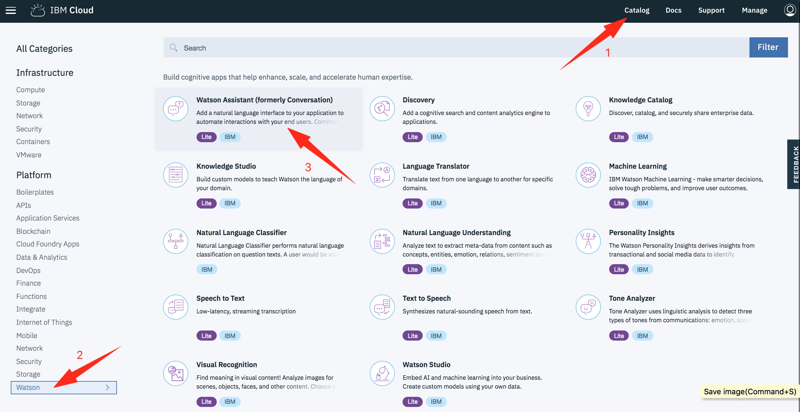  

  - create the service with a unique name: we'd suggest something like `Watson Assistant-eventname-yourinitials`, e.g. `Watson Assistant-DSA-GRW`
  - scroll down and ensure you are using the `Lite` plan, then hit `Create`

  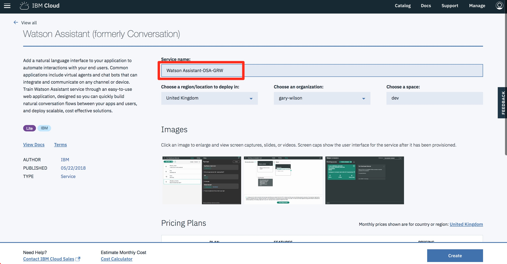  

**(2)** Launch the Watson Assistant tool by clicking on `Launch tool`.

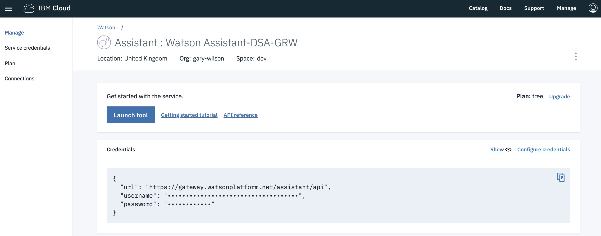

**(3)** Create a new `Workspace` called `Phone Advisor` - and then we'll go on to create the constructs required for our bot: `Intents`, `Entities` and `Dialogs`.

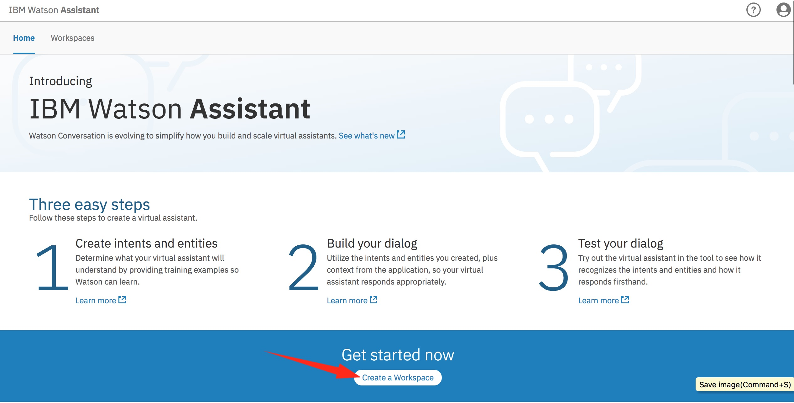

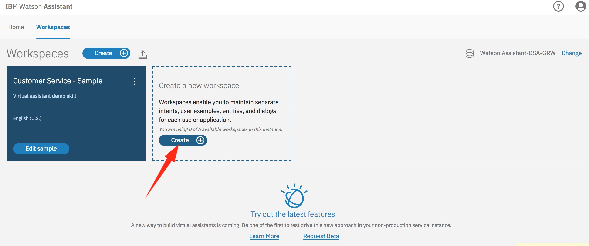

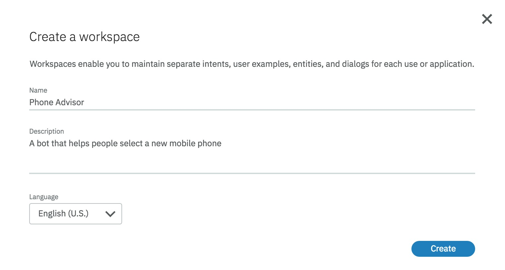

**(4)** Create the chatbot `Intents`.

An **_intent_** represents the _purpose_ of a user's input. By recognising the intent expressed by a user, Watson Assistant can choose the correct dialog flow to use to respond to it. To plan the intents for your application, you need to consider what your chatbot users might want to do, and what you want your application to be able to handle.

Choosing the correct intent for a user's input is the first step in providing a useful response. The intents you identify for your application will determine the dialog flows you need to create; they also might determine which back-end systems your application needs to integrate with in order to complete customer requests (such as customer databases or payment-processing systems).

Select `Add Intent` to get started, and create an intent name of **greeting**. You can add a description for your intent here if you wish.

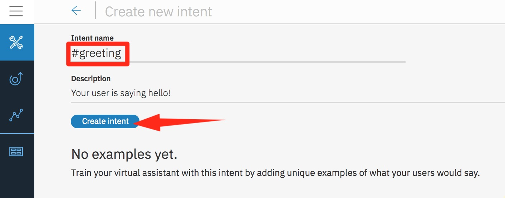

Once you've hit `Create Intent`, you need to add multiple _"user examples"_ of how a user might greet your bot, e.g.:
- good afternoon
- good evening
- good morning
- hi
- hello

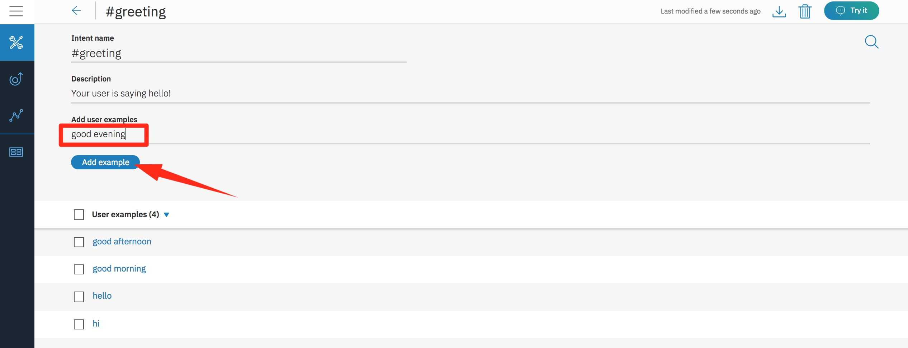

Repeat this process for an intent named **positive**:

- Intent name: **positive**
- Description: _Expressing positive opinion about mobile phones_
- User examples:
  - I care about style
  - I care about looks
  - I like Galaxy phones
  - I love Apple
  - I need good battery life
  - I prefer Android
  - I want a good looking phone
  - I want a great battery
  - The new Samsung looks great

What we are doing here is providing Watson Assistant with examples of positive opinions about a phone or a phone's attribute. As with any machine learning or cognitive service, the more examples you provide - a larger training set - the more accurate your chatbot will be in identifying user intent.

Your **positive** intent should look something like this:

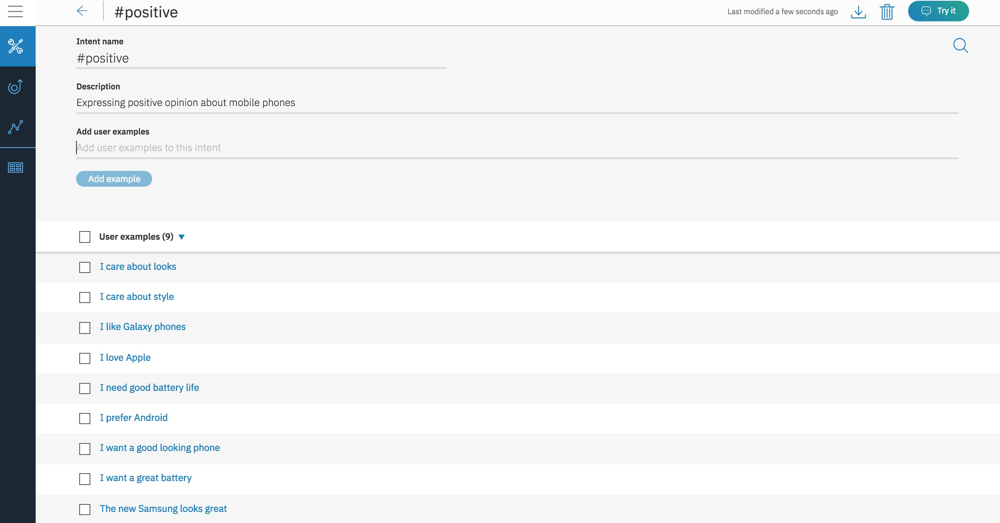

Repeat this process twice more for the following intents:

- Intent name: **negative**
- Description: _Expressing negative opinion about mobile phones_
- User examples:
  - Android sucks
  - HTC is the worst
  - I don't care about style
  - I don't care about the battery
  - I'm not bothered about looks
  - I do not like iPhones
  - I hate Samsung


- Intent name: **newphone**
- Description: _Expressing intent to buy or get advice about buying a new phone_
- User examples:
  - I am interested in buying a new phone
  - I am looking for a new phone
  - I need a new phone
  - I want advice regarding phones
  - I'd like to replace my phone
  - My old phone is terrible
  - What's the best phone available

Once you've created these, your `Intents` screen should look something like this:

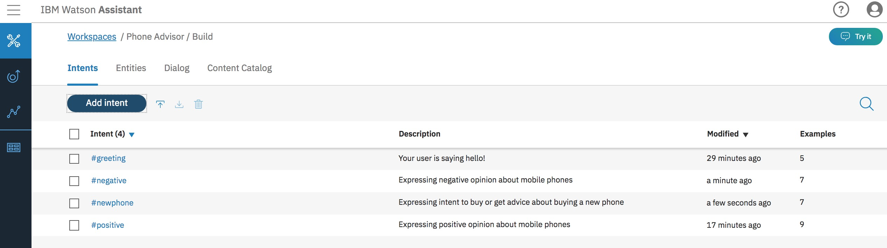

**(5)** Now let's create some `Entities`.

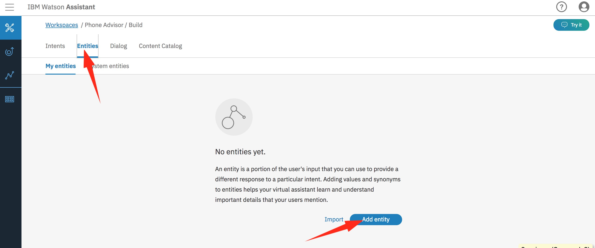

An **entity** represents a term or object in the user's input that provides _context_ for a particular intent. If intents represent _verbs_ (something a user wants to do), entities represent _nouns_ (such as the object of, or the context for, an action).

Entities make it possible for a single intent to represent multiple specific actions. For example in our case, the `positive` **intent** can be used with **entities** to recognise positive feeling about _different_ mobile phones or their attributes. So in effect, an entity defines a class of objects, with specific values representing the possible objects in that class.

Select `Add Entity`, enter a entity name of **brand**, then hit `Create Entity`.

Create a value of _Apple_, add a synonym _iPhone_, and select `Add Value`.

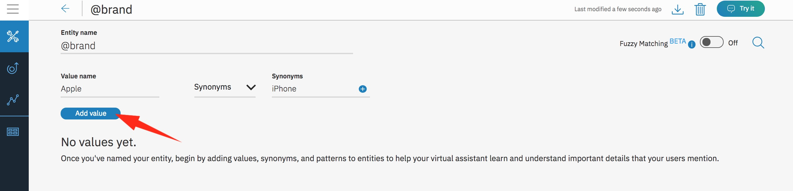

As you might expect, **synonyms** allow us to use multiple values to represent a single value. In this case, we will translate the use of either `Apple` or `iPhone` to a `@brand` value of `Apple`.

Repeat the process for values:

- _HTC_
- _Samsung (with synonyms Galaxy, J3, A8 and Edge)_

Feel free to include more here if you like.
Note that you can also use pattern matching when creating entity values. Take a look at the [Watson Assistant documentation](https://console.bluemix.net/docs/services/conversation/entities.html#defining-entities) if you want to know more.

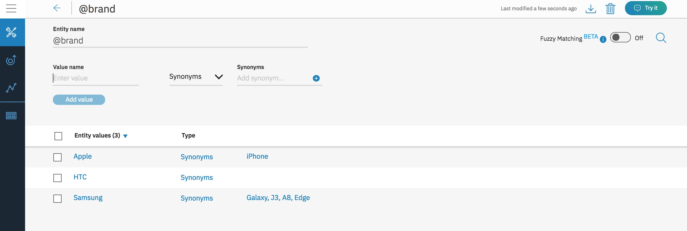

Create one more entity, named **attribute**, with values:
 - _battery (with synonym 'battery life')_
 - _style (with synonyms 'looks', 'stylish', 'fashion')_

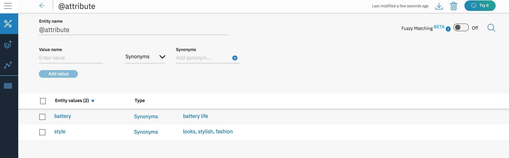

**(6)** The next step is to create a `Dialog` tree.

A **dialog** uses the _intents_ and _entities_ that are identified in the user's input, plus _context_ from the application that uses Watson Assistant, to interact with the user and ultimately provide a useful response. Our dialog tree should help the user choose a new mobile phone based on an existing preference or a required characteristic.

  - Select `Dialog` from the menu bar, and then hit `Create`.

  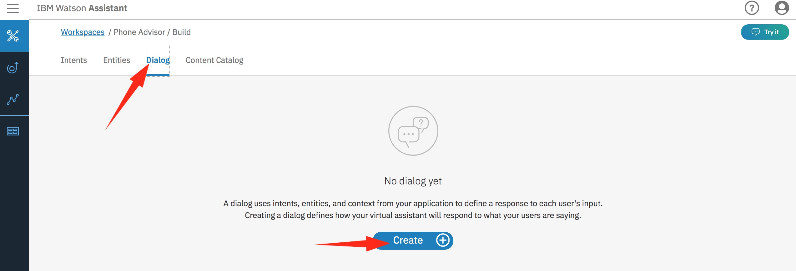

  - `Welcome` and `Anything Else` nodes will be automatically generated for you. These nodes are used to initialise the dialog with the user, and catch any user input that we don't provide a specific response for.

  - Modify the `Welcome` node so it welcomes the user with the message _"Hello. I am a mobile phone advisor. How can I help you?"_ by selecting the node, then changing the `Then Respond With` field.

  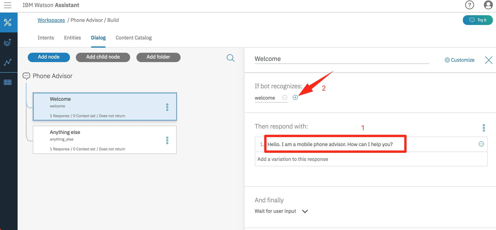

  - Now hit the plus sign next to `welcome`, change the operator from `and` to `or`, and add the `#greeting` intent to `If bot recognizes:`. Hit the plus sign again to add another test, change the operator to `or` once more, and enter `input.text == 'init'` into the `Enter an intent, entity or context variable...` field:

  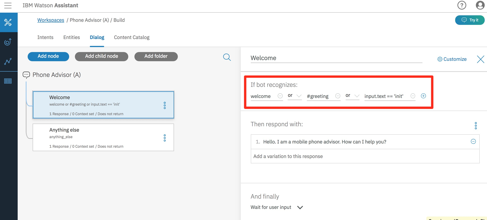

  These tests ensure that we will always provide a welcome response when the dialog first starts, or when someone 'greets' the chatbot. The `input.text == 'init'` test is used to initialise the HTML version of our bot later.

  - You can leave the `Anything Else` node with its default settings.

  - Next, create a `Help` node by selecting `Add Node`. Name it **Help**, and set the response to "_Can I help you with something else?_"

  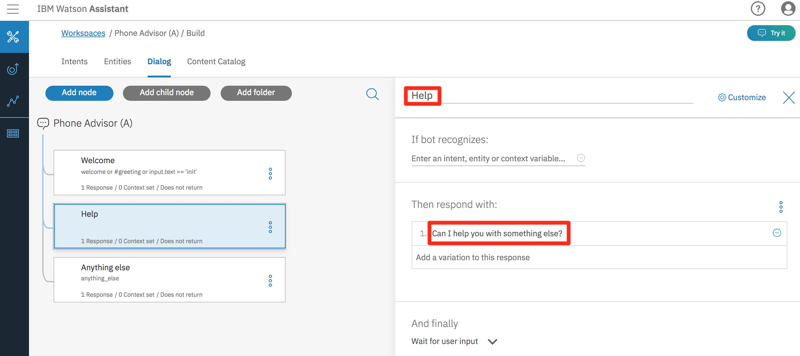

  - Now we'll construct a `New phone` advisor node. Here we'll look for positive or negative user responses, based on our previously built **intents**, as well as picking up either a brand name or a phone attribute defined by our **entities**.  Our dialog responses will then differ, based on the user input.
  - Start by adding a new node `New phone`, which is invoked if the `#newphone` intent is recognised. Add a couple of responses confirming that the bot understands in the `Then Respond With` field, and click `Set to random`. This will randomise one of these two responses to the `#newphone` intent, for a bit of variety.

  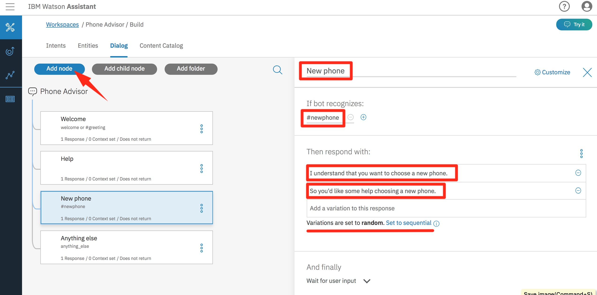

  - Next add a child node to your `New phone` node. You can do this by selecting the `New phone` node and choosing the `Add Child Node` option at the top of the dialog tree, or by selecting the three dots on the `New phone` node and then `Add Child Node` from the popup menu. Call this child node `Select`, and enter the response as shown:

  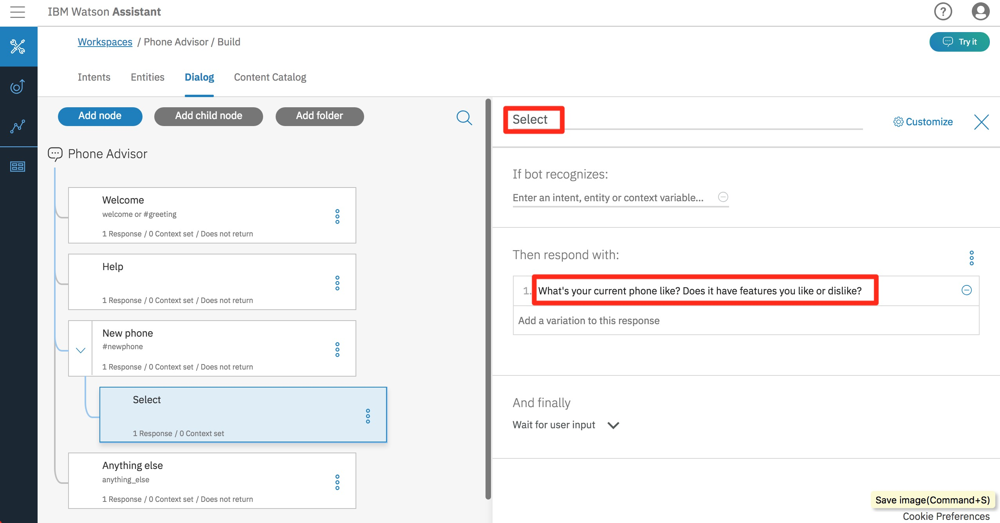

  - This node is asking the user what they like/dislike about their phone. We'll add some more logic to this soon, but in order to drop into this child node directly from the `New phone` node (i.e. without waiting for some more user input), we need to `Jump` to it.
  - Select the three dots on the `New phone` node and then the `Jump to` option:

  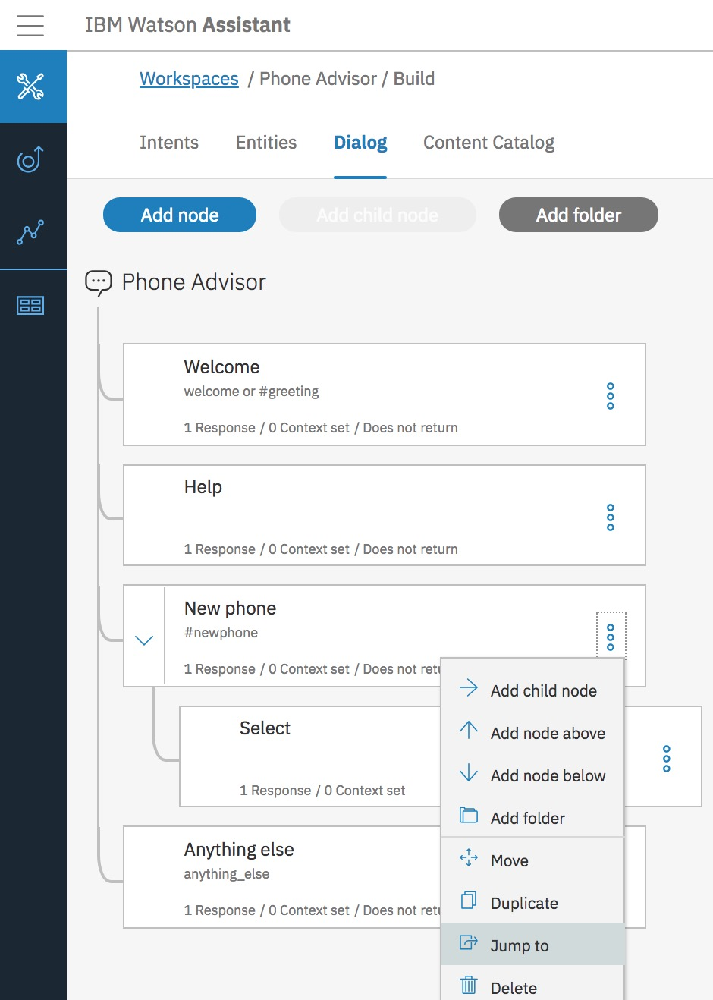

  - You will then be asked for a _destination node_. Pick the `Select` node and then choose `Respond` from the presented options.

  

  - Your dialog tree should then look this this:

  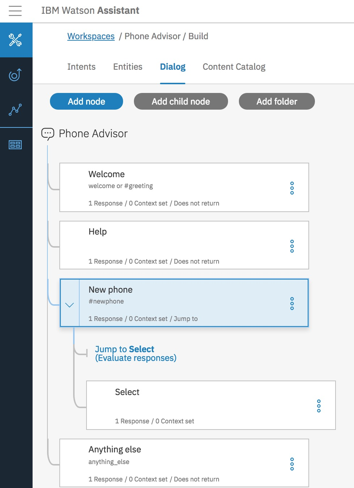

  - Finally, we need to create four child nodes of the `Select` node that will ultimately decide the chatbots response to the user's input. When completed it will look like this:

  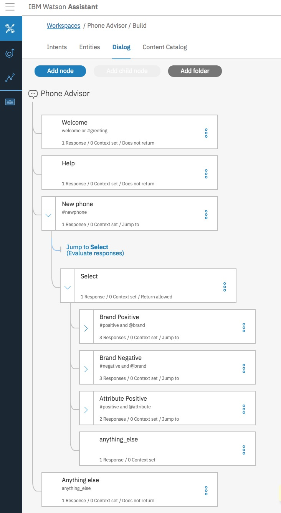

  - `Brand Positive` should check for our `#positive` intent and a `@brand` entity - it is looking for positive feelings about a brand, and will then respond with a recommendation.

  - Add a child node to the `Select` node. When you edit this _and each of the other child nodes here_, you should ensure that you allow for multiple responses by first selecting `Customize` from the top right, ensure `Multiple responses` is set to `On`, then hit `Apply`.

  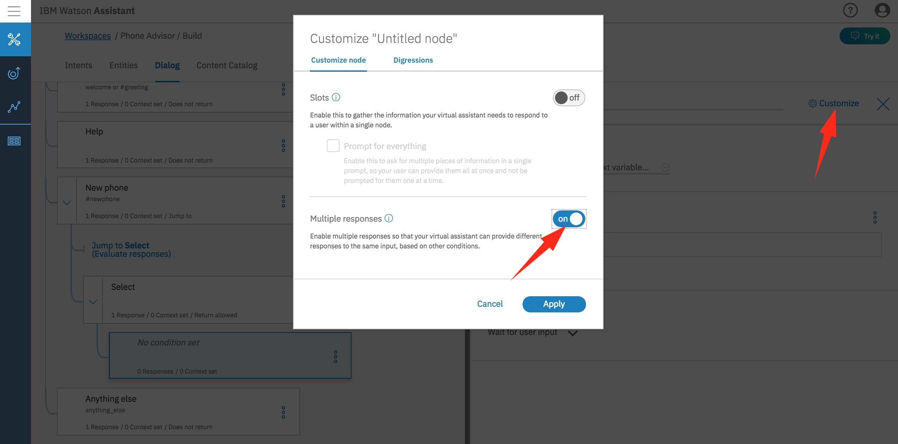

  - Now name the node `Brand Positive`, and ensure it's called `If bot recognizes:` both a `#positive` intent **and** a `@brand` entity:
    - Brand is _Apple_, `Respond with` _"If you like Apple you could get the iPhone X.  It's pretty cool."_
    - Brand is _Samsung_, `Respond with` _"If you like Samsung I'd recommend a new Samsung Galaxy S9."_
    - Brand is _HTC_, `Respond with` _"An HTC fan, huh?  I'd probably go for the HTC One."_


  - Feel free to edit the responses with your own text.

  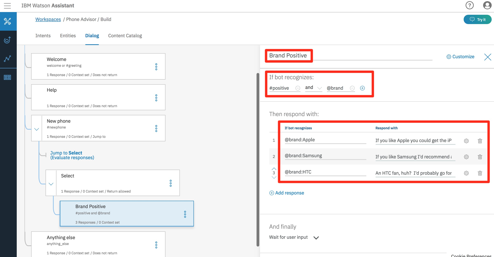

  - In each of these child nodes, we also want to make sure we ask the user if they need anything else after we've answered their question. On each node, edit the `And finally` section so that we `Jump to` to our `Help` node. Choose `Respond` when you've selected `Help` as the destination node for the jump.

  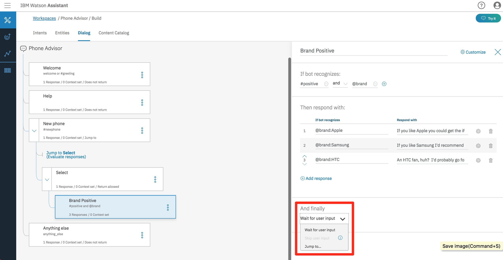

  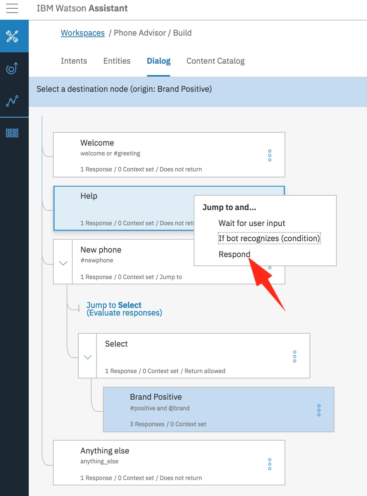

  - Now create the `Brand Negative` child node. It should look pretty much like `Brand Positive`, except it will test for a `#negative` intent and a `@brand` entity.

  - Use responses like these for negative sentiment about a brand, or again make up your own:
    - Apple: _"If you don't like Apple you could go for an Android phone, maybe a Samsung Galaxy or HTC One?"_
    - Samsung: _"If you want to steer away from Samsung but stay with Android then you could try an HTC One, or for a change you could go for a new iPhone?"_
    - HTC: _"If you don't like HTC, try a Samsung Galaxy S8 if you want to stay with Android, or maybe a new iPhone?"_


  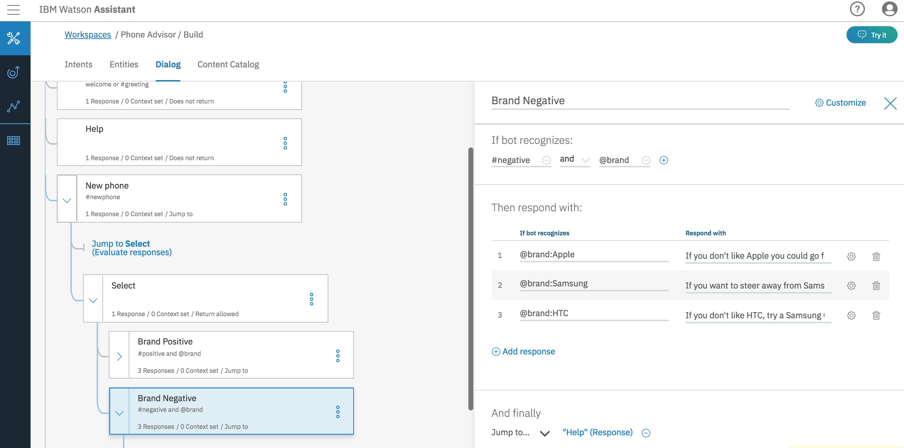

  - For the `Attribute Positive` child node look for `#positive` intent and an `@attribute` entity, using responses similar to these:
    - battery: _"If you need a long battery life then go retro! There's an updated Nokia 3310 out now."_
    - style: _"Beauty is in the eye of the beholder... but the Xiaomi Mi Mix looks very cool."_


  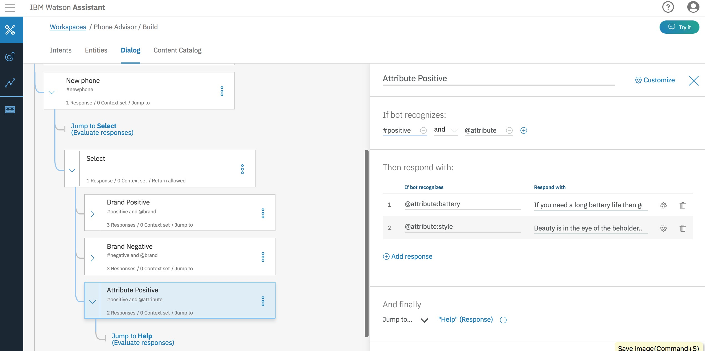

  - The final child node should be a catch-all for any user input we don't understand in this dialog branch. It should test for `anything_else`, respond with _"I'm not sure I understand."_ and then _wait for user input_.

  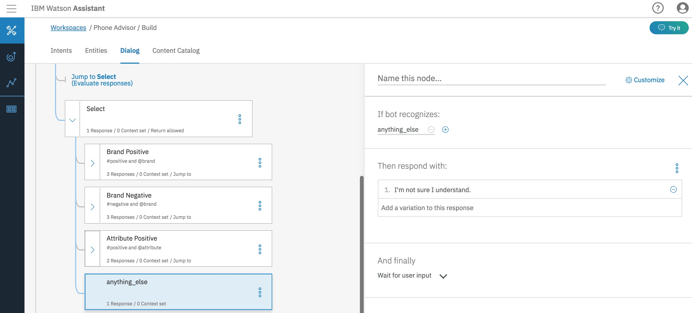

**(6)** If you need to you can download the whole Watson Assistant Phone Advisor Workspace [here](./Assistant/basic-workspace.json).
  - You can import a Workspace by clicking on the import icon next to the `Create` button in Workspaces

  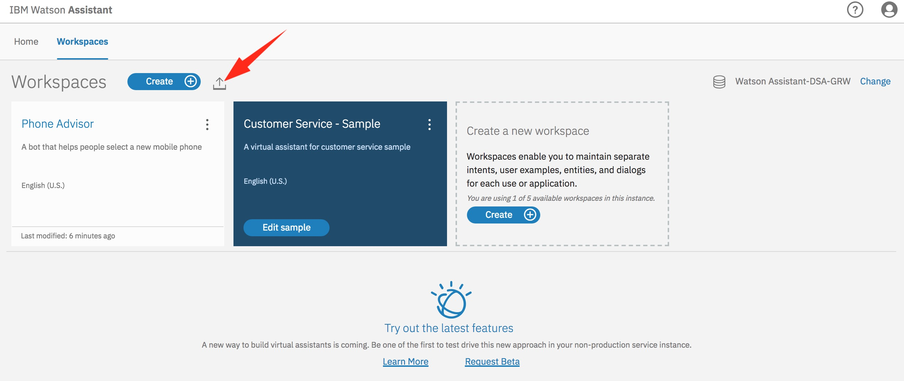

**(7)** You can test your dialog inside the Watson Assistant tool. Select the `Try It` button at the top right of the screen to enter the dialog tester:

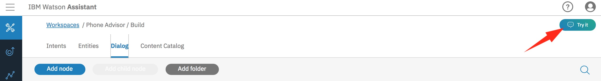

  - Try and test all of your dialog branches. It'll look something like this:

  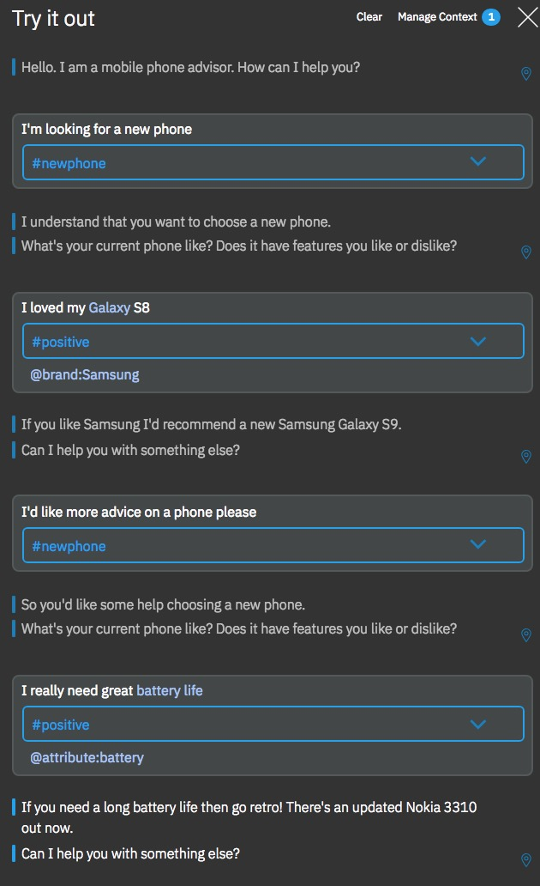

  - If you enter something Watson Assistant doesn't recognise - or if it's interpreting it incorrectly - you have the chance to further train Watson. In this example I've entered _"My Galaxy is very average"_. Watson Assistant is currently seeing this as positive, when in reality it's probably a fairly negative statement.

  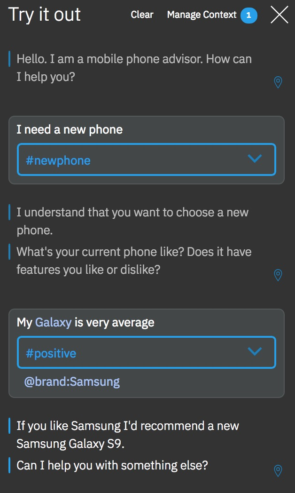

  - At this point, as I know this is really indicative of a negative user intent, I can select `#negative` from the drop down menu:

  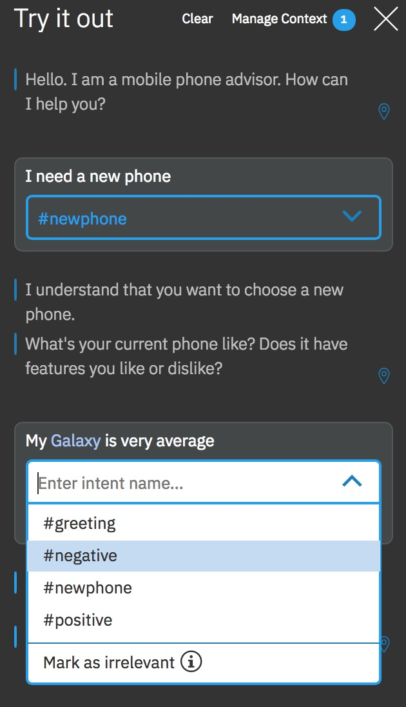

  - When we do this, Watson retrains our workspace by adding this text as another example to our `#negative` intent. After training is complete, a similar user response will now work! If you check your `#negative` intent you'll also see that the new example has been added to it.

  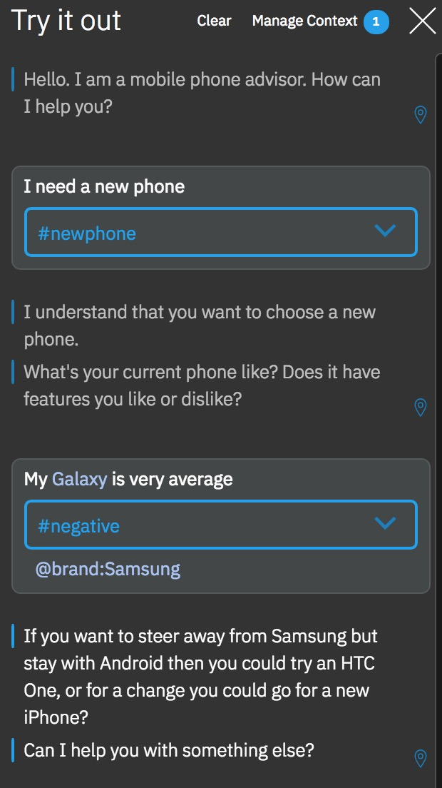

**(8)** Finally, go back to the Watson Assistant Workspaces menu, click on the three dots for the Workspace you created, then select `View Details`, and copy and save the Workspace ID. You'll need this for your Node-RED flow.

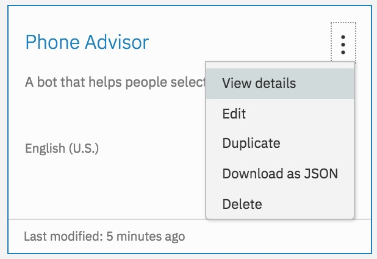

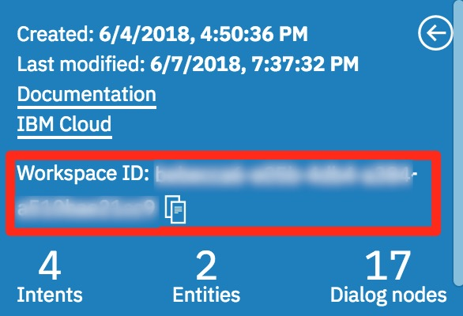

## Creating a web user interface for the chatbot using Node-RED
In this section we are going to create a UI for our chatbot using Node-RED.

If you are new to Node-RED then take a look at [this tutorial](https://nodered.org/docs/getting-started/first-flow) to get started.

**(1)** Log into IBM Cloud and if you don't already have one, create a Node-RED application from a Node-RED Starter boilerplate.
  - click on `Catalog`
  - filter on _node-red_ and select `Node-RED Starter`

    

  - `Create` a new Node-RED application with a unique name

**(2)** After creating the application (and even if you've previously created it) go to `Overview` from the left menu bar and increase the `GB MEMORY PER INSTANCE` from the default of 256Mb to at least 512 Mb. You can increase the value but can't `Save` it until your application is up and `Running`.


  - Once you save this change your Node-RED instance will automatically restart.

**(3)** Next select `Connections` from the left menu bar, and click on `Create connection`:


**(4)** Find the Watson Assistant instance you've just created, `Connect` it using the button shown, and `Restage` your Node-RED app when asked. IBM Cloud will ask you if you want to do this when you add a new connection to an application.

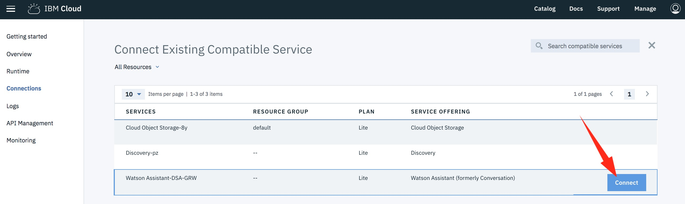

**(5)** After restaging, go to your Node-RED app URL and follow the Node-RED initialisation process. If you don't know the URL you can navigate directly to it from the `Visit App URL` link you can see in the screenshot in **(2)** above.

**(6)** Go to your Node-RED flow editor.

**(7)** We are going to create two flows. One will setup a basic web UI for our chatbot, and another will do the bulk of the work communicating with the Watson Assistant dialog.

**(8)** For the first flow, drag the following nodes from the palette on the left onto the editor window:
  - `http in` node: double-click the node to edit its properties, and ensure the method used is `GET` and the URL is set to `/bot`

  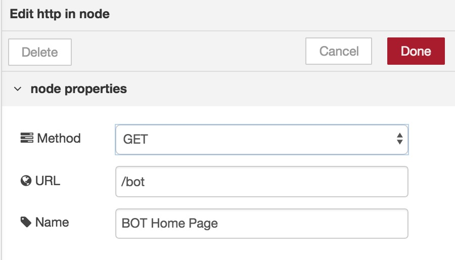

  - `http response` node: no properties changes are needed here
  - `template` node - copy the HTML content from [here](./Node-RED/template.html) into the Template section of the node properties:

  

**(9)** Connect them together as shown here:


**(10)** For the second flow create:
 - `http in` node with method `POST` and URL `/botchat`
 - `function` node with the following code, which takes the input from the web UI and formats it for passing to Watson Assistant:
```javascript
msg.params = msg.params || {};
msg.params.context = msg.payload.context;
msg.payload = msg.payload.message;
return msg;
```
 - `assistant` node, adding the Workspace ID within the node properties to match the one from your own Watson Assistant workspace. You retrieved this previously by selecting `View Details` from Watson Assistant.
 - `http response` node

**(11)** Connect them together, `deploy` them in Node-RED and go to your newly constructed UI. You'll find it at: https://your-Node-RED-app-name.mybluemix.net/bot if you've deployed to a US-based IBM Cloud location, or https://your-Node-RED-app-name.eu-gb.mybluemix.net/bot if you've deployed to the UK. Subsitute _your-Node-RED-app-name_ for the name you gave to your Node-RED instance.

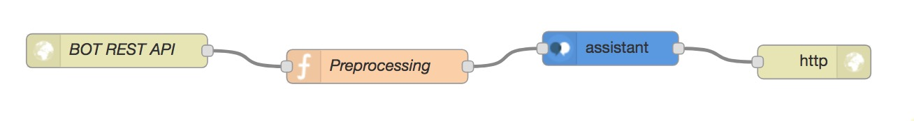

**(12)** Note: you can always access the Node RED editor directly via https://your-Node-RED-app-name.mybluemix.net/red (US) or https://your-Node-RED-app-name.eu-gb.mybluemix.net/red (UK).

**(13)** You can download and import the whole flow [here](./Node-RED/basic-flow.json) ... don't forget to _update the Workspace ID in the Assistant node_ if you do use this!

**(14)** The web application should look something likes this:

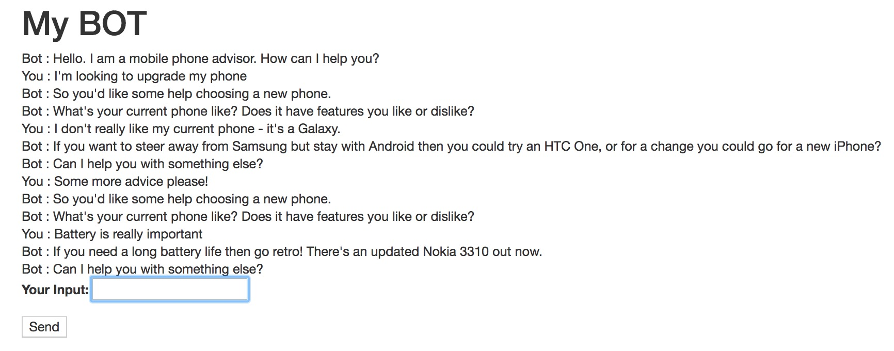

- If your chatbot isn't working as you expect, you can wire debug node(s) into your Node-RED flows to determine where the error is.

**(15)** You can also debug by using the `Improve` / `User Conversations` section in the Watson Assistant application. This can show you if you are finding the right `intents` and `entities` as you move down your dialog tree.

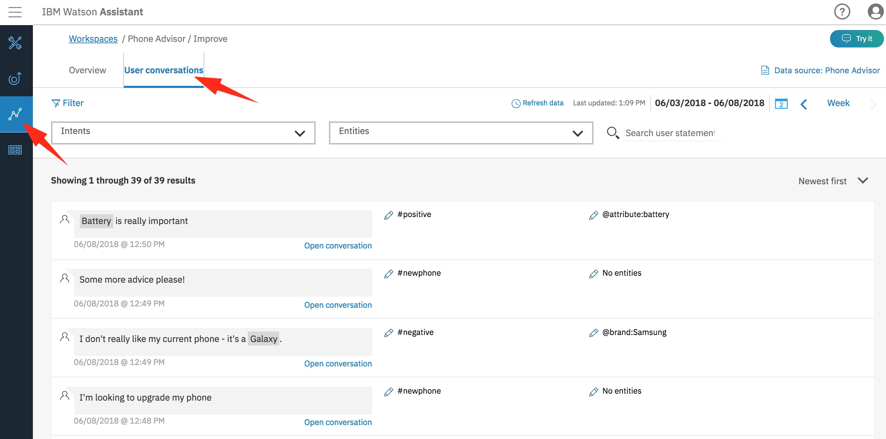

You can also train and further improve Watson Assistant using this feature - read more about it [here](https://console.bluemix.net/docs/services/conversation/logs.html#about-the-improve-component).

## Connecting Watson Assistant with Slack
**(1)** For this part of the lab, you will need a Slack userid connected to a Slack workspace that allows the creation of bots. You can either use your one of your own organisation's Slack workspaces for this, [create one yourself](https://get.slack.help/hc/en-us/articles/206845317-Create-a-Slack-workspace), or one will be provided for you if you are part of a guided lab session.

**(2)** Login to Slack and start the process of creating your Slackbot by adding a new `App`:

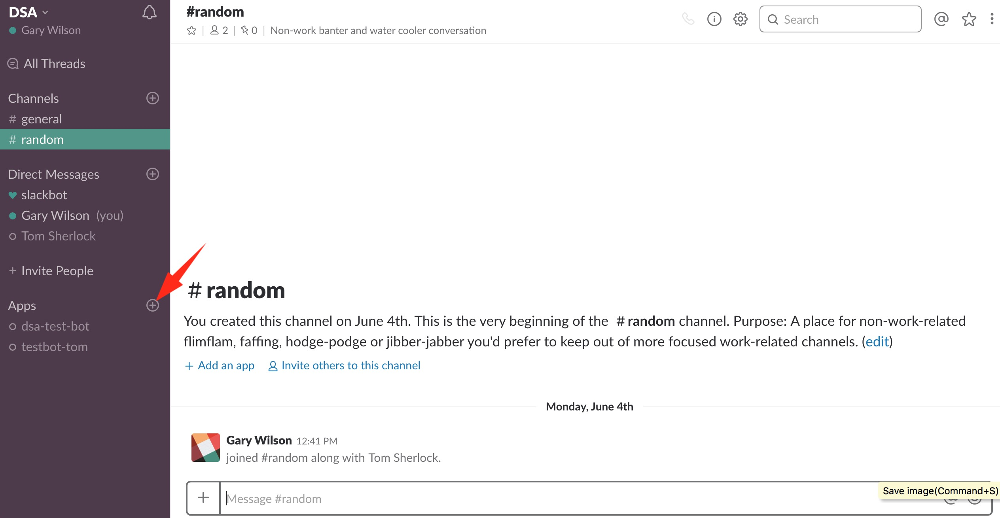

**(3)** Select `View App Directory` then in the search field type in `bots` and select the `Bots` option from the dropdown list:

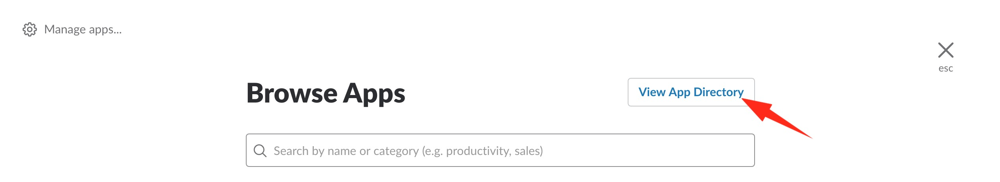

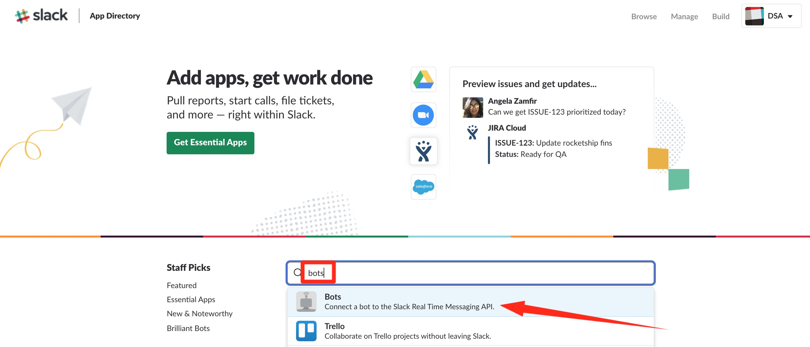

**(4)** Select `Add Configuration`, then choose a unique username for your bot and hit `Add bot integration`:

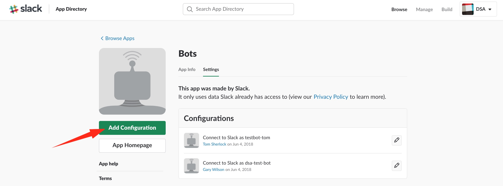

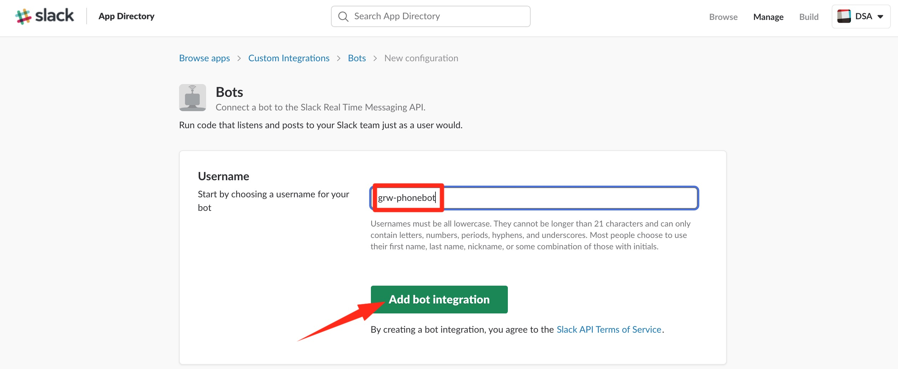

In general, you can create bots in any Slack workspace which you are a member of and authorised to do so, at https://insert-slack-workspace-name-here/services/new/bot.

**(5)** Save the API Token you get at this point - you'll need it shortly.

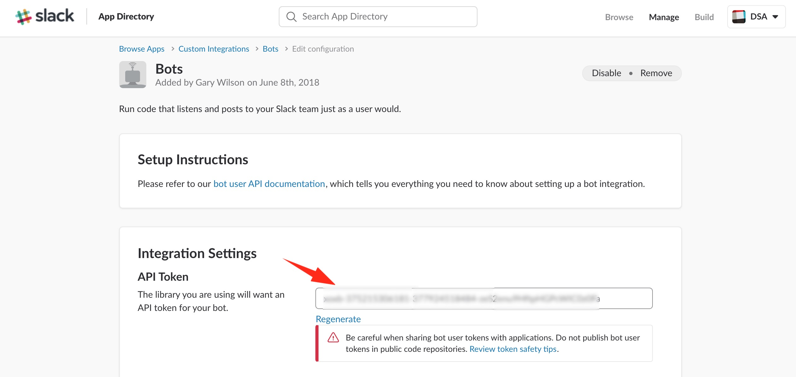

If you go back to your Slack workspace now you should see your newly created bot.


**(6)** Head over your Node-RED flow editor - we are going to create a new flow for the Slack chatbot that will be another way of interacting with your phone advisor chatbot. In order to do this, we are going to utilise some community-written Node-RED nodes that take all the hard work out of communicating with Slack!

**(7)** In the top-right menu of your Node-RED editor select the `burger` icon and `Manage palette`.


**(8)** Select `Install`, enter `node-red-contrib-slackbot` in the search field and `Install` it.

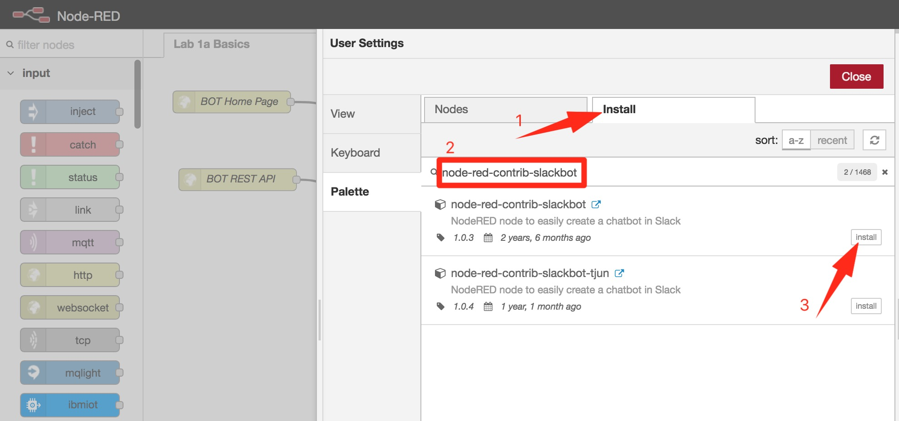

You'll then be asked to confirm the `Install`. Go ahead and do this, and after a few seconds you should get a `Notes added to palette` message.

**(9)** Drag `Slack Listen`, `Assistant`, `Function` and `Slack Reply` nodes onto the Node-RED editor and connect them together:

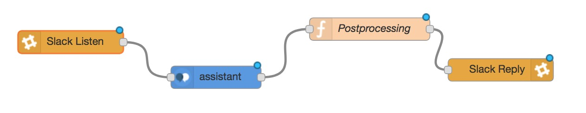

**(10)** Configure the `Slack Listen` node by double-clicking it, then clicking on the pencil in the node properties next to `Slackbot Token`. Enter the `Bot name` and `API Token` you saved in **(5)**.

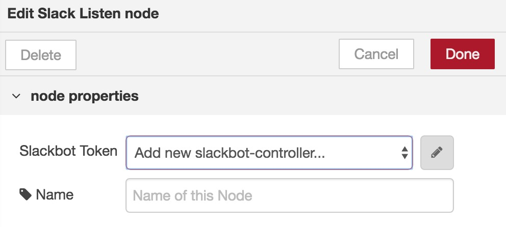

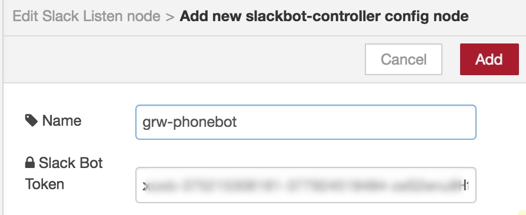

**(11)** Configure the `Slack Reply` node to use the same bot, by selecting it from the pulldown list in the node properties.

**(12)** Amend the `Assistant` node to match your Watson Assistant phone advisor Workspace ID and ensure `Save context` is checked.

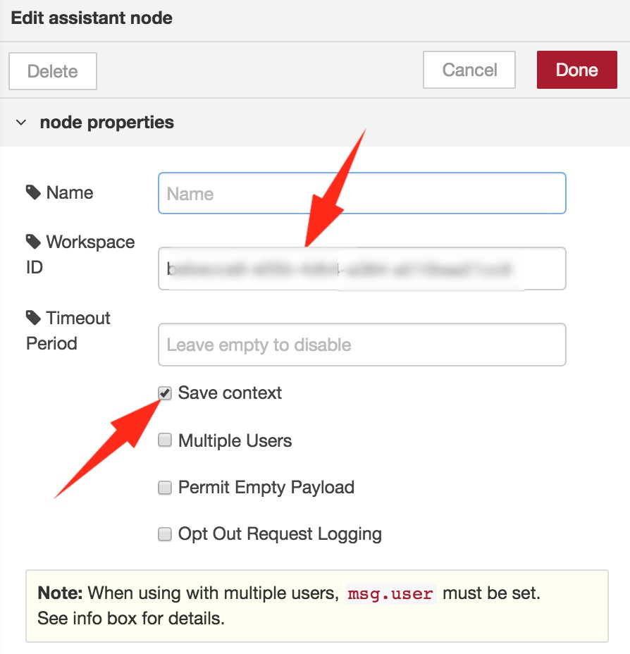

**(13)** Paste this into the `Function` node we've called `Postprocessing`:
```javascript
var output = msg.payload.output.text;
for (var t in output) {
    msg.payload = output[t];
    node.send(msg);
}
return ;
```
This simple bit of Javascript formats and sends a Slack message for every response received from Watson Assistant.

**(14)** Deploy your Node-RED flow, and go over to Slack and try to chat with your bot.

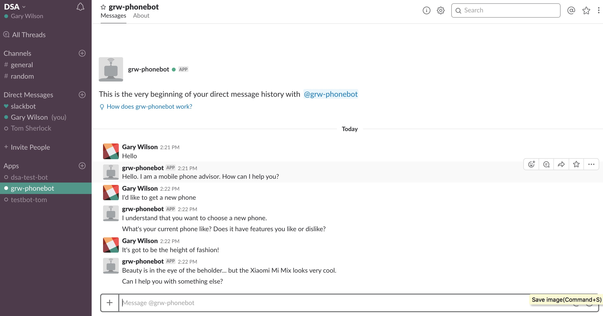

**(15)** You can download and import the whole flow [here](./Node-RED/slack-flow.json).

Well done! You've built a basic chatbot that uses two UIs!

Next you should go to the [Cognitive Lab 2](../2-Extended) material and extend your chatbot by using more Watson Assistant functionality as well as some new Watson Natural Language Understanding capabilities.
