# Cognitive: Basics
Build a Web Chatbot Application utilising the Watson Conversation API, and then connect it to a third party chat service (Slack).

## Requirements
- IBM Cloud account
- Slack account

## Agenda
##### Part 1: Create a Web UI chatbot using Watson Conversation & Node-RED
- Setup a Conversation instance
- Create intents and entities
- Create a dialog tree utilising your intents and entities
- Setup a web UI and a Node-RED orchestration app

##### Part 2: Create a Slack chatbot
- Create a Slack bot
- Install Slack nodes and setup a Node-RED app
- Create request and response routing to your Conversation service

## Creating Conversation instance
In this section we are going to create a [Conversation](https://www.ibm.com/watson/developercloud/conversation.html) with a basic dialog structure to power our bot.

**(1)** Log into IBM Cloud and create a Watson Conversation service (if you don't already have one).
  - click on `Create Service`
  - search for and select `Conversation`
  - create the service with a unique name - the `Lite` plan is fine to use.

  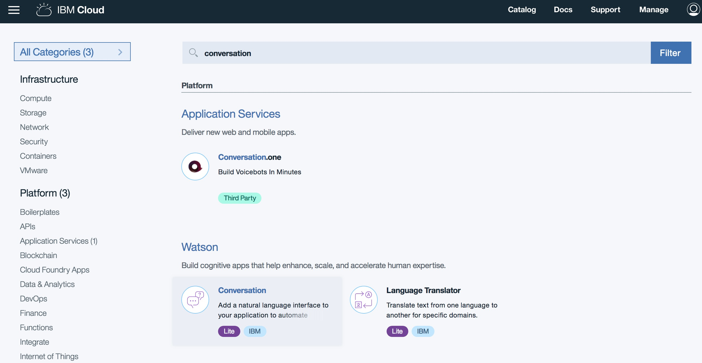  

**(2)** Launch the Watson Conversation tool by clicking on `Launch tool`.

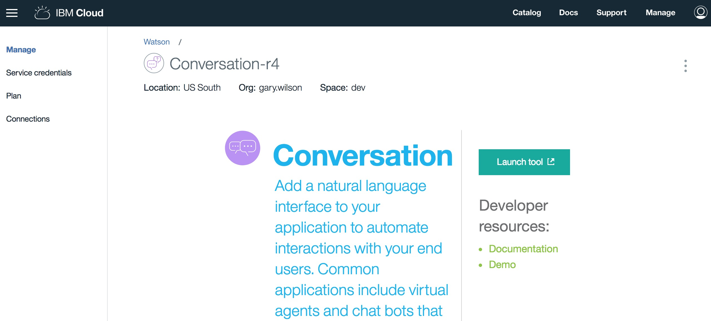

**(3)** Create a new `Workspace`, then we'll go on to create `Intents`, `Entities` and `Dialogs` - if you need help beyond what you find in this lab you can use [this documentation](https://console.bluemix.net/docs/services/conversation/getting-started.html#gettingstarted).

**(4)** Create `Intents`.

An intent represents the _purpose_ of a user's input. By recognising the intent expressed by a user, the Conversation service can choose the correct dialog flow to use to respond to it. To plan the intents for your application, you need to consider what your customers might want to do, and what you want your application to be able to handle.

Choosing the correct intent for a user's input is the first step in providing a useful response. The intents you identify for your application will determine the dialog flows you need to create; they also might determine which back-end systems your application needs to integrate with in order to complete customer requests (such as customer databases or payment-processing systems).

You should use several examples - at least nine or ten - for each intent you create in Watson Conversation. For our chatbot, we'll start with the following intents:


Select `Add Intent` to create each of these:
  - **#positive** for expressing positive opinion about mobile phones ... e.g.

  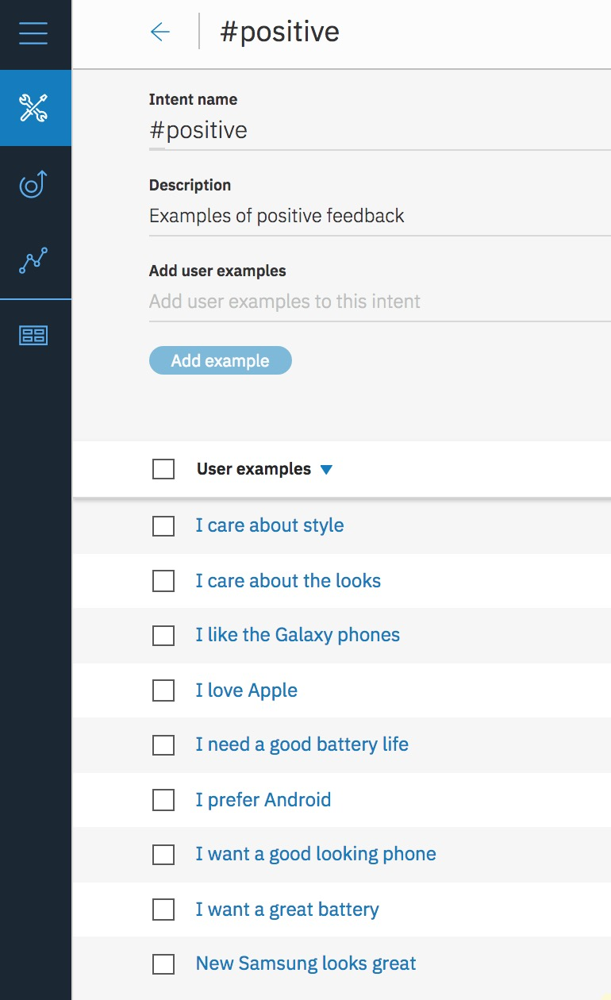
  - **#negative** for expressing negative opinion ... you should build this to look pretty much the inverse of your `#positive` intent, e.g.

  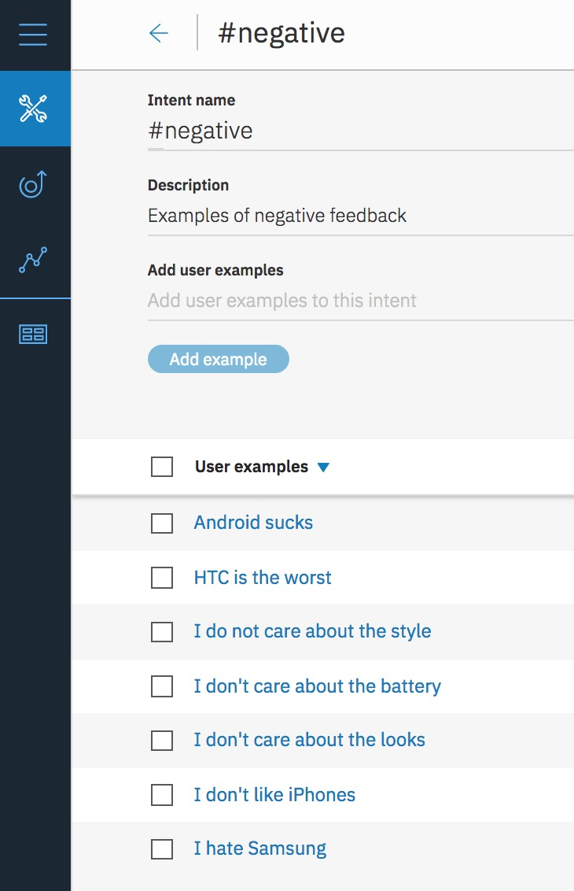
  - **#newphone** for expressing intent to buy or get advice about buying a new phone, e.g.

  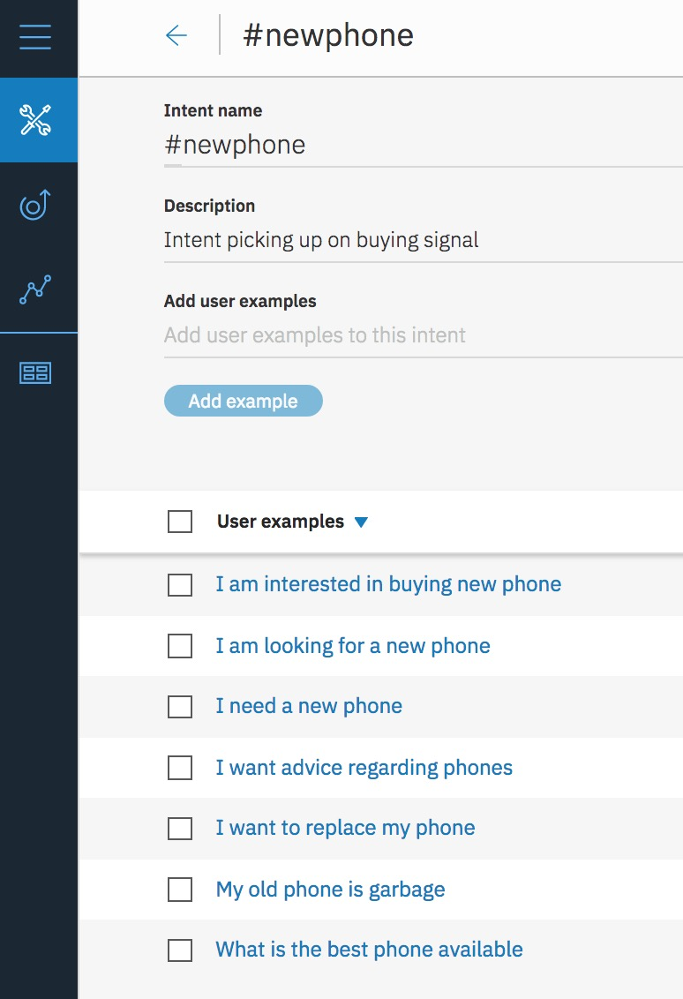
  - **#greeting** to capture greetings such as Hi, Hello, ...

  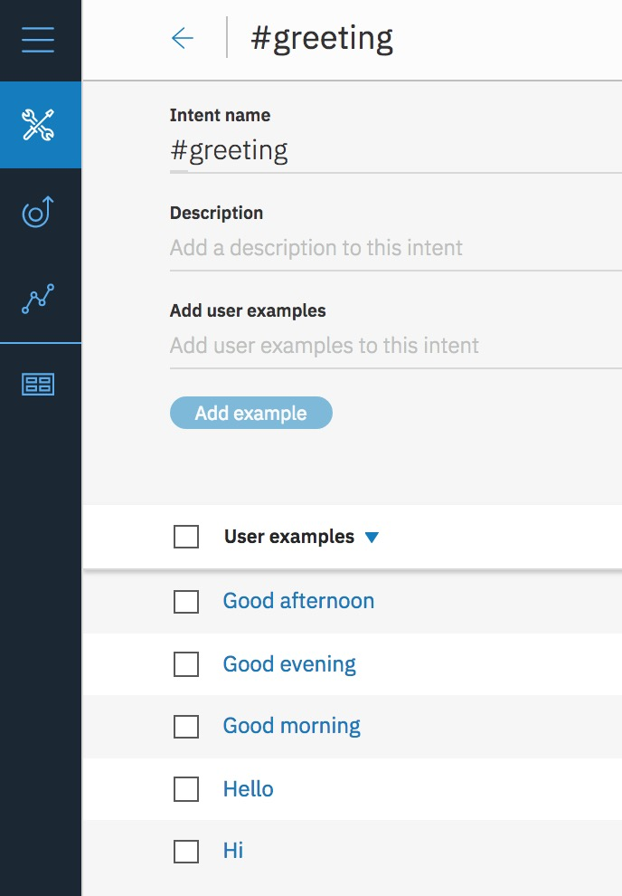

**(5)** Create `Entities`.

An entity represents a term or object in the user's input that provides _context_ for a particular intent. If intents represent _verbs_ (something a user wants to do), entities represent _nouns_ (such as the object of, or the context for, an action).

Entities make it possible for a single intent to represent multiple specific actions. An entity defines a class of objects, with specific values representing the possible objects in that class.
In our case we want to create the following entities:

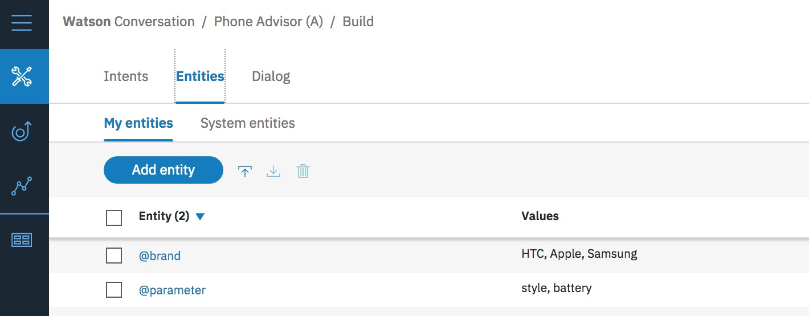
 - **@brand** with values _Samsung_, _Apple_ and _HTC_ (feel free to include more)

 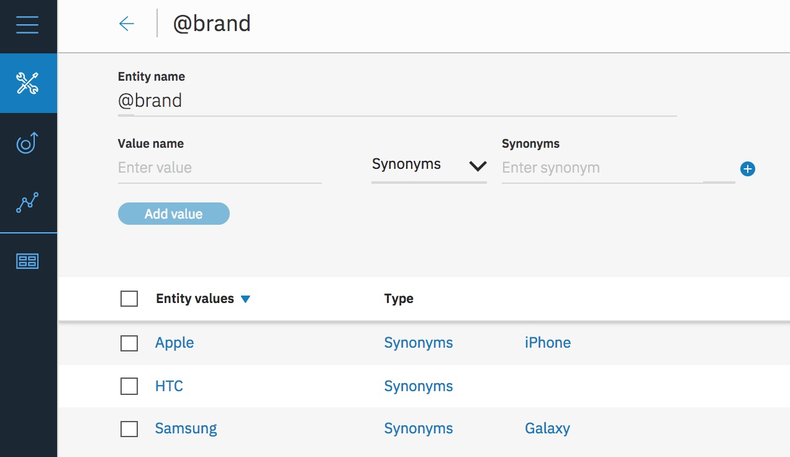
 - **@parameter** with values '_battery_' and '_style_'

 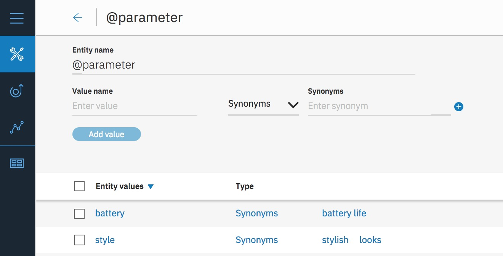
 - Note that you can add synonyms like _iPhone_ that will link to the _Apple_ brand, and _looks_ and _stylish_ that are also representative of the _style_ parameter.

**(6)** Create a `Dialog` tree. A dialog uses the intents and entities that are identified in the user's input, plus context from the application, to interact with the user and ultimately provide a useful response. Our dialog tree should help the user choose a new mobile phone based on an existing preference or a required characteristic.
  - Select `Dialog` from the menu bar, and then hit `Create`.
  - `Welcome` and `Anything Else` nodes will be automatically generated for you. These nodes are used to initialise the dialog with the user, and catch any user input that we don't have a specific response for.
  - Modify the `Welcome` node so it looks like this:   

  
  This will ensure the chatbot will always start with the _"Hello. I am a mobile phone advisor. How can I help you?"_ message.
  - You can leave the `Anything Else` node with its default settings.
  - Next, create a `Help` node by selecting Add Node. Name it `Help`, and set the response as seen here:

  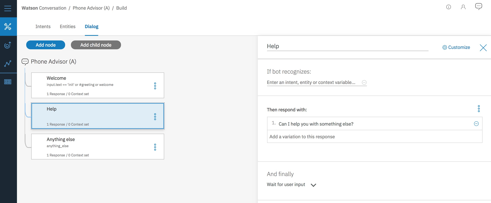

  - Now we'll construct your `New phone` advisor node. Here we will look for positive or negative user responses, based on our previously built `intents`, as well as picking up either a brand name or a characteristic (parameter) defined by our `entities`.  Our dialog responses will differ, and be based on the user input.
  - Start by adding a new node `New phone`, which is invoked if the `#newphone` intent is recognised. Add a response confirming that the bot understands!

  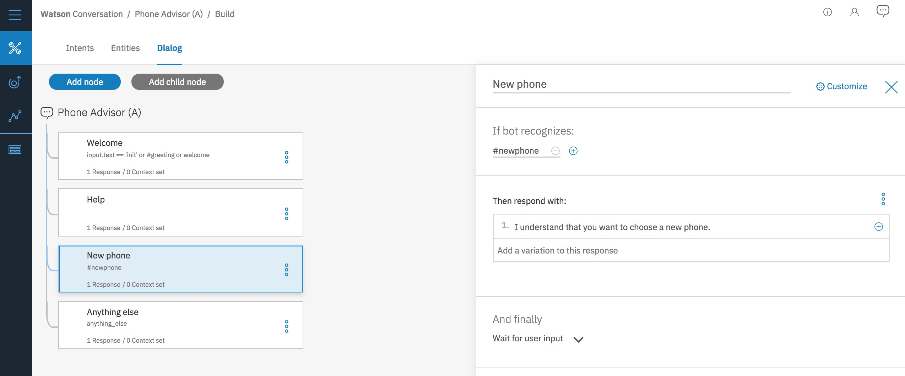

  - Next add a child node to your `New phone` node. You can do this by selecting the `New phone` node and choosing the `Add Child Node` option which will appear above the dialog tree, or by selecting the three dots on the `New phone` node and then `Add Child Node`. Call this child node Select, and enter the response as shown:

  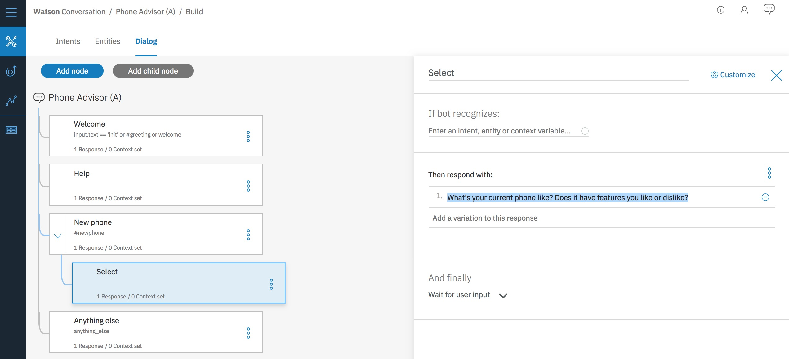

  - This node is asking the user what they like/dislike about their phone. We'll add some more logic to this soon, but in order to drop into this child node directly from the `New phone` node (i.e. without user input), we need to `Jump` to it.
  - Select the three dots on the `New phone` node and then the `Jump to` option:

  

  - You will then be asked for a _destination node_. Pick the `Select` node and `Respond` from the presented options.

  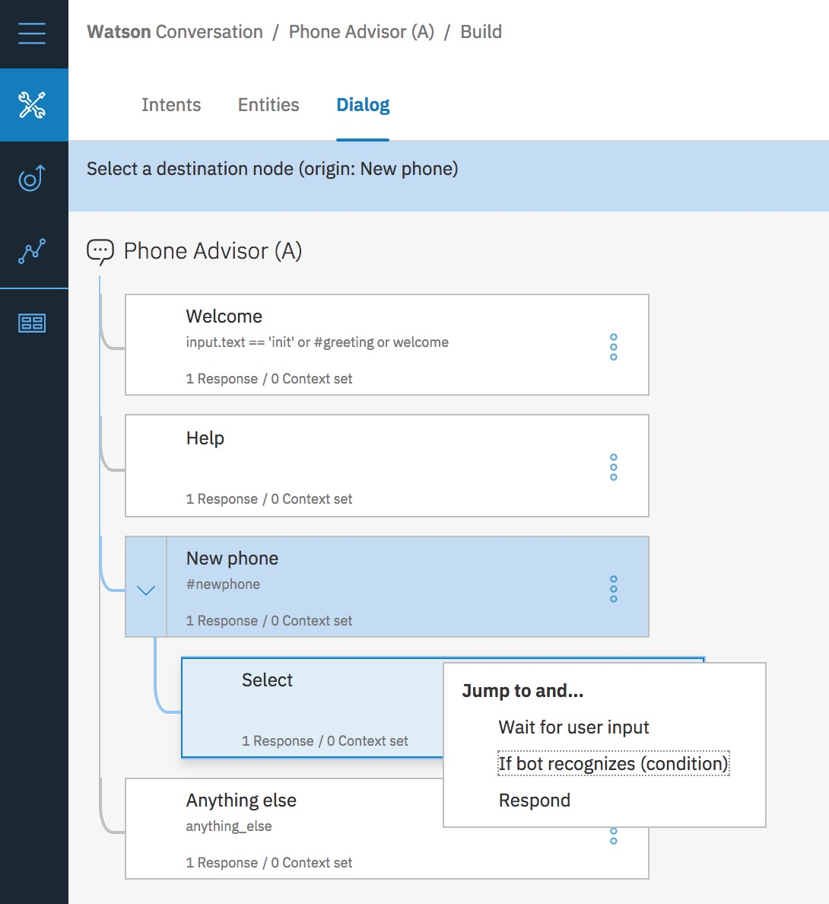

  - Your dialog tree should then look this this:

  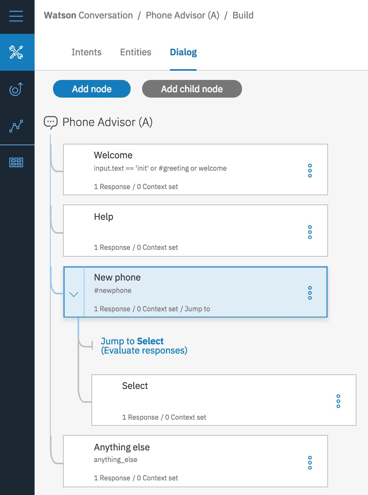

  - Finally, create four child nodes of the `Select` node that will ultimately decide the chatbots response to the user's preference:

  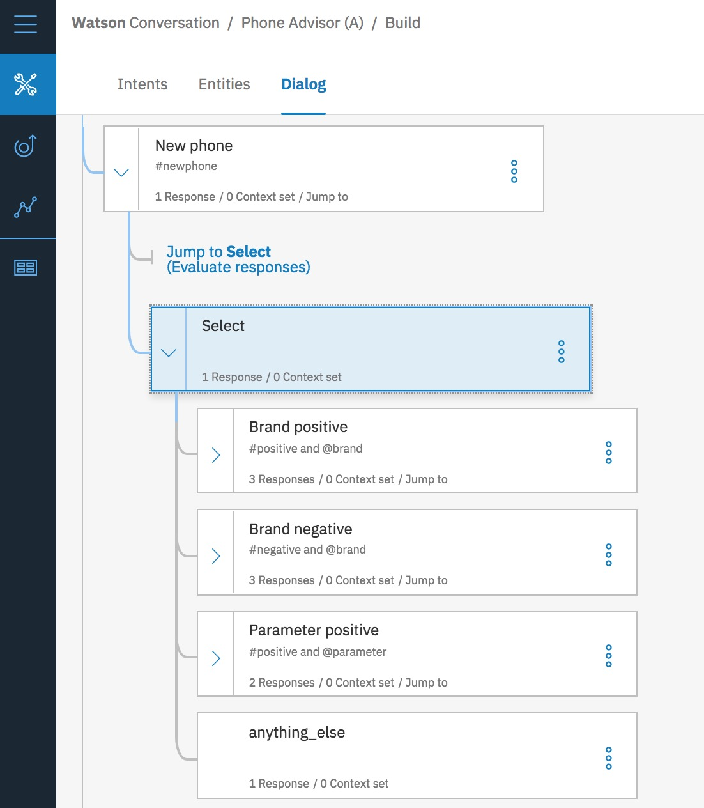

  - `Brand Positive` should check for `#positive` intent and a `@brand` entity - it is looking for positive feelings about a brand, and will then respond with a recommendation. When you edit this _and each of the other child nodes_, you should ensure that you allow for multiple responses by first selecting `Customize` from the top right, and then ensuring `Multiple responses` is set to `On`.

  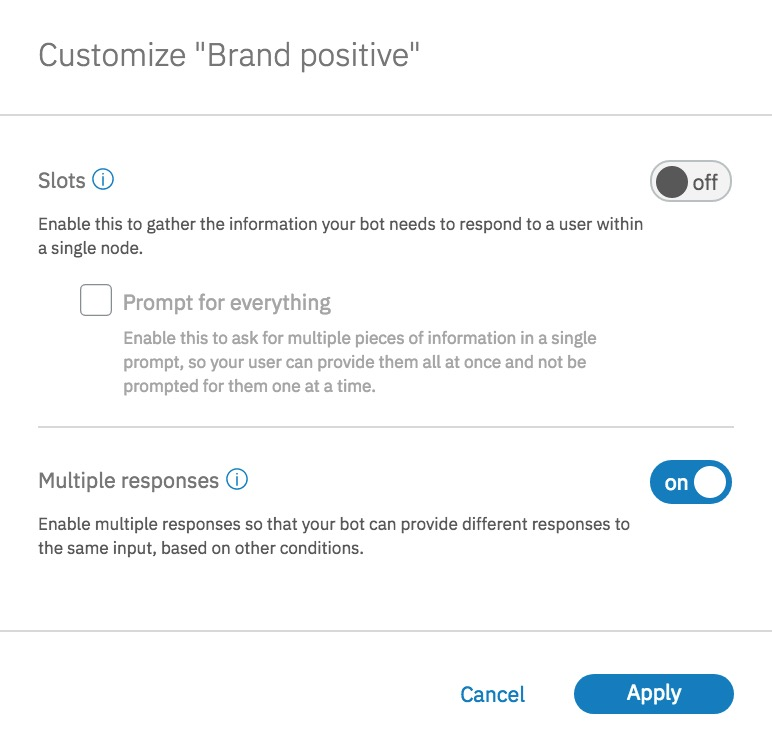

  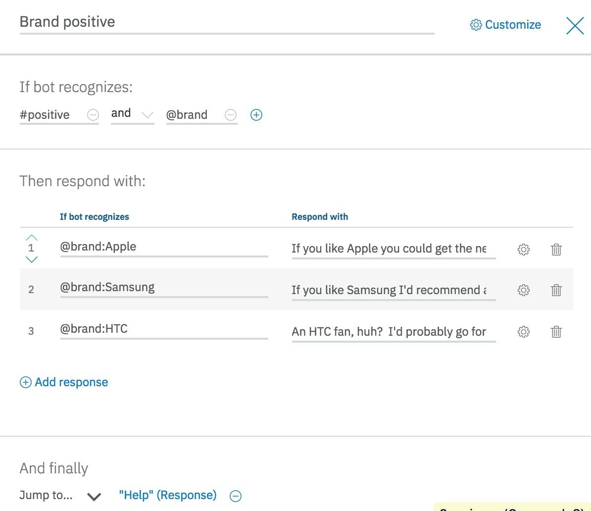

  - Use responses like these, or make up your own!
    - Apple: _"If you like Apple you could get the new iPhone.  It's pretty cool."_
    - Samsung: _"If you like Samsung I'd recommend a new Samsung Galaxy S8."_
    - HTC: _"An HTC fan, huh?  I'd probably go for the HTC One."_


  - Make sure you `Jump to` to `Help` node, via the `And finally` section at the bottom of the node. This will ensure that we drop out of the dialog and ask the user if they would like any more help.

  - Now create the `Brand Negative` child node. It should look pretty much like `Brand Positive`, except it will test for a `#negative` intent and a `@brand` entity.

  - Use responses like these for negative sentiment about a brand, or again make up your own!
    - Apple: _"If you don't like Apple you could go for an Android fun, maybe a Samsung Galaxy or HTC One?"_
    - Samsung: _"If you want to steer away from Samsung but stay with Android then you could try an HTC One, or for a change you could go for a new iPhone?"_
    - HTC: _"If you don't like HTC, try a Samsung Galaxy S8 if you want to stay with Android, or maybe a new iPhone?"_


  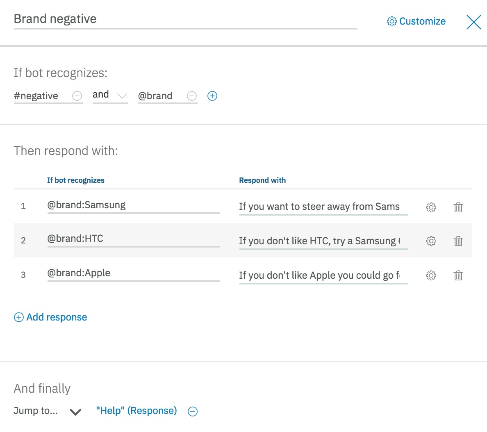

  - For the `Parameter Positive` child node look for `#positive` intent and a `@parameter` entity, using responses similar to:
    - battery: _"If you need a long battery life then go retro! There's an updated Nokia 3310 out now."_
    - style: _"Beauty is in the eye of the beholder... but the Xiaomi Mi Mix looks very cool."_

  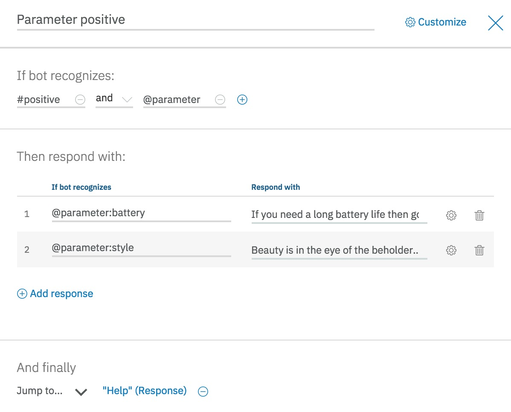

  - The final child node should be a catch-all for any user input we don't understand in this dialog branch. It should test for `anything_else`, respond with _"I'm not sure I understand."_ and then _wait for user input_.

  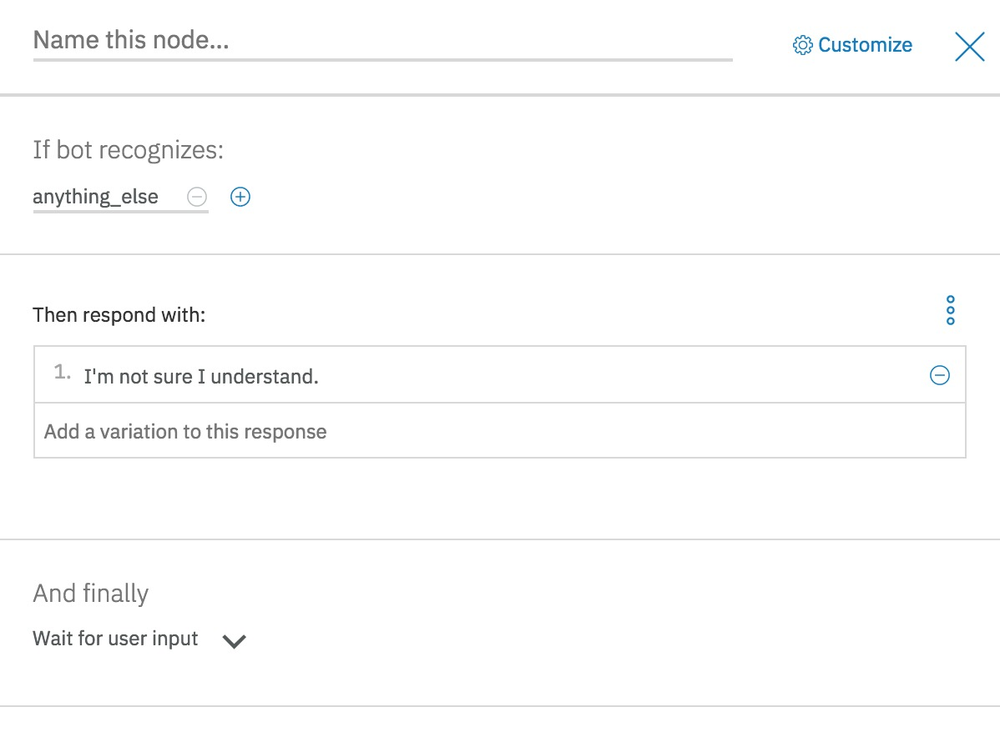

**(6)** If you prefer, you can download the whole Workspace [here](./Conversation/basic-workspace.json).
  - You can import a Workspace by clicking on the  icon next to the `Create` button in Workspaces

**(7)** You can test your dialog inside the Conversation tool. Select the Ask Watson speech bubble at the top right of the screen to enter the dialog tester:

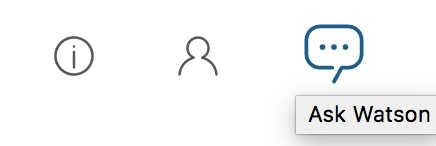

  - Try and test all of your dialog branches. It'll look something like this:

  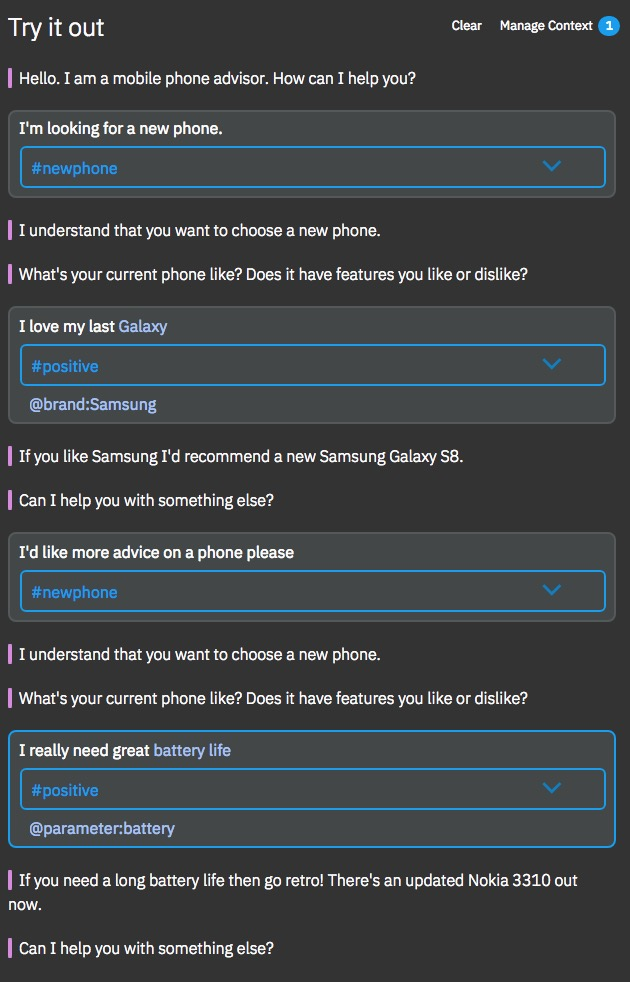

  - If you enter something Watson Conversation doesn't recognise, it will tell you, and give you the chance to further train Watson. In this example I've entered _"I've had real problems with my iPhone 6"_. Note that Conversation picks up the `@brand` entity but doesn't know how to deal with my intent:

  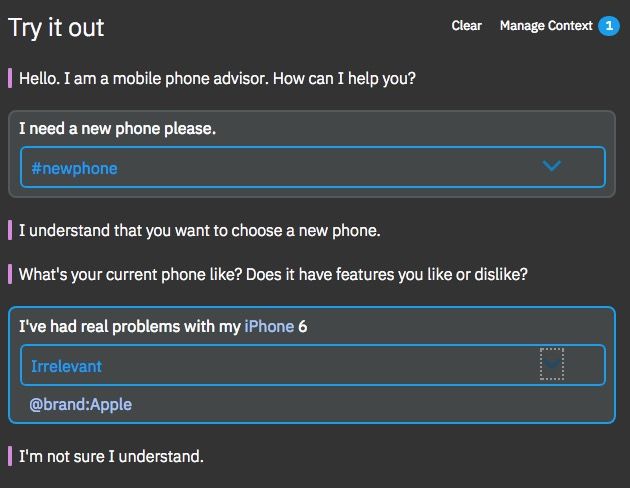

  - At this point, as I know this is a negative intent, I can select `#negative` from the drop down menu:

  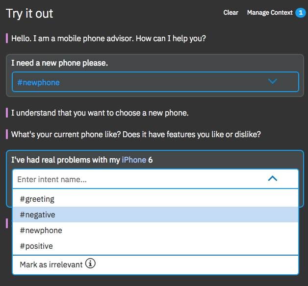

  - When we do this, Watson retrains our workspace by adding this text as another example to our `#negative` intent. After training is complete, a similar user response will now work! Check your `#negative` intent to see that the new example has been added.

  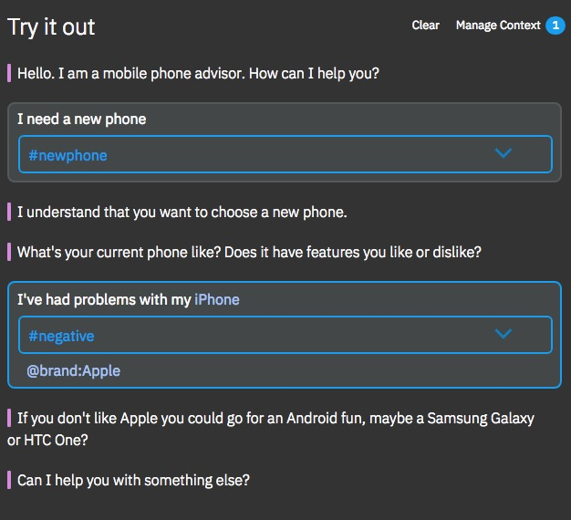

**(8)** Finally, go back to the Watson Conversation Workspaces menu, click on the three dots for the Workspace you created, `View Details` and copy and save the Workspace ID. You'll need this for your Node-RED flow.

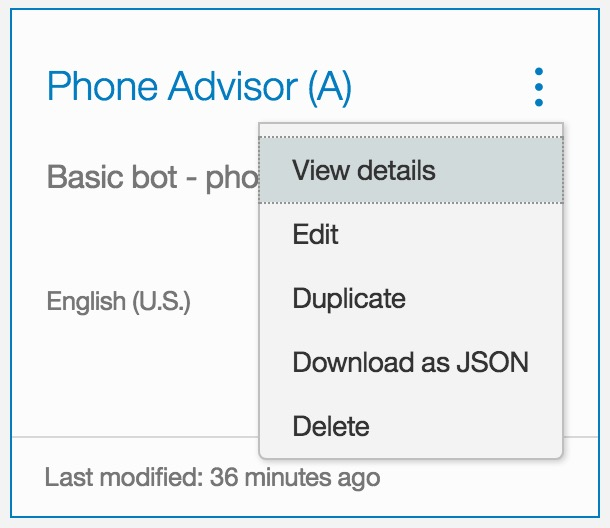

## Creating a UI for the Conversation app using Node-RED
In this section we are going to create a UI for our chatbot using Node-RED.

If you are new to Node-RED then take a look at [this tutorial](https://nodered.org/docs/getting-started/first-flow) to get started.

**(1)** Log into IBM Cloud and if you don't already have one, create a Node-RED Boilerplate Application.
  - click on `Catalog`
  - filter on _node-red_ and select `Node-RED Starter`

    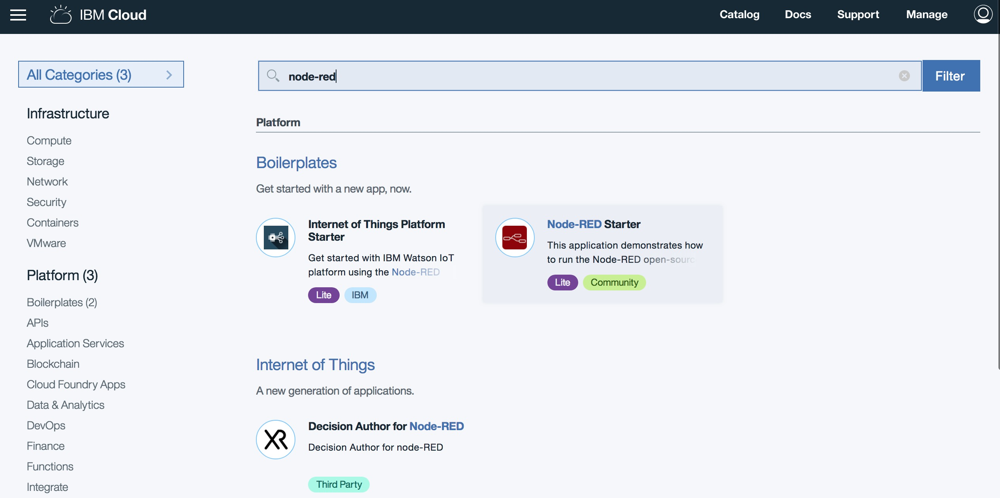

  - `Create` a new Node-RED application with a unique name

**(2)** After creating the application (or even if you've previously created it) go to `Overview` from the left menu bar and increase the `GB MEMORY PER INSTANCE` from the default of 256Mb to at least 512 Mb, preferably 1Gb. You can increase the value but can't `Save` it until your application is started.

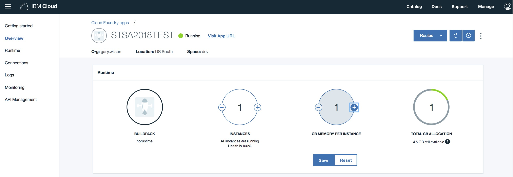

  - Once you save this change your Node-RED instance will automatically restart.

**(3)** Next select `Connections` from the left menu bar, and click on `Create connection`:

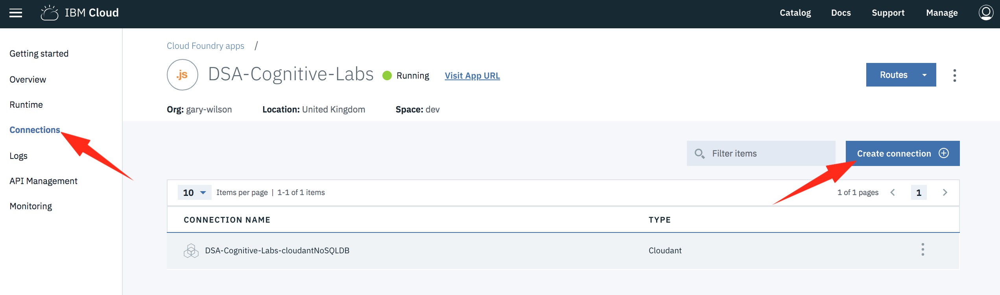

**(4)** Find the Conversation instance we've just created, `Connect` it using the button, and `Restage` your Node-RED app when asked. IBM Cloud will ask you if you want to do this when you add a new connection, or you can do it any time by issuing the `cf restage my-app` command from a terminal window, where _my-app_ is your IBM Cloud Node-RED application name.

**(5)** After restaging, go to the app's URL and go through the Node-RED initialisation process. If you don't know the URL you can navigate directly to it from the `Visit App URL` link you can see in the screenshot in **(2)** above.

**(6)** Go to the Node-RED flow editor.

**(7)** We are going to create two flows. One will setup a basic web conversation UI, and another will do the bulk of the work communicating with the Conversation dialog.

**(8)** For the first flow, create:
  - `http in` node: edit the node properties with method `GET` and URL `/bot`
  - `http response` node
  - `template` node - copy the HTML content from [here](./Node-RED/template.html) into the Template section of the node properties:

    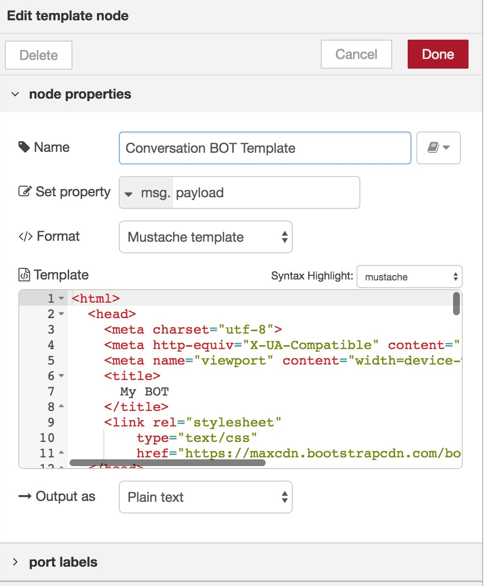

**(9)** Connect them together as shown here:

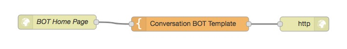

**(10)** For the second flow create:
 - `http in` node with method `POST` and URL `/botchat`
 - `function` node with the following code, which takes the input from the web UI and formats it for passing to Watson Conversation:
```javascript
msg.params = msg.params || {};
msg.params.context = msg.payload.context;
msg.payload = msg.payload.message;
return msg;
```
 - `Conversation` node with Workspace ID of your workspace. You retrieved this previously by selecting `View Details` from your Conversation Workspace.
 - `http response` node

**(11)** Connect them together, `deploy` them in Node-RED and go to your newly constructed UI. You'll find it at: **_your-Node-RED-application-name_.mybluemix.net/bot**

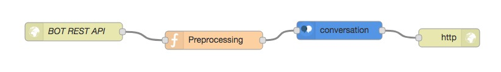

**(12)** Note: you can always access the Node RED editor at **_your-Node-RED-application-name_.mybluemix.net/red**

**(13)** You can download and import the whole flow [here](./Node-RED/basic-flow.json) ... don't forget to _update the Workspace ID in the Conversation node_ if you do use this!

**(14)** The web application should look something likes this: 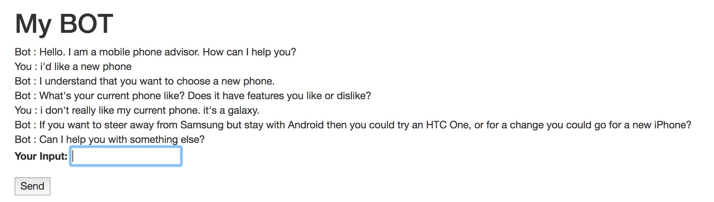

- If your chatbot isn't working as you expect, you should wire debug node(s) into your Node-RED flows to determine where the error is.

**(15)** You can also debug by looking at `User Conversations` in the Watson Conversation application. This can show you if you are finding the right `intents` and `entities` as you move down your dialog tree. 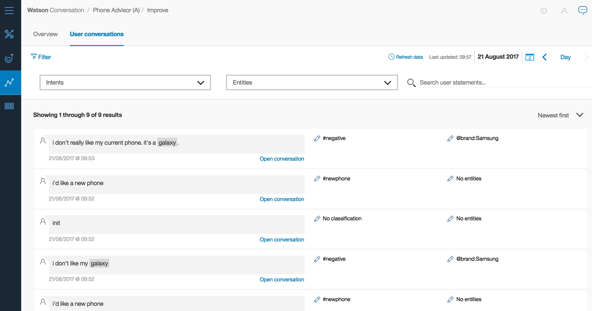

You can also train and further improve Watson Conversation using this feature - read more about it [here](https://console.bluemix.net/docs/services/conversation/logs.html#about-the-improve-component).

## Connecting Conversation with Slack
**(1)** Login to Slack and choose a unique name for your bot. In general, you can create bot in any Slack team which you are a member of [here](https://my.slack.com/services/new/bot).

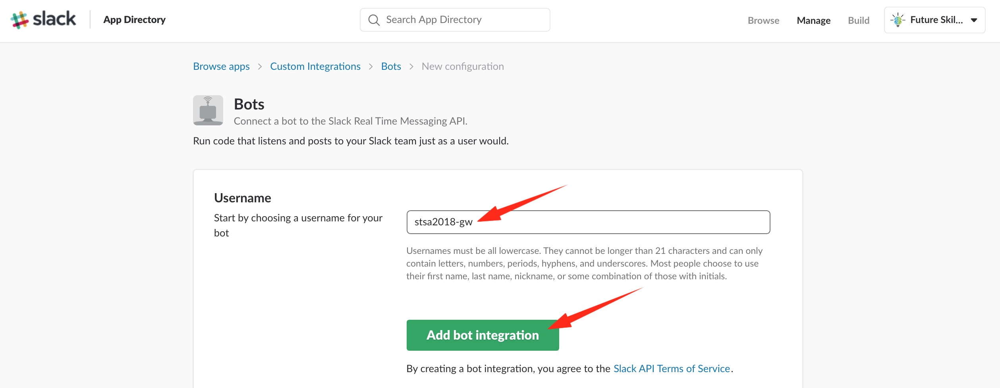

**(2)** Save the API Token you get at this point - you'll need it shortly.

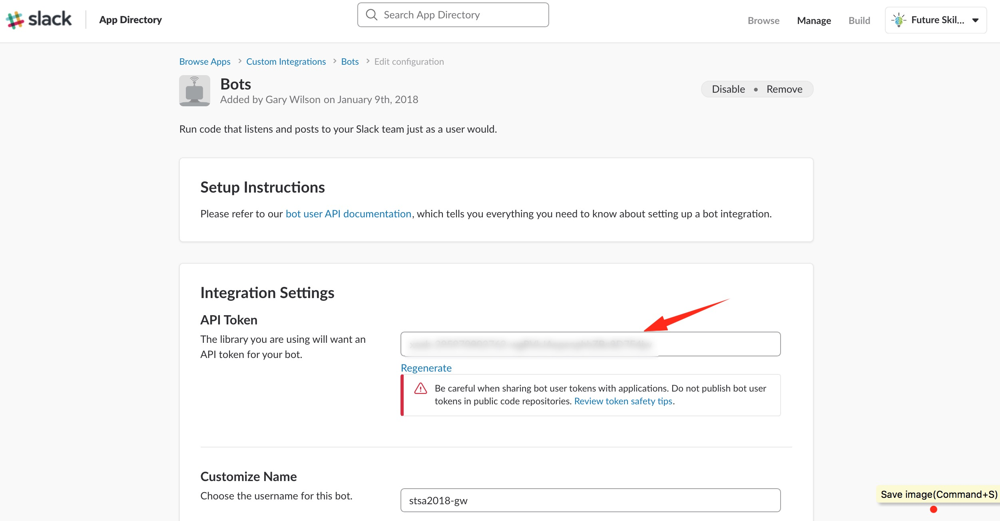

**(3)** Head over your Node-RED flow editor - we are going to create a new flow for the Slack chatbot that will essentially be another way of interacting with your conversation.

**(4)** In the top-right menu of your Node-RED editor select the `burger` icon, `Manage palette` and then `Install`:

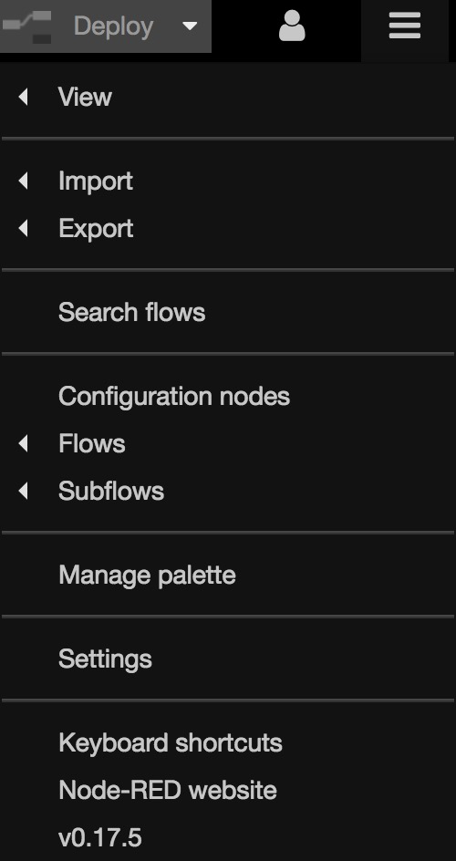

**(5)** Search for and install `node-red-contrib-slackbot`.

**(6)** Drag `Slack Listen`, `Conversation`, `Function` and `Slack Reply` nodes onto the Node-RED editor and connect them together:

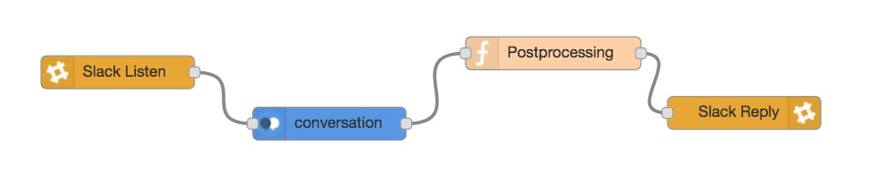

**(7)** Configure the `Slack Listen` node by double-clicking it, then clicking on the pencil in the node properties next to `Slackbot Token`. Enter the `Bot name` and `API Token` you saved in **(2)**.


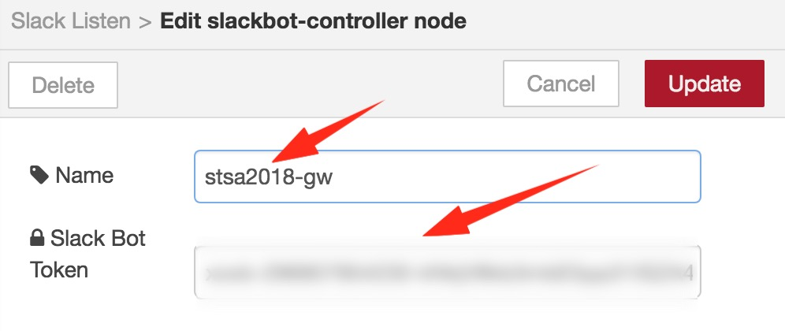

**(8)** Configure the `Slack Reply` node to use the same bot, by selecting it from the pulldown list in the node properties.

**(9)** Amend the `Conversation` node to reflect your Watson Conversation Workspace ID and ensure `Save context` is checked.

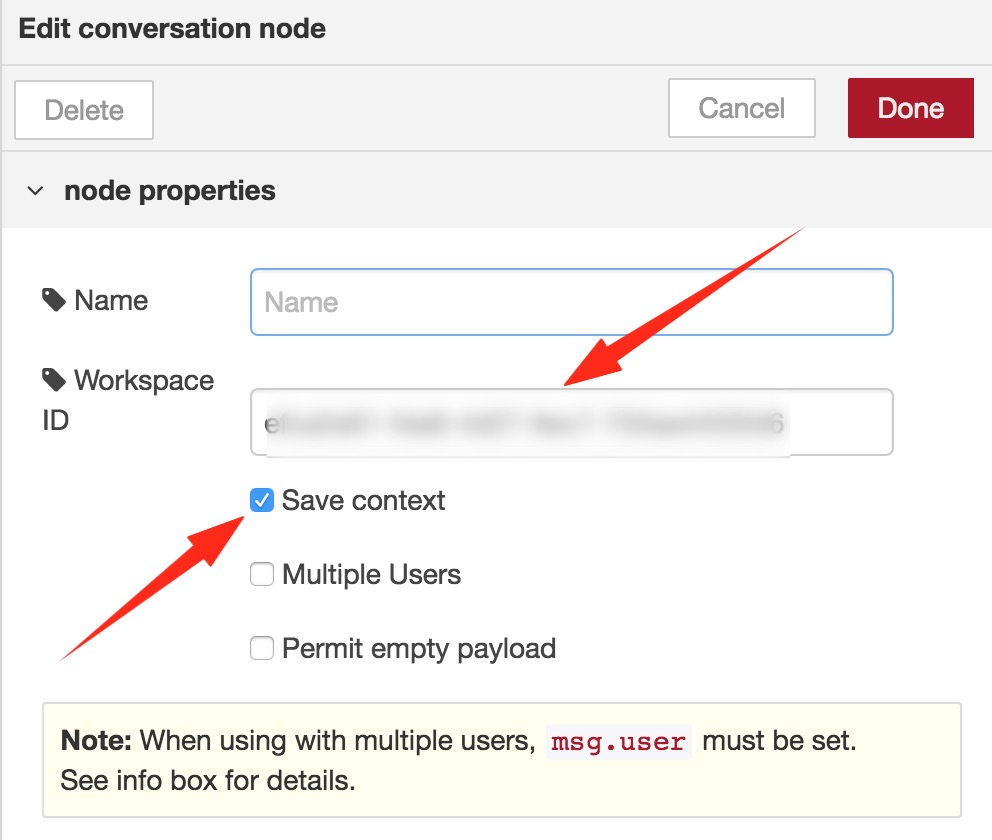

**(10)** Paste this into the `Function` node we've called `Postprocessing`:
```javascript
var output = msg.payload.output.text;
for (var t in output) {
    msg.payload = output[t];
    node.send(msg);
}
return ;
```
This simple bit of Javascript formats and sends a Slack message for every response received from Watson Conversation.

**(11)** Deploy your Node-RED flow, and go over to Slack and try to chat with your bot.

- Add your new bot to Slack from the `Apps` section. You need to need to be using the same Slack workspace here as you used when you created your bot.

  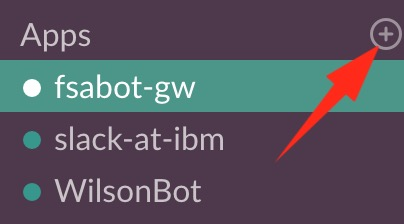

  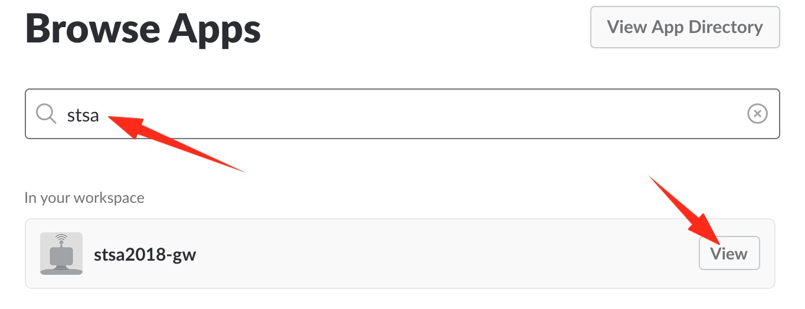

- Try it out!

  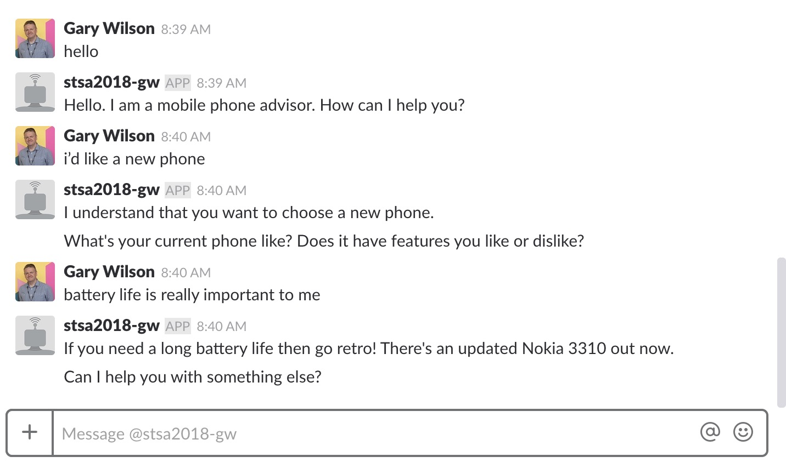

**(14)** You can download and import the whole flow [here](./Node-RED/slack-flow.json).

Well done! You've built a basic chatbot that uses two UIs!

Next you should go to the [Cognitive: Extended](../2-Extended) lab to extend your chatbot using more Conversation and Natural Language Understanding capabilities.
