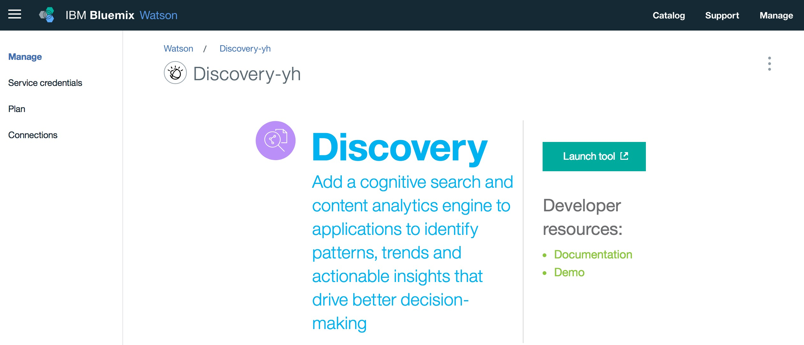
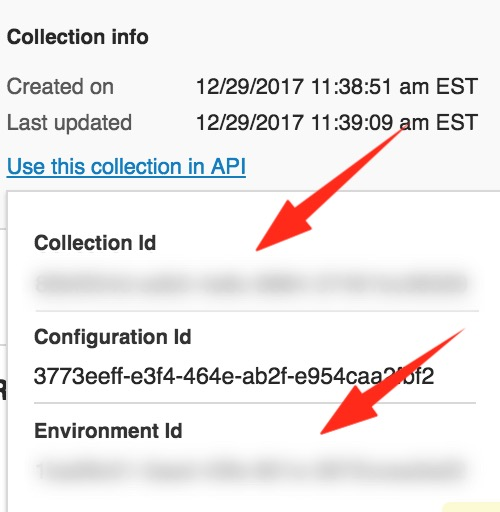
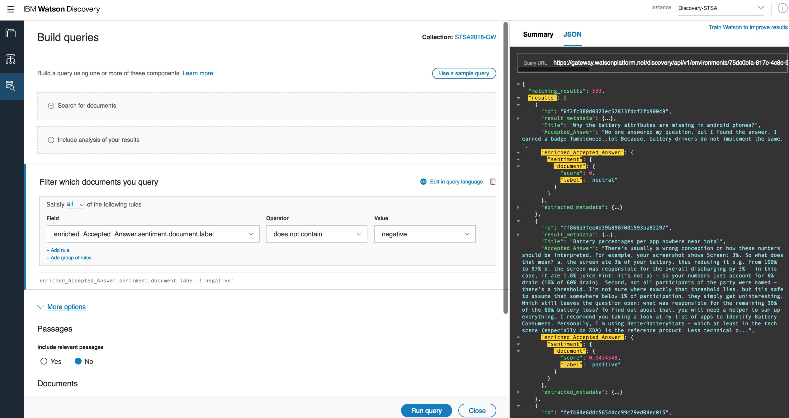
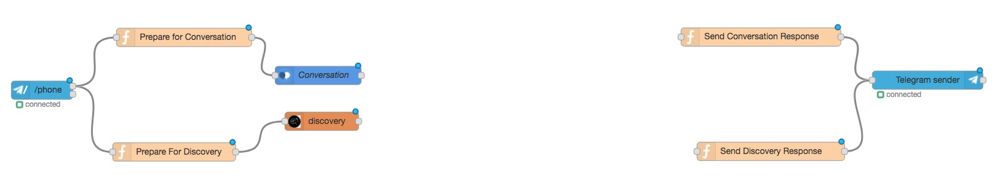
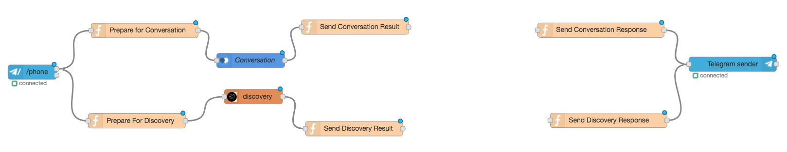
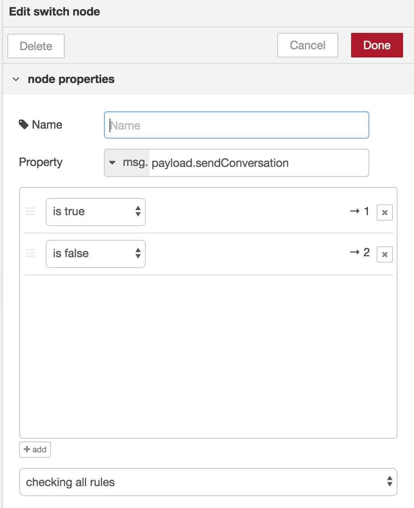
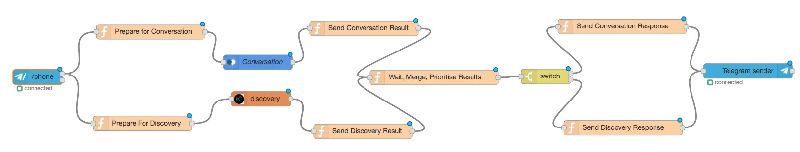
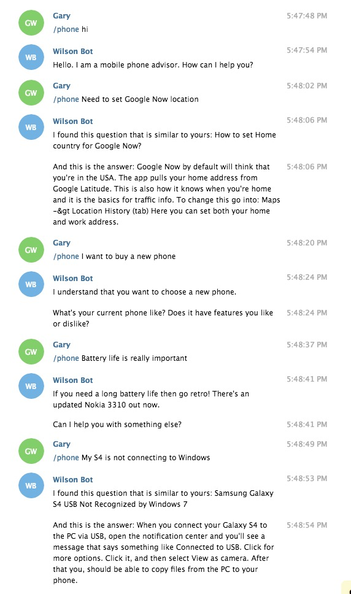

# Cognitive: Discovery
This lab will focus on extending your simple chatbot to handle long tail conversations, by using the Watson Discovery service. We'll also make use of another 3rd party chat service - _Telegram_.

## Requirements
- Successful completion of _Cognitive: Basics_ lab

## Agenda:
- setup Telegram chatbot interface
- setup Discovery Service instance
- setup Discovery document collection
- build Discovery Q&A repository
- setup Node-RED orchestration application
- query Discovery through Bot
- connect Discovery and Conversation

## Set up Telegram chatbot interface
This lab builds on the simple conversation workspace created in the _Cognitive: Basics_ lab, and uses the Telegram messaging interface.  The first thing we need to do therefore, is set up a new Telegram chatbot.

**(1)** If you haven't used Telegram before, download the app to your phone:

  - Android:  https://play.google.com/store/apps/details?id=org.telegram.messenger
  - iOS:  https://itunes.apple.com/app/telegram-messenger/id686449807

**(2)** Once you've successfully signed up, you can either continue to use Telegram via the app, or you can also use the Telegram web interface [here](https://web.telegram.org).

**(3)** Use the search bar in the app to find **@botfather**:


**(4)** **@botfather** helps you create and manage Telegram bots. Send the message `/newbot` to @botfather.

**(5)** Follow the prompts to enter a name and username for your new bot, and then save the generated API token - you'll need this in your Node-RED flow shortly.


**(6)** Note that you can configure your bots at any time by using the `/mybots` command with @botfather, including retrieving your API key if you misplace it.

**(7)** Now you have your Telegram bot, we'll set up Node-RED so it works with the simple conversation we created in the _Cognitive: Basics_ lab. Go to your Node-RED editor and add in the Telegram nodes via `Manage Palette`. You should install the `node-red-contrib-telegrambot` package.


**(8)** The flow for using Telegram as our chatbot UI is pretty similar to the one you created for Slack, with a minor tweak to cater for the way that the nodes handle getting responses routed to the right user. Download the code from [here](./Node-RED/basic-flow-telegram.json), copy all of the contents of the JSON file to the clipboard, and import it to Node-RED via the `burger` icon at the top right of your Node-RED editor, `Import`, `Clipboard`.


**(9)** Double-click the `Telegram Command` node on the left and then click the pencil to add your bot name and API token. Note that the command field is currently set to `/phone`, which means that only Telegram user input that is pre-fixed with `/phone` will be picked up by the flow.  This is a useful feature when it comes to testing.


**(10)** If you don't want to use the command feature, just wire up the `Telegram Command` node to the `Prepare for Conversation` node using the second output rather than the first. This will pass all user input rather than just those pre-fixed with `/phone`.  


**(11)** Change the `Conversation` node to use the Workspace ID of the basic Watson Conversation workspace you made a backup copy of at the start of the Extended lab, and edit the `Telegram Sender` node to point to your bot.

**(12)** Test your basic bot!


## Setting up the Discovery Service
In this section we are going to setup the Discovery service, create a custom collection containing potential long-tail questions and answers that a user might ask, upload the dataset and test a query.

**(1)** Create a `Watson Discovery` service in IBM Cloud (use the `Lite` plan if you are using your personal IBM Cloud ID, or `Standard` if you are using a linked account).


`Connect` this new service to your existing Node-RED application - using the same method you did with the Conversation and NLU services previously - and `restage` it when asked.

**(2)** Launch the Discovery tool from your newly created service and once in the application, `Create a data collection`.




**(3)** You may be guided to set up new storage - complete this process. Then give your new data collection a name, use the `Default Configuration` and click `Create`.


**(4)** Next, we are going to create a custom configuration that enriches our dataset. Click on `Switch`:


**(5)** Select `Create a new configuration` give it a name when asked, and close down the informational message talking about `Adding Sample Documents`.

**(6)** Download, and extract this [dataset](./data/discovery_data.zip) - it contains 1000 Q&A pairs in JSON format that can help our chatbot answer questions about specific mobile phone related issues. Watson Discovery allows you to add content to a collection using _Microsoft Word, PDF, HTML, or JSON documents_.

**(7)** Watson Discovery can enrich (add cognitive metadata to) your ingested documents with semantic information collected by these seven Watson functions - Entity Extraction, Sentiment Analysis, Category Classification, Concept Tagging, Keyword Extraction, Emotion Analysis and Semantic Role Extraction. We are going to just use **Sentiment Analysis** here, so we can filter out negative sounding responses before our chatbot responds to the user. You can find out more about enrichment [here](https://console.bluemix.net/docs/services/discovery/building.html#adding-enrichments).

**(8)** First, delete all default enrichments and hit `Apply and Save`. Then upload one sample JSON document from the extracted dataset by selecting `or browse from computer` and choosing one of the JSON files.


**(9)** Click on the uploaded document and then select the `Add a field to enrich` dropdown, then `Accepted_Answer`.


**(10)** For the `Accepted_Answer` field, select `Add Enrichment`, add just `Sentiment Analysis` and hit `Done`. You can see all of the possible enrichments we can apply on this screen.


**(11)** Hit `Apply and Save` then `Close`, and go back into your collection.  At this point, we are going to upload all of the documents to create our knowledge base. As we do this Watson Discovery will create the sentiment metadata for the `Accepted_Answer` field within each document.


- Drag and drop or browse and select **all** of the JSON documents from the previously extracted dataset. Watson Discovery will start to upload and process all of the files ... it will take a few minutes! You will see the `Document` count increase and the `General Sentiment` values change as Watson Discovery processes each of the files.

  

- Whilst on this screen make a note of `Environment ID` and `Collection ID` as we'll need them in our Node-RED flow.

  

**(12)** Let the `Document count` field get to about 100 before you do anything else. Whilst uploading and processing is ongoing, we can query the collection built so far by clicking on the `Build Query` icon  on the left side of the screen, selecting your collection from the dropdown menu and `Get Started`.

**(13)** If you select the `Run query` icon at the bottom of the screen you will see a selection of the documents in the collection that have been uploaded so far. Use the twisty next to one of the `enriched_Accepted_Answer` fields to see the sentiment score Watson Discovery has applied to the document.


**(14)** Next, we are going to make use of our enrichment by filtering out answers that have negative sentiment. Using `Filter which documents you query`, select:

  - Field: `enriched_Accepted_Answer.sentiment.document.label`
  - Operator: `does not contain`
  - Value: `negative`

At this point also set `Passages` to `No` in `More options`. _Passage Retrieval_ lets you find pieces of information within large documents that are ingested into Watson Discovery, finding relevant snippets of a document based on your query. For developers, Passage Retrieval can reduce the time that it takes to hand-craft data into consumable units of information for conversational chat bots or search and exploration interfaces. In our case, we already have _consumable units_ (Q&A pairs in JSON documents), so Passage Retrieval is not required.

If you run this query you will see the answer data is then filtered by positive and neutral responses only.



**(15)** You can test a natural language query of the collection by asking a question in `Search for documents`. Discovery will return documents in best match order. Try _"My Nexus 7 can't connect to Mac"_ as shown in the example here.


**(16)** For more on building queries, have a look at the tutorial [here](https://console.bluemix.net/docs/services/discovery/query-reference.html#query-building).

**(17)** When Watson Discovery has processed all the documents, we can now test the service in a Node-RED application, and incorporate it into our Telegram chatbot.

## Querying the Discovery through our Telegram chatbot
**(1)** In the previously imported Telegram Node-RED flow add a new `function` node called `Prepare for Discovery` with the following code:
```javascript
msg.chatId = msg.payload.chatId;
msg.discoveryparams = {};
msg.discoveryparams.query = msg.payload.content;
return msg;
```
This handles the Telegram chat interface and sets the query to be passed to Watson Discovery to be whatever has been entered by the user via the chatbot, e.g. _"My Nexus 7 can't connect to Mac"_.

**(2)** Add a `discovery` node and double-click to configure it. Set the Method to `Search in collection`.

**(3)** Enter the `Environment ID` and `Collection ID` you noted earlier, set `Number of documents` to `1` and turn-off `Passages`.

**(4)** Into the `Filter for Search` field, copy the filter that we used in our Discovery query earlier: `enriched_Accepted_Answer.sentiment.document.label:!"negative"`


**(5)** Add a function node `Send Discovery Response` that uses the code below. This node strips out the best matching response from Discovery (returned in the `msg.search_results.results` array) and sends it onto Telegram. `Title` and `Accepted_Answer` are the fields used in the original JSON Q&A pair documents. Because there are two messages sent back to the user, we are using a `setTimeout` function to delay the sending of the second message slightly, so they arrive in the correct order.
```javascript
var question = msg.search_results.results[0].Title;
var answer = msg.search_results.results[0].Accepted_Answer;

msg.payload = {
        chatId : msg.chatId,
        type : "message",
        content : "I found this question that is similar to yours: " + question
    };
node.send(msg);

// Use setTimeout function to ensure small delay in sending
// 2nd message to ensure answer arrives after question.

setTimeout(function (){
    msg.payload = {
            chatId : msg.chatId,
            type : "message",
            content : "And this is the answer: " + answer
        };
    node.send(msg);

    return;
}, 500);
```

**(6)** Connect the nodes up as shown below, delete the connection between the Telegram and `Prepare for Conversation` nodes (for now), and `deploy`.


**(7)** The whole flow can be found [here](./Node-RED/flow-1.json).

**(8)** You can test the bot's performance with questions like these:
 - _How do I know my compass is pointing the right way?_
 - _Can I keep reinstalling apps I've bought from the market?_
 - _The GPS on my HTC Desire is not working after upgrading_

## Connecting the short and long tail using Conversation and Discovery
In this section we want to combine the "power" of the Conversation service with the "knowledge" of the Discovery service by joining them together. When the user asks a question we are going to ask both services and then decide which is the most appropriate answer to use.
If Conversation is confident about the user's intent then we will use the answer from there, otherwise we will use the best answer from Watson Discovery.

**(1)** We need to send the same user input to Discovery and Conversation, so re-wire the Telegram Receiver output node to the `Prepare for Conversation` node.

**(2)** Now we need to create a function that will wait until both the outputs are forthcoming, merge the results, and check to see which response we will use. First though, sever the connections between the Watson services and the function nodes to the right. Your flow should now look like this:



**(3)** Drop in two new `function` nodes. Name one `Send Conversation Result` and use the code:
```javascript
msg.topic = "conversation";
return msg;
```
and name the other `Send Discovery Result` and use the code:
```javascript
msg.topic = "discovery";
return msg;
```
These nodes pass the responses from the appropriate Watson service and signal to the next function node which response has arrived. Wire them up as you can see here:



**(4)** Create another `function` node `Wait, Merge, Prioritise Results`, and copy in the code below:
```javascript
// Wait for messages from both Conversation and Discovery
// to arrive.  msg.payload holds Conversation results,
// msg.search_results holds Discovery results.  Save these
// and chatId in context.

context.data = context.data || {};

switch (msg.topic) {
    case "conversation":
        context.data.conversation = msg.payload;
        context.data.chatId = msg.chatId;
        msg = null;
        break;
    case "discovery":
        context.data.discovery = msg.search_results;
        context.data.chatId = msg.chatId;
        msg = null;
        break;
    default:
        msg = null;
    	break;
}

// When both messages have arrived, create new message with
// Discovery and Conversation results, plus chatId

if (context.data.conversation != null && context.data.discovery != null ) {
	msg2 = {};
	msg2.chatId = context.data.chatId;
	msg2.search_results = context.data.discovery;
    msg2.payload = context.data.conversation;

// Go with Conversation result if intent confidence score > 80%
// else return best Discovery result

    var threshold = 0.8;
    if ((msg2.payload.intents.length === 0 ||
         msg2.payload.intents[0].confidence < threshold) &&
         msg2.search_results.results.length > 0) {
                msg2.payload.sendConversation = false;
                }
    else {
        msg2.payload.sendConversation = true;
        }

    context.data = null;
	return msg2;
}
else return null;
```
This code waits for responses from Conversation **and** Discovery, creates a new message which includes both sets of response data, and then decides which response to output to the user - if the Conversation intent confidence score > 80% it returns that result (short-tail), if not it returns the best Discovery results (long-tail).

**(5)** Finally, create a `switch` node with Property `msg.payload.sendConversation` and Conditions `is true -> 1` and `is false -> 2`



**(6)** Connect the nodes as shown below, then `deploy`:



**(7)** The whole flow can be found [here](./Node-RED/flow-2.json).

**(8)** You can test the bot's performance with user input that can follow either path: e.g.
  - _Need to set Google Now location_ (Discovery)
  - _I want a buy new phone_ (Conversation)
  - _My S4 is not connecting to Windows_ (Discovery)



Congratulations! You've extended your chatbot to include long-tail responses using a Watson Discovery collection, and updated your Node-RED application to pick the best response from Discovery or Conversation!

Now go and try the [Cognitive: Visual](../4-Visual) lab, where you will create a new app that uses Watson Visual Recognition to simulate a drone inspection application.
