# Cognitive Lab 4: Watson Visual Recognition
The **Watson Visual Recognition** service uses deep learning algorithms to analyse images for scenes, objects, faces, food, text, and other content. A set of built-in classes provides highly accurate results without training, and you can also train custom classifiers and collections using your own images.

In this lab are going to build an app that will use the default **Watson Visual Recognition** classifier and Node-RED to classify any image from its internet URL address, and present the analysis using a dashboard.

Then we'll customise a Node-RED flow that simulates a drone inspection application that is trained to look for cracks in buildings or other infrastructure. The application will use a Visual Recognition `custom classifier` that we will train to recognise cracks, and simulates the checking of drone camera photographs against this classifier to show the confidence level Watson has in determining such faults.

We'll use IBM Cloud Object Storage as our drone simulator - this will store some sample images we can ask the app to check against - and we'll also create an interface that will allow us to test images by entering a web URL. Both applications are built using the _Node-RED Dashboard UI_.

## Requirements
This workshop does not use any of the assets built during previous labs.
The same instance of Node-RED can be used.

## Agenda
- setup **Visual Recognition** and **Object Storage** instances in IBM Cloud
- create a **Node-RED** flow to classify and display web images using Node-RED dashboarding
- use **Watson Studio** to train a custom Visual Recognition classifier
- create an Object Storage repository and upload test images
- import and customise the basic _'drone inspection'_ Node-RED flow
- run and test your application
- add a web URL input capability
- extend your application to use a mapping service

## Setup IBM Cloud services
**(1)** First, create a **Watson Visual Recognition** service instance on IBM Cloud, using a unique name, as you have done with other Watson services (use the `Lite` plan if you are using your personal IBM Cloud ID, or `Standard` if you are using a linked account).

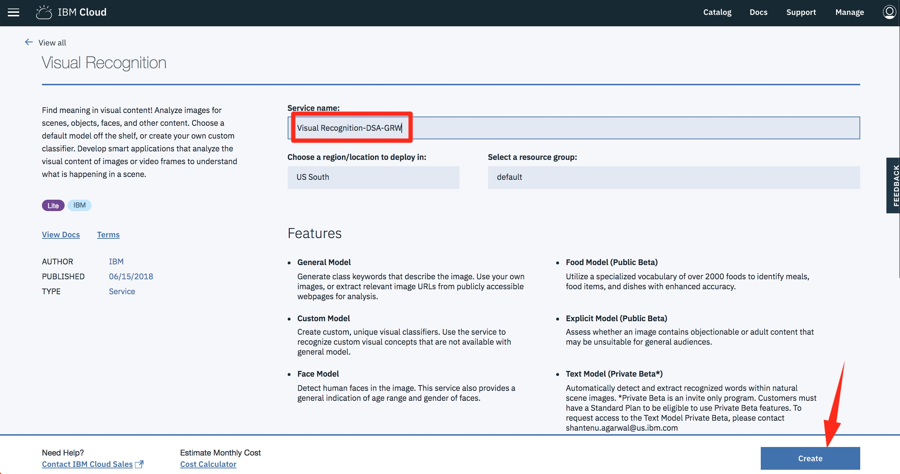

**(2)** Next, create an **Object Storage** service instance.


Rather than just creating a service with the defaults here, select `Compare Versions`...


... and then ensure `Object Storage OpenStack Swift` is selected. Now go ahead and create the service. We are using this version of Object Storage as someone has created Node-RED nodes that work with it. Scroll down and ensure you use the `Standard` service.


It may take a few minutes to provision.

**(3)** Now go to your Node-RED application in IBM Cloud, click `Connections` then `Create connection` and connect in these two new services. You only need to restage your application when you've added **both** services.


When you connect in the Visual Recognition service you may be asked to `Connect IAM-Enabled Service` - just hit `Connect` using the defaults shown here:


**(4)** At this point you should also note down the credentials for your newly created Object Storage service. Select `View Credentials` from the pull down menu...

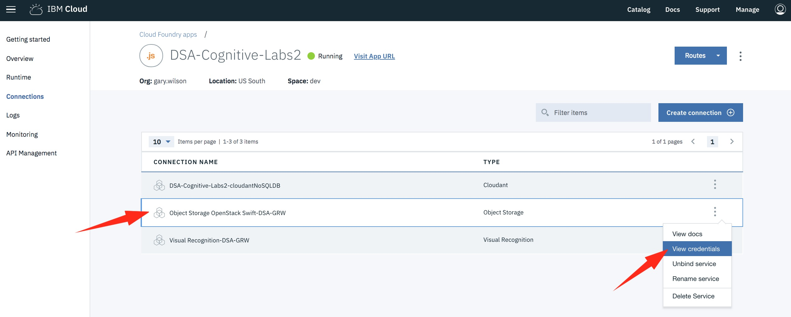

... and then note down `projectId`, `userId`, `username` and `password` from the credentials list. We'll need these in our _'drone inspection'_ Node-RED flow later.

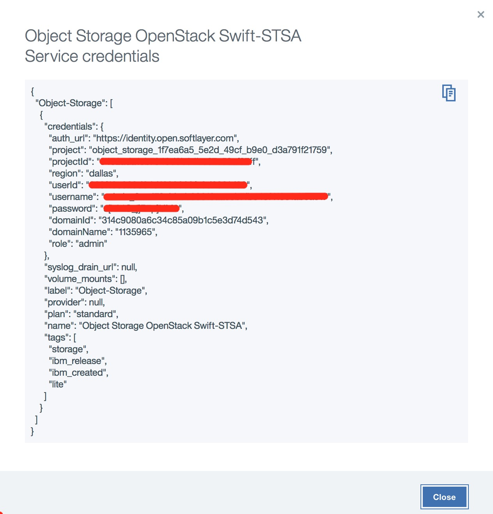

## Build a Visual Recognition dashboard
The Visual Recognition default service analyses images and provides a response that includes keywords (classes) that provide information about the image content, as well as confidence levels for each keyword. Our app will allow the user to enter a URL (that should point to an image), and pass the image to Watson which will return any classes found, the confidence level, and if it can find one, a class type (or hierarchy). For example, Watson would return a class type of `/fruit/pome/apple/eating apple/Granny Smith` if it sees a Granny Smith apple.

**(1)** Go to Node-RED and install the following nodes via the `Manage Palette` menu option in Node-RED:
  - `node-red-dashboard`
  - `node-red-node-base64`
  - `node-red-contrib-objectstore`

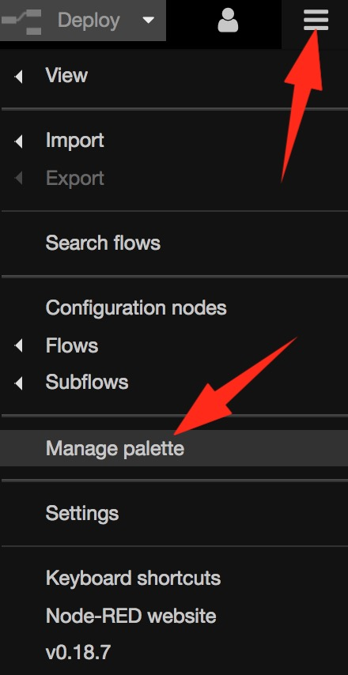

**(2)** Add a new tab in Node-RED so you have a blank working area, then drop in `Inject`, `Visual Recognition`, and `Debug` nodes.

Change the `Inject` node so that the payload is a string, and the text passed is the URL of an image from a web page. Try a Google Images search to find one - just make sure you do a `Copy Image Address` to ensure your URL will reference the image itself rather than a whole webpage:

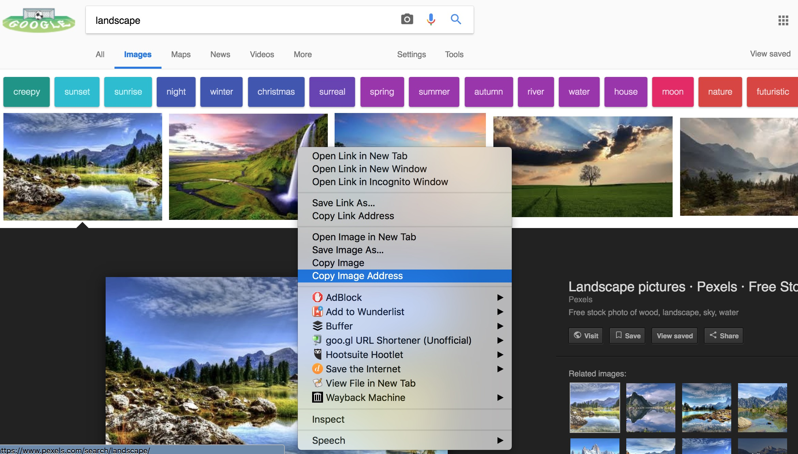

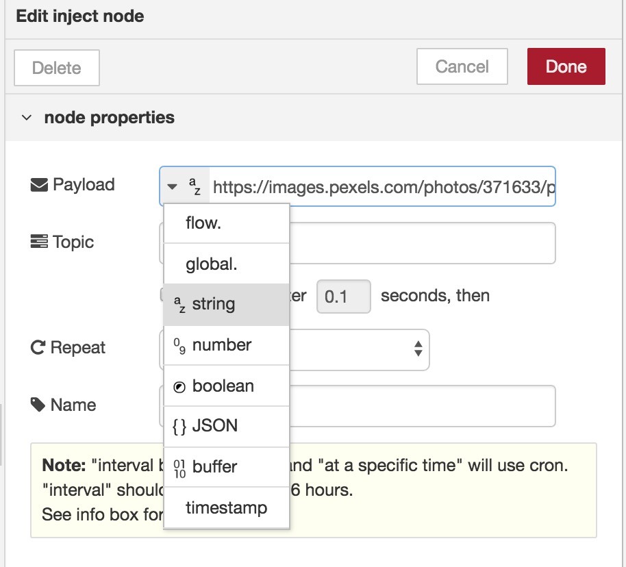

Modify the `Debug` node so it outputs the `complete message object` rather than just `msg.payload`. This is because the Visual Recognition analysis is returned in `msg.result`. Go ahead and `Deploy`.

**(3)** Hit the `Inject` button. If your image URL is valid, you should see something like this in the debug panel, where Watson has recognised object classes and hierarchies from the image:

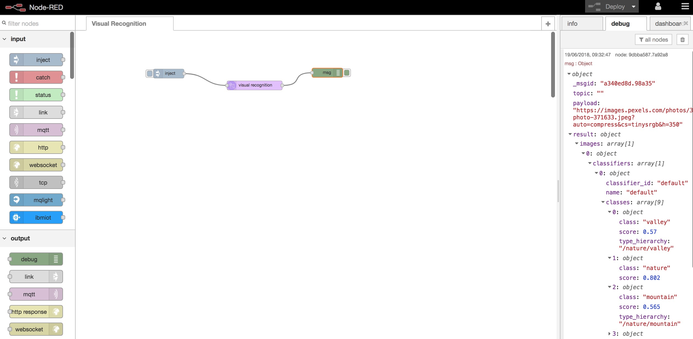

**(4)** Now let's take that output and create a dashboard to display it in a more readable format. Copy the code from [here](./Node-RED/default-1.json), and import it to Node-RED using the `burger` icon / `Import` / `Clipboard`.

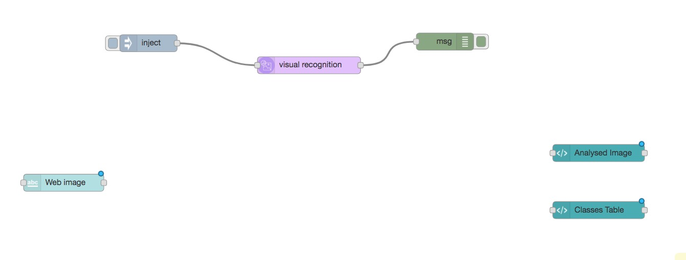

These imported nodes are `Node-RED Dashboard UI` components. These UI _buttons_ and _templates_ are just two of many components you can use from Node-RED Dashboard, a module that provides a set of nodes to help you quickly create live data dashboards. Here these nodes build the simple Node-RED dashboard to display the Visual Recognition analysis.

The `Web image` node creates a text input area on our dashboard which will allow us to enter an image URL address. The `Analysed image` and `Classes table` nodes are dashboard template nodes - the former simply displays the image we are analysing, and the latter creates a table from the results received.

**(5)** To complete the flow, drop in `Change`, `HTTP Request`, `base64` and `Function` nodes, delete the `Inject` and `Debug` nodes, and re-use the `Visual Recognition` node:

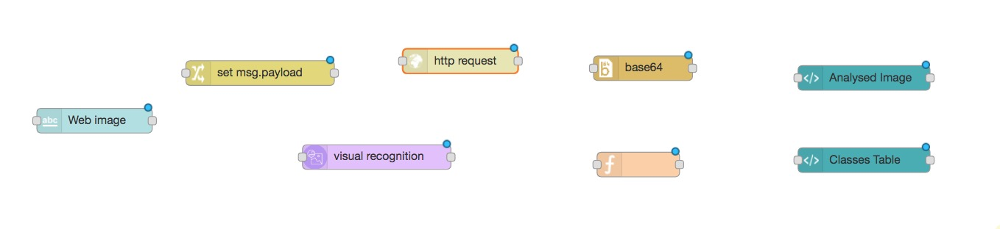

- Modify the `Change` node so it sets `msg.url` to `msg.payload`. This is what the HTTP request node is expecting as input.

  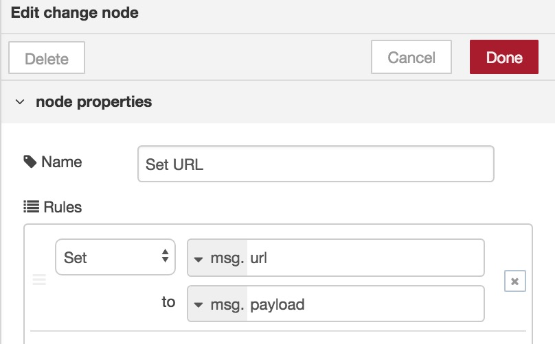

- Make sure the `HTTP Request` node has a method of `GET`, and that it returns `a binary buffer`.

- The `base64` node can be left to default - it's used to convert the image back to a usable format.
- Edit the `Function` node so it contains the code below. This takes the output from `msg.result` and formats it for the table to be shown on the dashboard:

```javascript
// Create array entry for each image class found by Watson Visual Recognition

var images = [];
for (i = 0; i < msg.result.images[0].classifiers[0].classes.length; i++) {
    images.push({class: msg.result.images[0].classifiers[0].classes[i].class,
                      score: (msg.result.images[0].classifiers[0].classes[i].score * 100).toFixed(0),
                      type: msg.result.images[0].classifiers[0].classes[i].type_hierarchy
                    })
}
msg.payload = {
    imagelist: images,
};
return msg;
```

**(6)** Connect the nodes up as shown below, and `Deploy`.

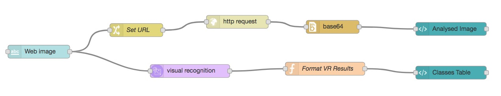

**(7)** When you first deploy Node-RED dashboard components, you will see a new tab next to the debug tab called `dashboard`. If you select this you can customise the look and feel of your dashboard, but for now just select the `link icon`, which will take you to your new dashboard app.

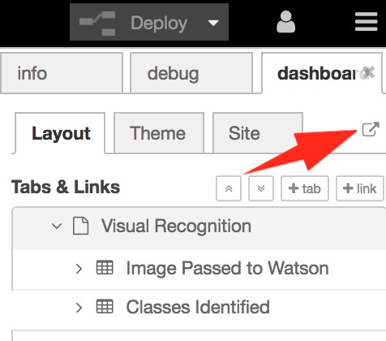

**(8)** The dashboard will look pretty blank at first, but if you enter an image URL in the text input field, your flow will retrieve and display the image, pass the image through Watson Visual Recognition, and display the results!

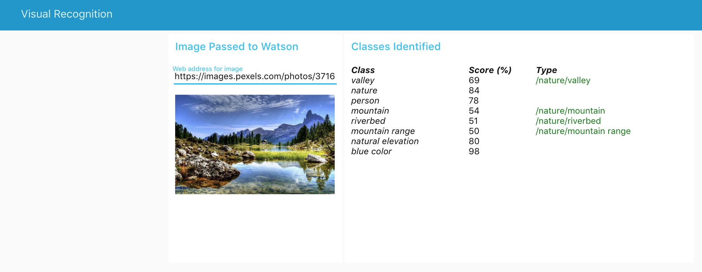

## Train a Visual Recognition custom classifier
As well as being able to recognise objects using its default classifier, the Visual Recognition service can learn from example images you upload to create a new classifier. You'll need to provide some images that are representative of the thing you are looking for, as well as some that are not.

**(1)** Go to your Visual Recognition service in IBM Cloud, and select `Launch Tool`.

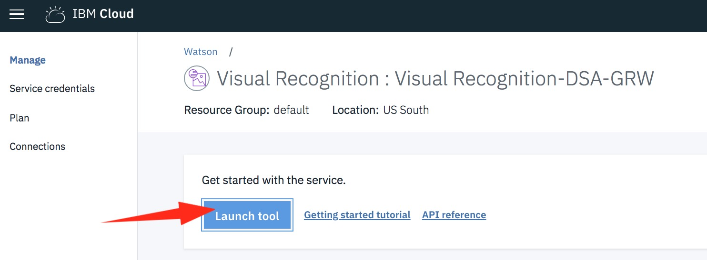

This will take you to **Watson Studio**, the application that amongst other things, allows us to create a custom classifier.


Select `Create Model` under `Custom` here.

**(2)** Give your new project a name, e.g. `Drone Inspection`, select the Visual Recognition service you created from the pull-down menu, and select `Create`.

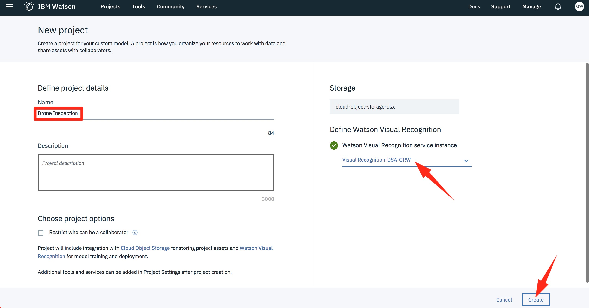

**(3)** Download the following zip files, which contain images we are going to use to train Watson. We'll use [this file](./data/vr-crack-images.zip) to train the custom class to recognise cracks in buildings, and [this one](./data/vr-nocrack-images.zip) has images that have no cracks, so that Watson can be trained to distinguish between the two.

These zip files contain only a small set of images, and clearly Watson will provide more accurate results the more images we supply during training. But, even with this small training set, you'll see Visual Recognition gives us pretty solid results.

**(4)** Edit the `Default Custom Model` field and give it a more appropriate name, e.g. `InspectionModel`. Then upload the zip files to your project:

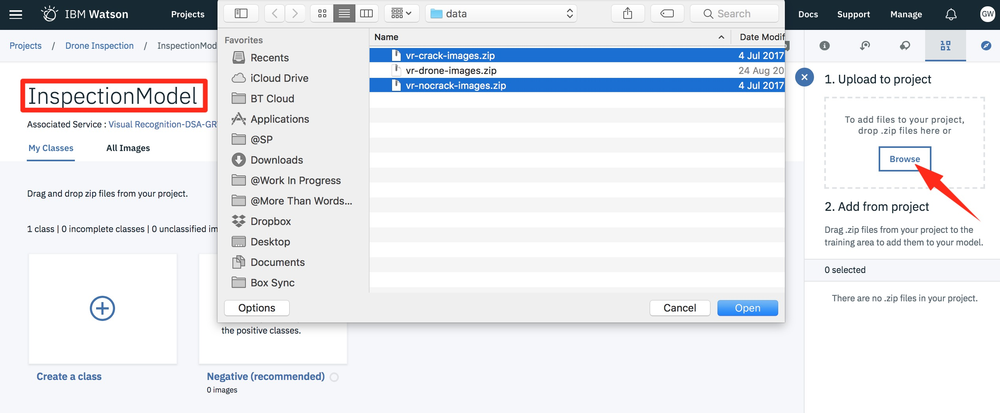

**(5)** Select `Create a class`, name it `CracksDetected`.

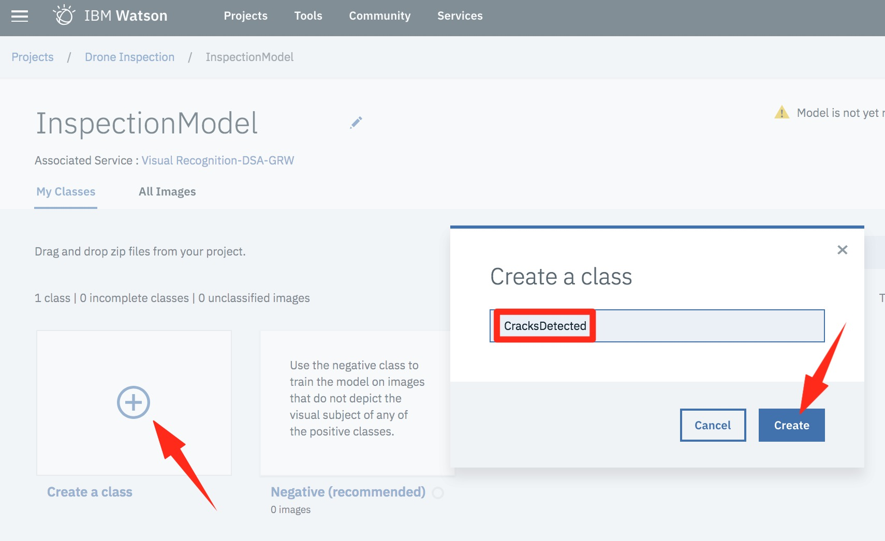

When the zip files have been uploaded, drag the `vr-crack-images.zip` file to the `CracksDetected` class.

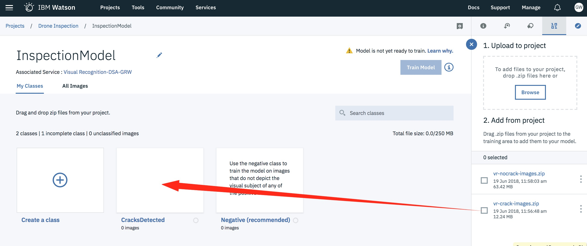

**(6)** Next drag the `vr-nocrack-images.zip` file to the `Negative` class, and when that is complete, select `Train Model`.

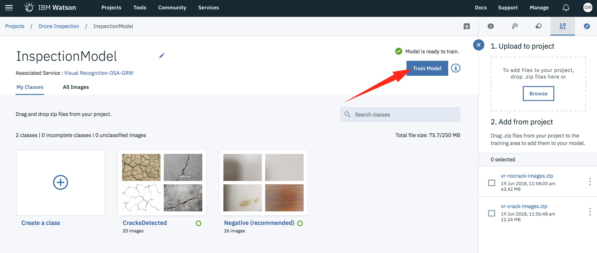

**(7)** After a few minutes you'll get a notification that training is complete. Select the option to view and test your model.

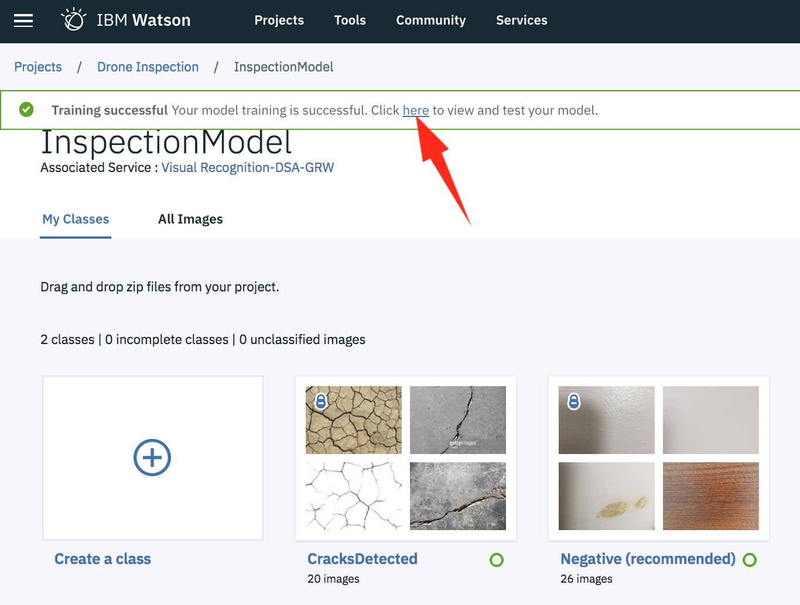

From the `Overview` tab, **copy the Model ID and save it for later use in your Node-RED flow**.

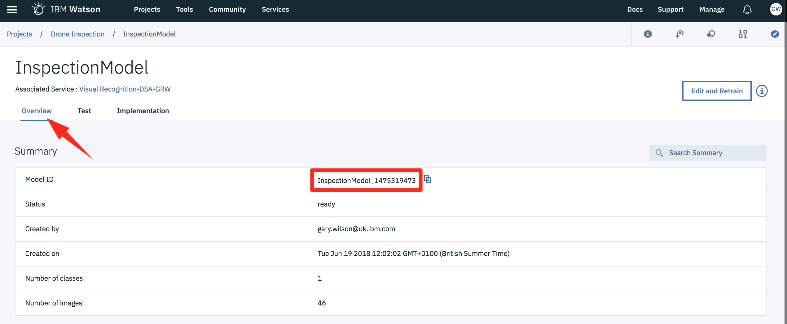

## Configure Object Storage and upload test images
As mentioned we are going to use **IBM Cloud Object Storage** to hold the images we are going to test the classifier against - this simulates the drone or another device taking photographic images.

**(1)** Download and extract the test images from [here](./data/vr-drone-images.zip).

**(2)** Go to your Object Storage instance in IBM Cloud and `Add a container`.


**(3)** Give your container the name `Crack Detection`, select it when it has been created, and then `Add files`. Select all five files in the extracted `vr-drone-images` folder and `Open`. You should then have an Object Storage container that looks like this:


## Import and customise the Drone Inspection Node-RED flow
**(1)** Copy the Node-RED code from [here](./Node-RED/inspection1.json) and `Import` from `Clipboard` in your Node-RED editor.

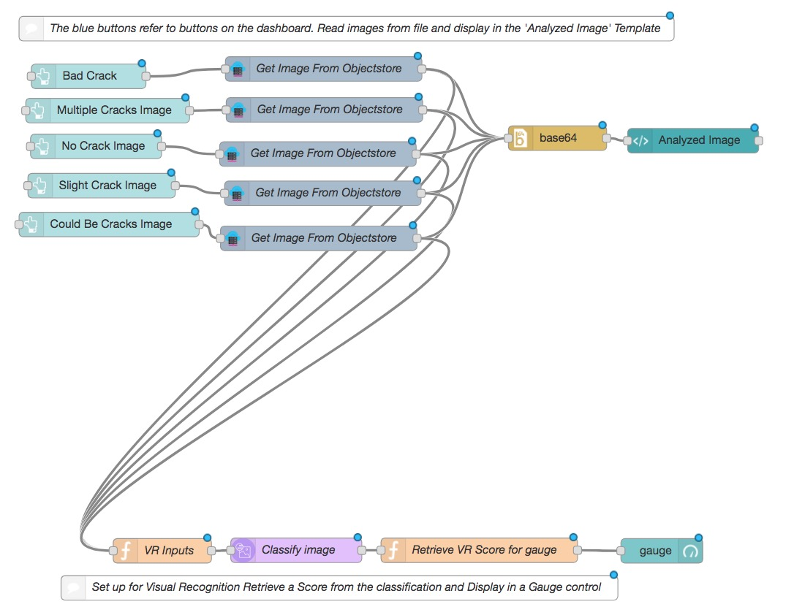

**(2)** Edit the top `Get Image from Objectstore` node, then select the `Object Storage Service` dropdown, `Add new os-config...`, then the pencil icon, in order to enter your own Object Storage service details.

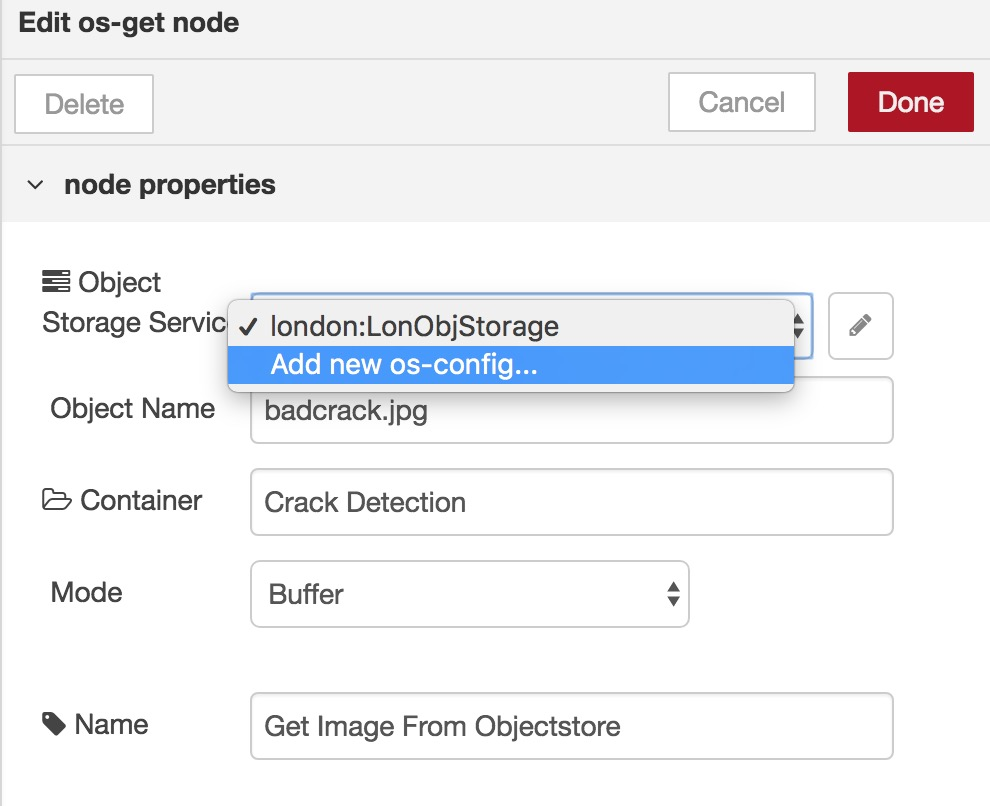

**(3)** Leave `Configuration Information` as `API Based`, then enter the Object Storage service credentials you saved earlier. You will need to enter a `Name` here also:

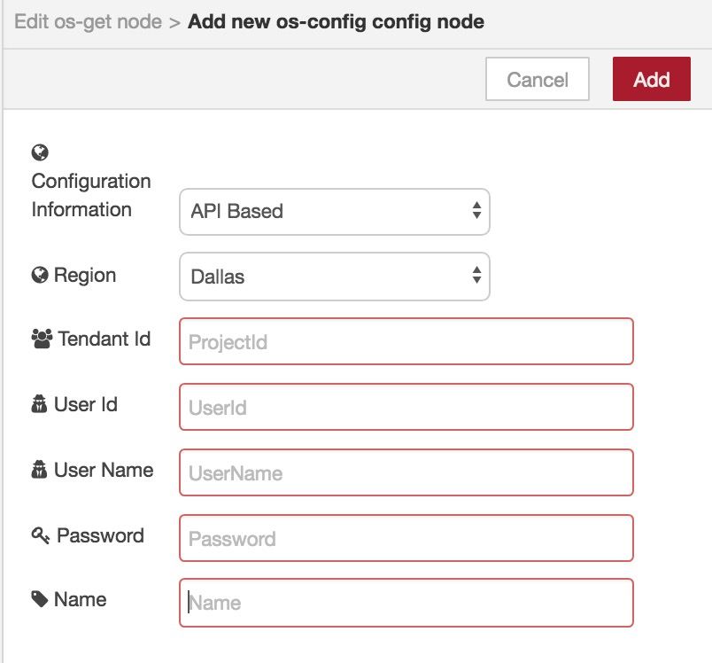

**(4)** Click `Done` after ensuring the Object Storage Service reflects your new service instance, and then edit the other four `Get Image from Objectstore` nodes, changing each to use your instance.

**(5)** The fives nodes to the left of the Object Storage nodes are **Node-RED Dashboard UI buttons**. The function of the buttons here are to go and retrieve the appropriate image from Object Storage when selected.          

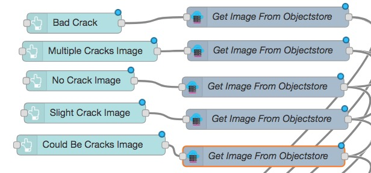

**(6)** The Dashboard is created and modified when you add dashboard nodes to your flow. It uses the concepts of **tabs**, **groups** and **widgets** to configure the dashboard layout, all of which can also be configured from the dashboard tab on the right hand-side of the Node-RED editor.

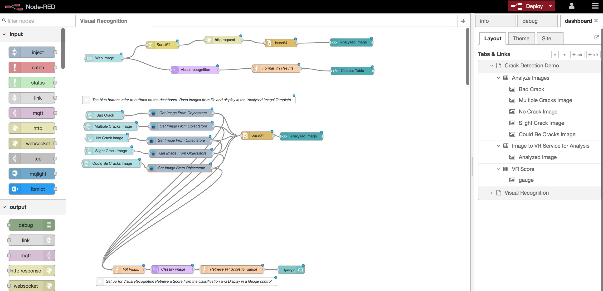

**(7)** The best way to learn how to use the Dashboard UI nodes is to experiment! [This tutorial](https://developer.ibm.com/recipes/tutorials/visualize-virtual-sensor-data-using-dashboard-nodes/), which uses Watson IoT and a virtual sensor to create an interactive dashboard is a good place to start.

**(8)** The `base64` node is a function that converts `msg.payload` to and from base64 format. It's used here to pass the downloaded image from Object Storage to the dashboard template node `Analyzed Image`.


**(9)** Node-RED’s dashboard nodes provide a comprehensive set of UI components for building basic dashboards – graphs, gauges, basic text as well as sliders and inputs. However, there may be times when you need create a custom widget. The `template` node is the solution for this - it's a generic node that takes `HTML` and `Angular/Angular-Material` directives which can be used to create a dynamic user interface element.

In this case, we are creating a simple widget to display the image downloaded from Object Storage that is about to be analysed by the Visual Recognition service. If you open up the node you'll see the following HTML:  

``

**(10)** The bottom section of the flow deals with the Visual Recognition component of our application.

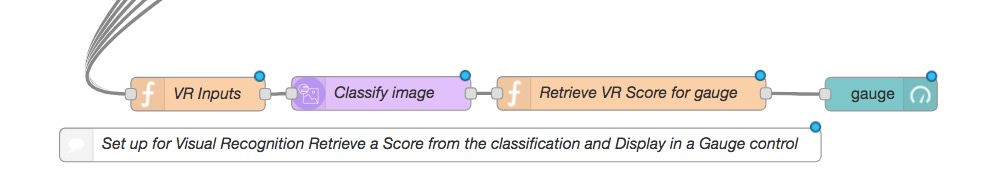

The `VR Inputs` function node contains the code shown below, which provides the setup for the visual recognition node. Here you just need to change the `classifier_id` supplied from `CrackDetection_237362588` to the `MODEL ID` you noted down when you created your custom classifier in **Watson Studio**.
```javascript
global.set("imgData",msg.payload);
global.set("fileName",msg.filename);
msg.headers = { "Content - Type ":"image / jpeg "};
msg.params = {classifier_ids:["CrackDetection_237362588"],
  owners:["me","IBM"],
  threshold: "0.0"
};
return msg;
```

If you forgot to note the classifer ID down, you can get it by selecting your `Drone Inspection` project from the `Projects` pull-down in **Watson Studio**, and selecting `Assets`.

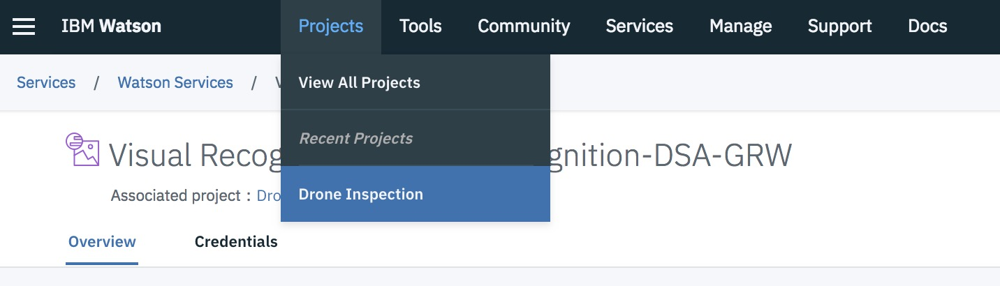

You'll find the classifier ID under `MODEL ID` at the bottom of the `Assets` screen.

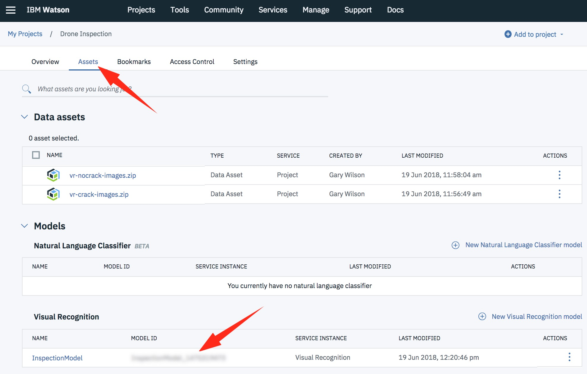

**(11)** The `Classify Image` and `Retrieve VR Score for Gauge` nodes need no changes. The former calls the Watson Visual Recognition service, compares our selected image with our classifier, and provides results to the latter, which retrieves the score from the `msg.result` JSON message and rounds it.

**(12)** Finally, the `gauge` node takes the score as input and adds a gauge widget to the dashboard. Double-click the node if you want to look at its customisation options.

**(13)** `Deploy` the flow. You may see the following message:

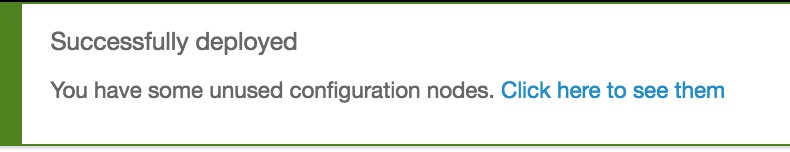

You can choose to ignore it, or if you hit `Click here to see them` you will see a `config` tab showing you an `unused os-config` node. You can double-click this, `Delete` it and `Deploy` again in order to get rid of the message.

**(14)** Now go to the dashboard via the link on the Node-RED dashboard tab, as you did previously. Each time you select one of the buttons, the associated image is retrieved from Object Storage, displayed, and analysed by the Virtual Recognition service. The VR score is then shown on the gauge. Check them all out. Here's a couple of examples:

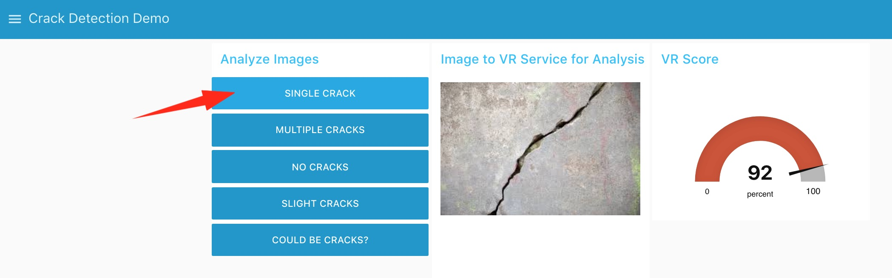

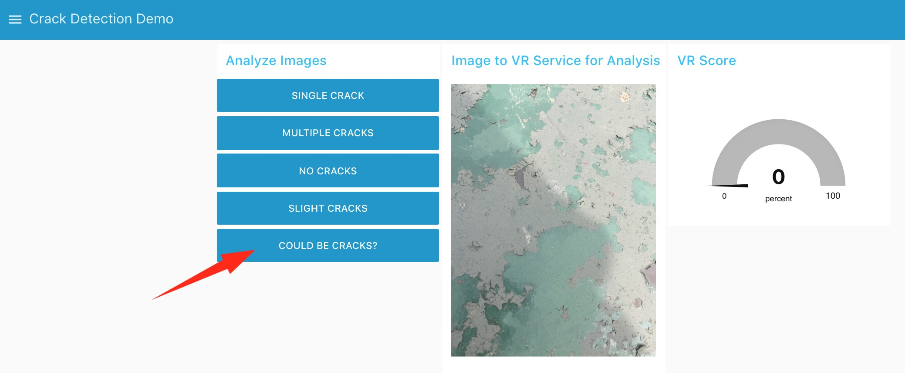

## Add a web URL input capability
Here we'll add an additional input option so we can use web images to check against our classifier.

**(1)** Drop a Dashboard `text input` node, a `function` node and an `HTTP request` node on to the editor.

**(2)** Edit the `text input` node, and customise it as shown here:  

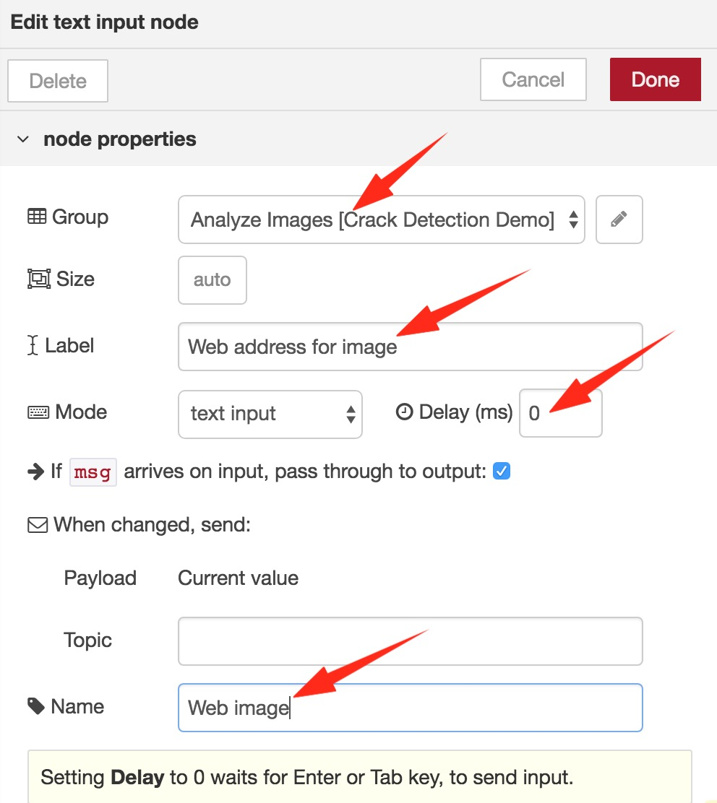

This will be the dashboard component we use to enter a URL that points to a web image to pass to the VR service.

**(3)** Edit the `function` node and call it `Pass URL`. It should contains just the following two lines of code, which set `msg.url` to the text (URL) entered on the dashboard. This is passing the image URL to the HTTP node using the format required.
```javascript
msg.url = msg.payload;
return msg;
```
**(4)** Edit the `HTTP request` node. Make sure it is doing a `GET` and that it will return `a binary buffer`. This node will retrieve the image from the URL provided.

**(5)** Wire the new nodes up as shown here. Ensure the `HTTP request` node is wired up to both the `base64` and `VR Inputs` nodes.

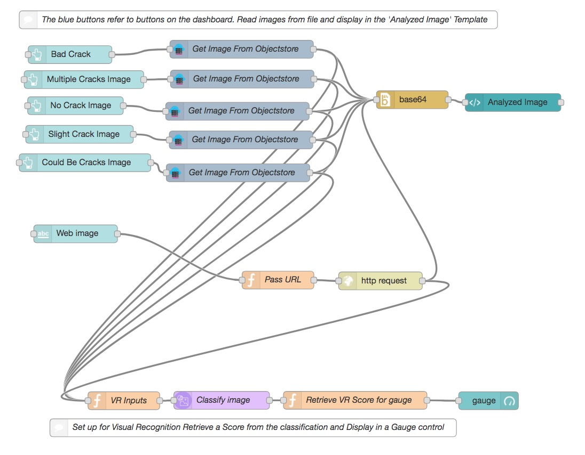

**(6)** Deploy your app, and go back to your dashboard application. You should now see an additional option `Web address for image` as part of the `Analyze Images` group where you can type in a URL.

**(7)** Go to https://images.google.co.uk/ and search for 'building cracks' or something similar. Select an image, then right-click on it and `Copy Image Address`.

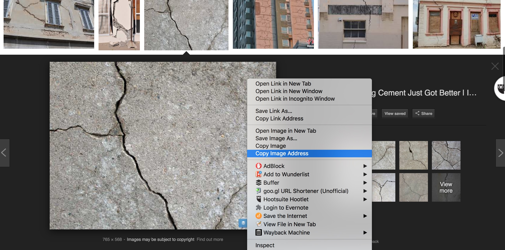

**(8)** Paste the URL into the new input field in the dashboard and hit `Enter`. The image should then appear in the dashboard and the VR result will be displayed on the gauge.

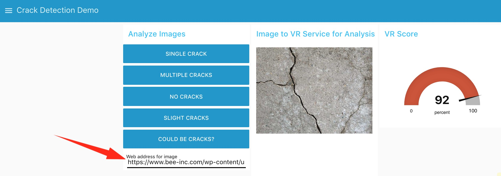

Feel free to experiment with other URL images!

## Extend the application to use the Node-RED Worldmap service
Node-RED has a mapping capability (`node-red-contrib-web-worldmap`) that you can use plot 'things' on a map. Things to be plotted just need to have `name`, `lat` (latitude) and `lon` (longitude) properties in `msg.payload` to be automatically added to a map. If you want to learn more go [here](https://flows.nodered.org/node/node-red-contrib-web-worldmap) - the demo flow at the bottom of the page that plots live earthquake data retrieved from the US Geological Survey website is a good one to try out.

Here we'll use the `worldmap` nodes to simulate plotting the position of our 'drone' on a map, as well as passing the results from the VR service and a link to the image for display.

**(1)** Install the `node-red-contrib-web-worldmap` module from the Node-RED editor via `Manage palette`.

**(2)** Drop a `function` node, a `worldmap input` node and a `debug` node onto your existing flow.

**(3)** Name the function node `Retrieve VR Scores and Drone Data`, and use the following code. The other nodes don't need any additional customisation.
```javascript
var droneProps = {
   "name" : "Drone-1",
   "lat" : "51.0632",
   "lon" : "-1.308",
   "altitude": 13.6,
   "battery": 79,
   "speed": 0.2,
   "weblink" : {name:"Click for image", url: msg.url},
   "icon" :"uav",
   "iconColor" :"red",
   "crack" : 0
};
//Add randomize with fudge factor for variability
var tmp = parseFloat(droneProps.lat) + (Math.floor((Math.random() * 10) + 1)/500);
droneProps.lat = (Math.round(tmp * 100000)/100000).toString();
tmp = parseFloat(droneProps.lon) + (Math.floor((Math.random() * 10) + 1)/500);
droneProps.lon = (Math.round(tmp * 100000)/100000).toString();
droneProps.altitude = droneProps.altitude + Math.round(((Math.random()*2-1)/3*10))/10;
droneProps.crack = msg.payload;    
msg.payload = droneProps;
return msg;
```
**(4)** This code sets up the message to be passed to the `worldmap` node. The `name`, `lat` and `lon` attributes are required and are used to plot the 'drone' on our map at the supplied co-ordinates - the code is adding a randomised small change to `lat` and `lon` to simulate drone movement. Any other supplied parameters to the `worldmap` node will appear in a popup window when the 'drone' is selected - `altitude`, `battery` and `speed` of the drone are just examples of the type of data that might be useful in this scenario. Clearly much of the data is simulated here, but it could be passed as live data if coded into the application.

**(5)** The `weblink` attribute allows us to pass in a URL for display in the popup, which is useful here as we can use it to display the image having been taken by the 'drone'. `icon` and `iconColor` are pretty obvious ... go [here](https://flows.nodered.org/node/node-red-contrib-web-worldmap) for more information on the icons you can use. Finally, `score` is the result obtained from the VR service.

**(6)** Connect the nodes up like this:

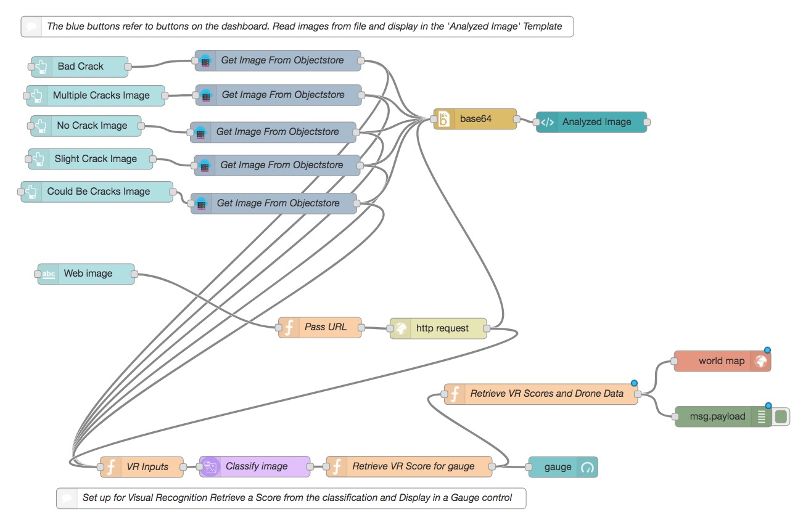

**(7)** Deploy the flow, enter a web image URL in the dashboard, then go to https://MYNODEREDAPPNAME.mybluemix.net/worldmap/ to see the map (substitute MYNODEREDAPPNAME for your Node-RED instance name).

If you click on the drone icon the popup appears showing the VR confidence score `crack`, and all the other attributes discussed, including a live link to the image itself via `Click for image`.

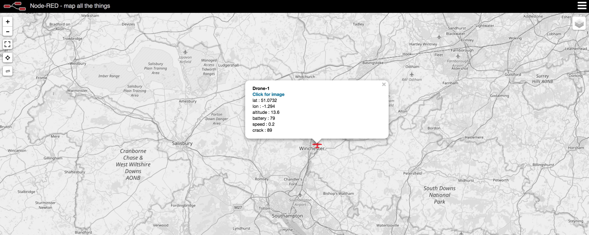

The complete flow can be downloaded from [here](./Node-RED/inspection2.json).

Congratulations! You've reached the end of the Visual Recognition lab.

Next try [Cognitive Lab 5](../5-NLU) where we'll use **Watson Natural Language Understanding** to create a cognitive text analysis prototype.
