# Cognitive: Visual Recognition
The Watson Visual Recognition service uses deep learning algorithms to analyse images for scenes, objects, faces, and other content. A set of built-in classes provides highly accurate results without training, and you can also train custom classifiers and collections using your own images.

In this lab are going to build a Node-RED flow that simulates a drone inspection application looking for cracks in buildings or other infrastructure. The application will use a Visual Recognition custom classifier that we have trained to recognise cracks in images, and simulates the checking of drone camera photographs against this classifier to show the confidence levels Watson has in determining such faults.

We'll use IBM Cloud Object Storage initially as our drone simulator - this will store some images to check against - as well as building an interface that will allow us to test images downloaded via a web URL. The application is built using the Node-RED Dashboard UI.

_Thanks to Douglas McGarrie for the original idea and building the application._

## Requirements
This workshop does not use any of the assets built during previous labs.

The same instance of Node-RED can be used.

## Agenda
- setup Visual Recognition and Object Storage instances in IBM Cloud
- train a custom classifier
- create Object Storage and upload test images
- import and customise the basic Node-RED flow
- run and test your application
- add a web URL input capability
- extend your application to use a mapping service

## Setup IBM Cloud services
**(1)** First, create a **Visual Recognition** service instance on IBM Cloud, and note down the API Key from the Service Credentials (use the `Lite` plan if you are using your personal IBM Cloud ID, or `Standard` if you are using a linked account). 

If there are no credentials automatically created, use `New Credentials` to `Add` some.

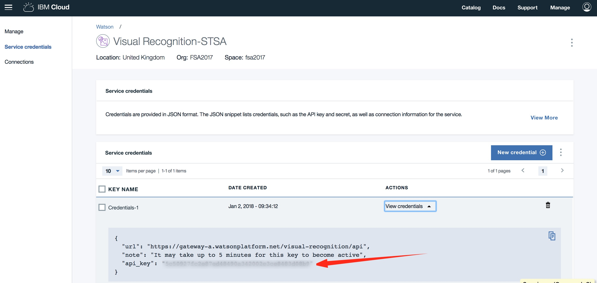

**(2)** Next, create an **Object Storage** service instance.

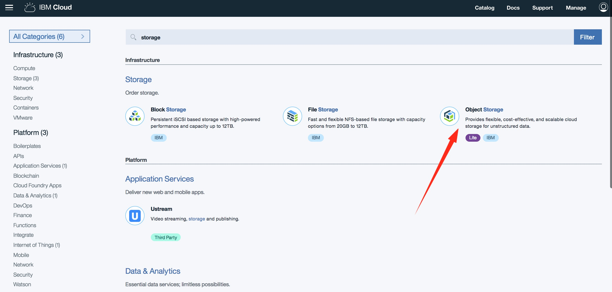

Rather than just creating a service with the defaults here, select `Compare Versions`...

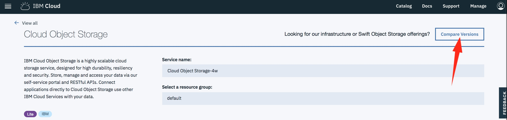

... and then ensure `Object Storage OpenStack Swift` is selected. Now go ahead and create the service. We are using this version of Object Storage as someone has already created Node-RED nodes to interact with this this version of the service. Use the `Standard` service.

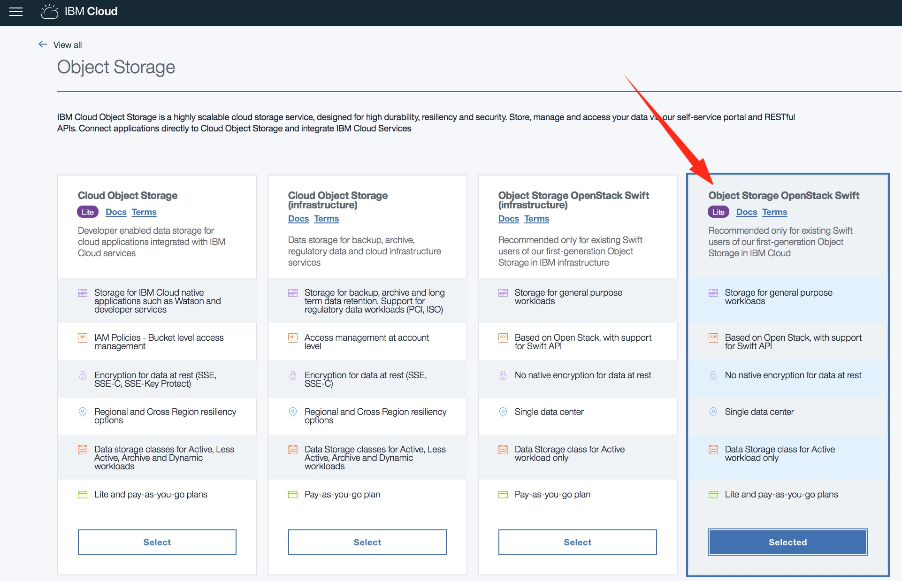

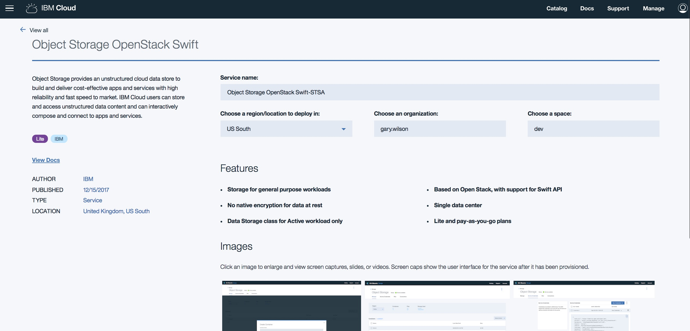

It may take a few minutes to provision.

**(3)** Now go to your Node-RED application in IBM Cloud, click `Connections` then `Create connection` and connect in your two new services. You only need to restage your application when you've added both services.

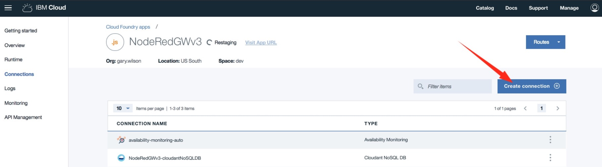

**(4)** At this point you should also note down the credentials for your newly created Object Storage service. Select `View Credentials` from the pull down menu...

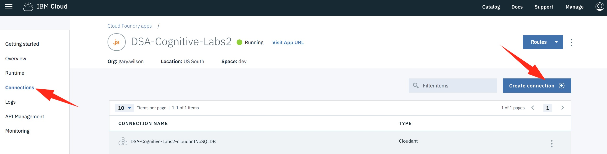

... and then note down `projectId`, `userId`, `username` and `password` from the credentials list. We'll need these in our Node-RED flow.

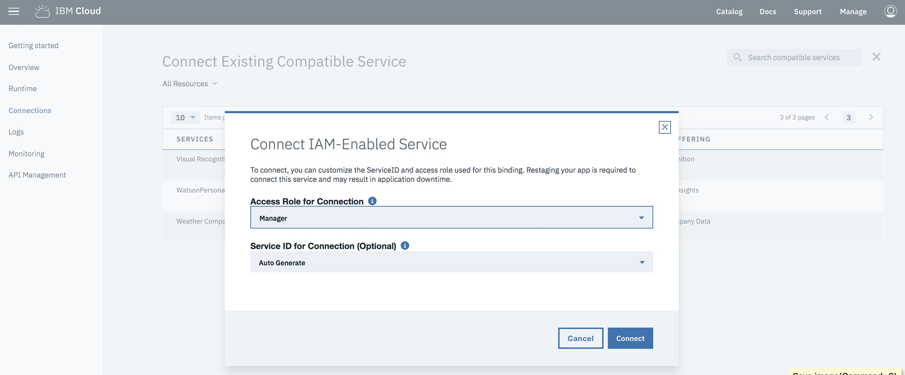

## Train a Visual Recognition custom classifier
The Visual Recognition service can learn from example images you upload to create a new classifier. You'll need to provide some images that are representative of the thing you are looking for, as well as some that are not.

**(1)** Go to http://visual-recognition-tooling.mybluemix.net and enter the API key you saved when you created the Visual Recognition service.

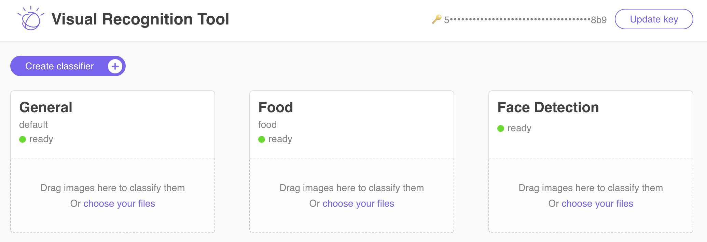

**(2)** Select `Create classifier` and give it a name, e.g. `DroneInspection`. Enter `yescracks` as the class name for your 'positive' class in the first box, and delete the second box (as we don't need another class). We'll use the supplied `Negative` class for our 'no crack' images.

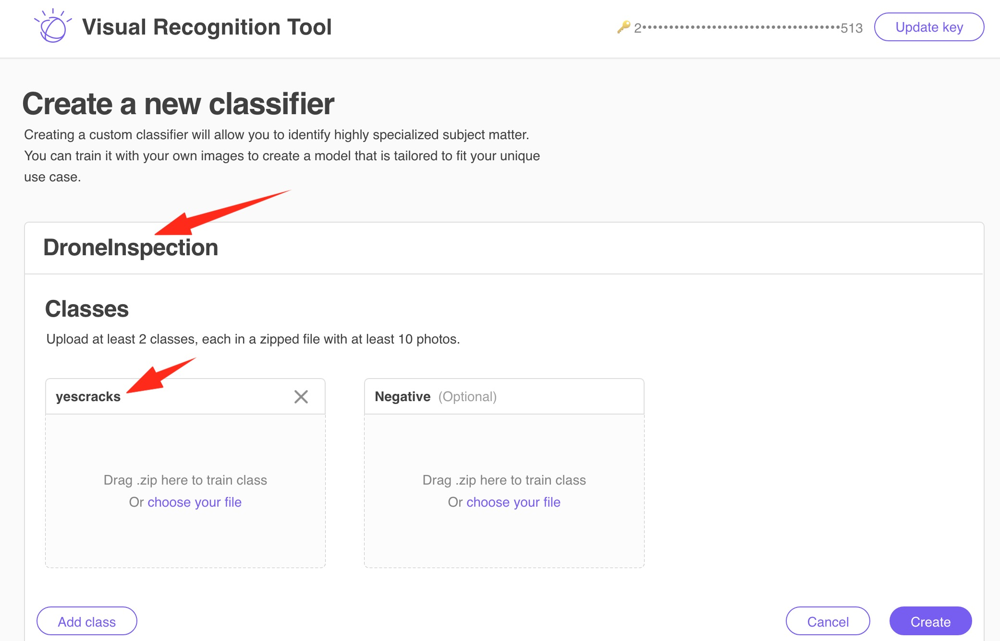

**(3)** Each class is expecting a zip file with at least 10 images. Choose [this file](./data/vr-crack-images.zip) to train the `yescracks` class, and [this one](./data/vr-nocrack-images.zip) to train the `Negative` class.

These zip files contain only a small set of images, and clearly Watson will provide more accurate results the more images we supply during training. But, even with this small training set, you'll see Visual Recognition gives us pretty solid results.

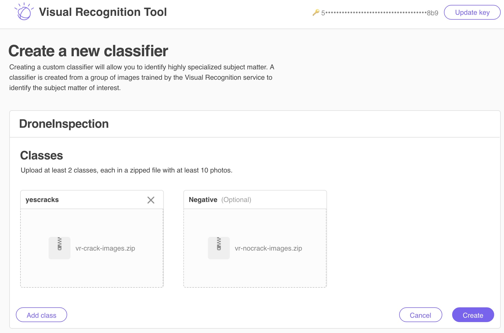

**(4)** Once you've provided each class with a zip file, hit `Create`. You'll then have to wait a few minutes for the training to complete.

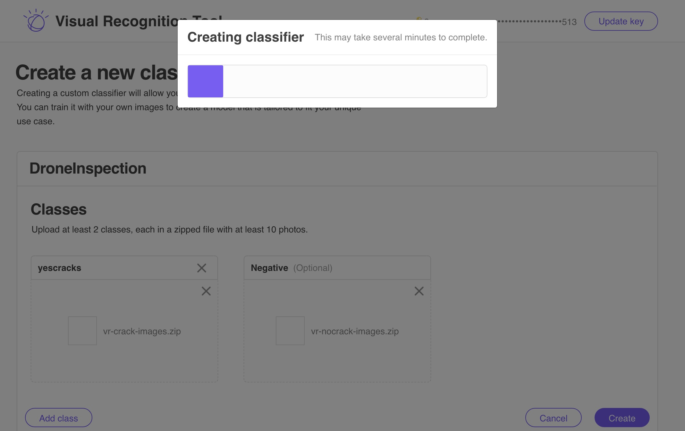

**(5)** Once it's done, your customer classifier will be created. Note down the classifer ID provided, as you'll need this in your Node-RED flow.

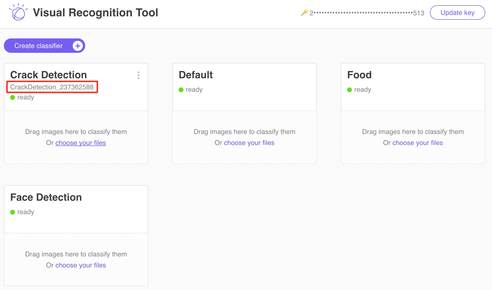

## Configure Object Storage and upload test images
As mentioned we are going to use **IBM Cloud Object Storage** to hold the images we are going to test the classifier against - this simulates the drone or another device taking photographic images.

**(1)** Download and extract the test images from [here](./data/vr-drone-images.zip).

**(2)** Go to your Object Storage instance and `Add a container`.

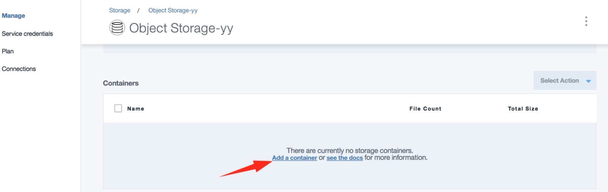

**(3)** Give your container the name `Crack Detection`, select it when it has been created, and then `Add files`. Select all five files in the extracted `vr-drone-images` folder and `Open`. You should then have an Object Storage container that looks like this.

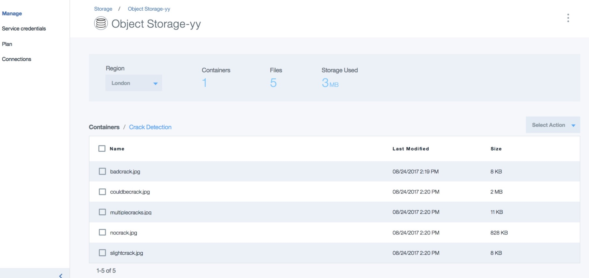

## Import and customise the basic Node-RED flow
**(1)** Install the following nodes via the `Manage Palette` menu option in Node-RED:
  - `node-red-dashboard`
  - `node-red-node-base64`
  - `node-red-contrib-objectstore`

**(2)** Copy the Node-RED code from [here](./Node-RED/inspection1.json) and `Import` from `Clipboard` in your Node-RED editor.

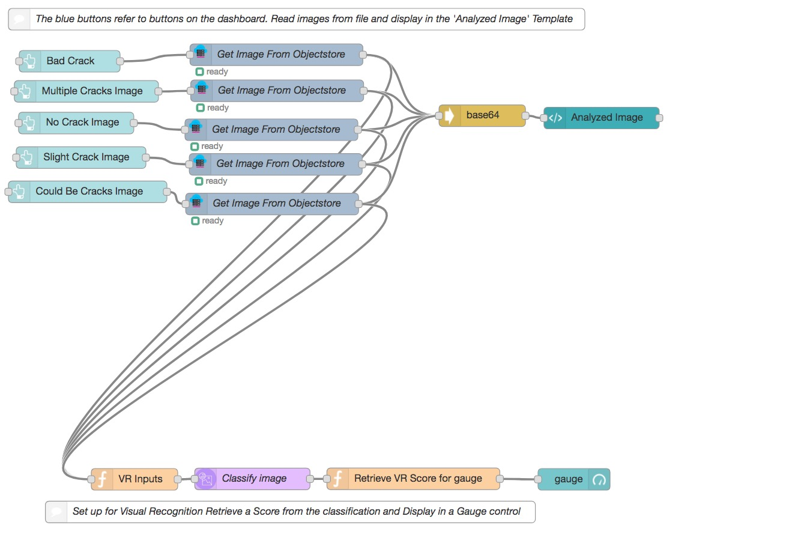

**(3)** Edit the top `Get Image from Objectstore` node, then select the `Object Storage Service` dropdown, `Add new os-config...`, then the pencil icon, in order to enter your own Object Storage service details.


**(4)** Leave `Configuration Information` as `API Based`, then enter the credentials you saved earlier. You will need to enter a `Name` here also:

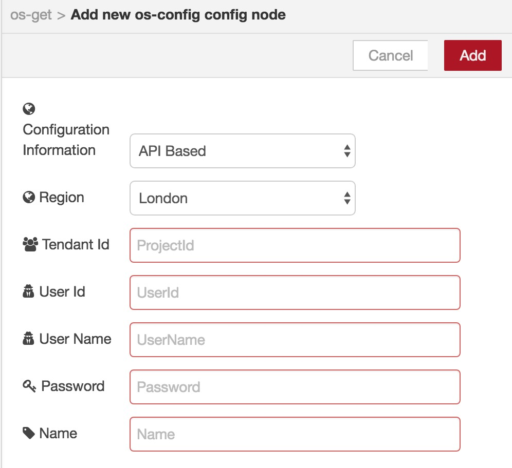

**(5)** Click `Done` after ensuring the Object Storage Service reflects your new service instance, and then edit the other four `Get Image from Objectstore` nodes, changing each to use your instance.

**(6)** The fives nodes to the left of the Object Storage nodes are Node-RED **Dashboard UI buttons**. Buttons are just one of many components you can use from Node-RED Dashboard, a module that provides a set of nodes to quickly create live data dashboards. The function of the buttons here are to go and retrieve the appropriate image from Object Storage when selected.          

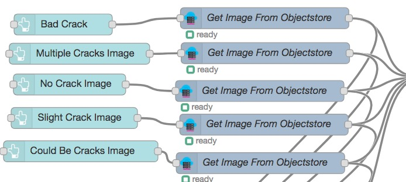

**(7)** The Dashboard is created and modified when you add dashboard nodes to your flow. It uses the concepts of **tabs**, **groups** and **widgets** to configure the dashboard layout, all of which can also be configured from the dashboard tab on the right hand-side of the Node-RED editor.

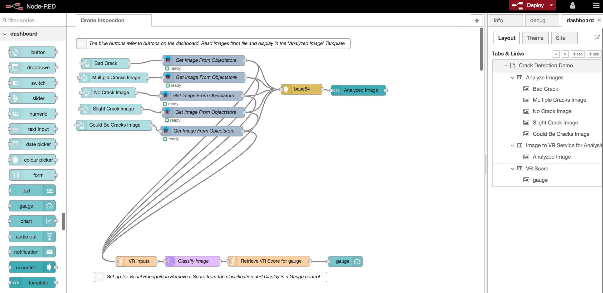

**(8)** The best way to learn how to use the Dashboard UI nodes is to experiment! [This tutorial](https://developer.ibm.com/recipes/tutorials/visualize-virtual-sensor-data-using-dashboard-nodes/), which uses Watson IoT and a virtual sensor to create an interactive dashboard is a good place to start.

**(9)** The `base64` node is a function that converts `msg.payload` to and from base64 format. It's used here to pass the downloaded image from Object Storage to the dashboard template node `Analyzed Image`.

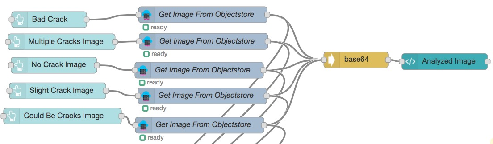

**(10)** Node-RED’s dashboard nodes provide a comprehensive set of UI components for building basic dashboards – graphs, gauges, basic text as well as sliders and inputs. However, there may be times when you need create a custom widget. The `template` node is the solution for this - it's a generic node that takes html and Angular/Angular-Material directives which can be used to create a dynamic user interface element. In this case, we are creating a simple widget to display the image downloaded from Object Storage that is about to be analysed by the Visual Recognition service. If you open up the node you'll see the following HTML:  

``

**(11)** The bottom section of the flow deals with the Visual Recognition component of our application.

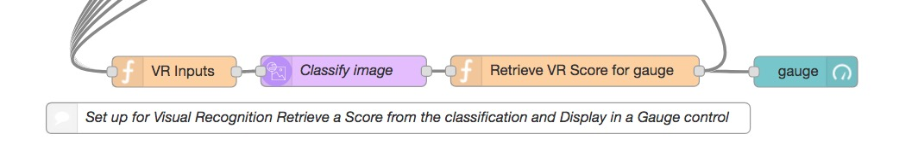

The `VR Inputs` function node contains the code shown below, which provides the setup for the visual recognition node. Here you need to change the `classifier_id` supplied from `CrackDetection_237362588` to the classifier ID you noted down when you trained Watson.
```javascript
global.set("imgData",msg.payload);
global.set("fileName",msg.filename);
msg.headers = { "Content - Type ":"image / jpeg "};
msg.params = {classifier_ids:["CrackDetection_237362588"],
  owners:["me","IBM"],
  threshold: "0.0"
};
return msg;
```
**(12)** The `Classify Image` and `Retrieve VR Score for Gauge` nodes need no changes. The former calls the Watson VR service, comparing our selected image with our classifier and provides results to the latter, which retrieves the score from the `msg.result` JSON message and rounds it.

**(13)** Finally, the `gauge` node takes the score as input and adds a gauge widget to the dashboard. Double-click the node if you want to look at its customisation options.

**(14)** Deploy the flow, then go to your app. You'll find it at https://MYNODEREDAPPNAME.mybluemix.net/ui/. Each time you select one of the buttons, the associated image is retrieved from Object Storage, displayed, and analysed by the Virtual Recognition service. The VR score is then shown on the gauge. Check them all out. Here's a couple of examples:

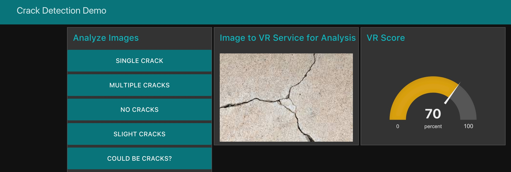

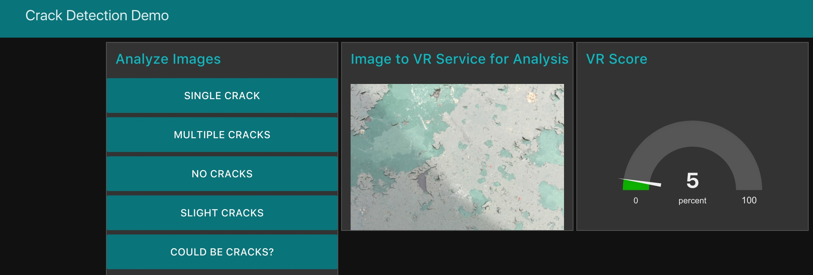

## Add a web URL input capability
Here we'll add an additional input option for images that we can use to check against our classifier.

**(1)** Drop a Dashboard `text input` node, a `function` node and an `HTTP request` node on to the editor.

**(2)** Edit the `text input` node, and customise it as shown here:  


This will be the dashboard component we use to enter a URL that points to a web image to pass to the VR service.

**(3)** Edit the `function` node and call it `Pass URL`. It should contains just the following two lines of code, which set `msg.url` to the text (URL) entered on the dashboard. This is essentially passing the image URL to the HTTP node using the format required.
```javascript
msg.url = msg.payload;
return msg;
```
**(4)** Edit the `HTTP request` node. Make sure it is doing a `GET` and that it will return `a binary buffer`. This node will retrieve the image from the URL provided.

**(5)** Wire the new nodes up as shown here. Ensure the `HTTP request` node is wired up to both the `base64` and `VR Inputs` nodes.

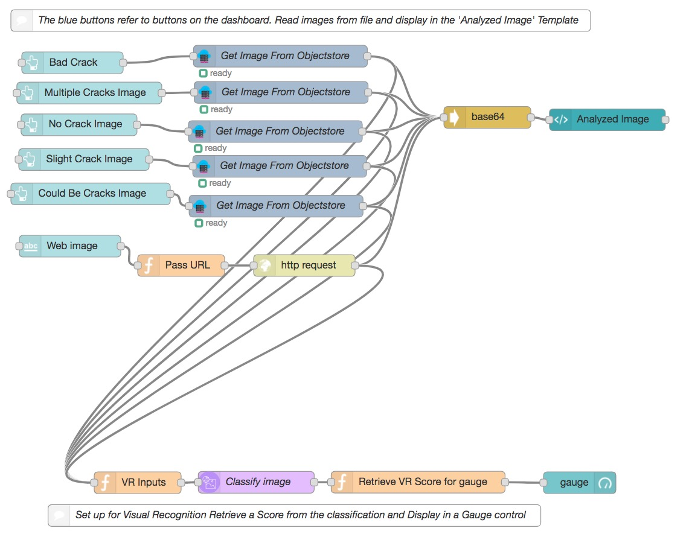

**(6)** Deploy your app, and go back to your dashboard application. You should see an additional option `Web address for image` as part of the `Analyze Images` group where you can type in a URL.

**(7)** Go to https://images.google.co.uk/ and search for 'building cracks' or something similar. Select an image, then right-click on it and `Copy Image Address`.

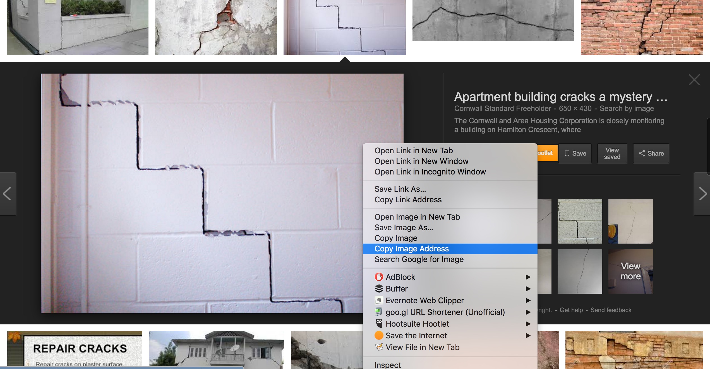

**(8)** Paste the URL into the new input field in the dashboard and hit `Enter`. The image should then appear in the dashboard and the VR result will be displayed on the gauge.

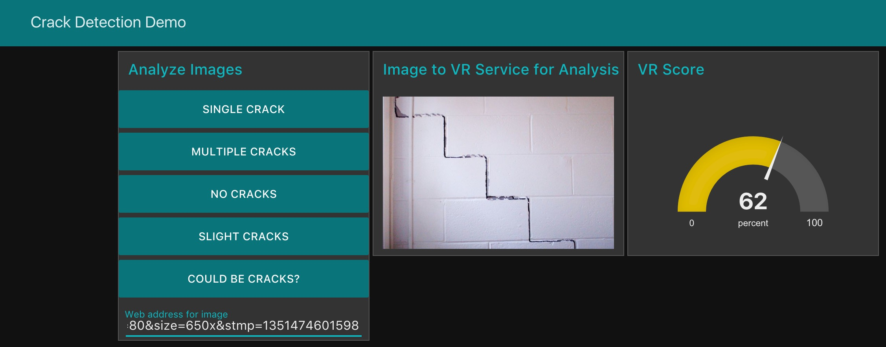

## Extend the application to use the Node-RED Worldmap service
Node-RED has a mapping capability (`node-red-contrib-web-worldmap`) that you can use plot 'things' on a map. Things to be plotted just need to have `name`, `lat` (latitude) and `lon` (longitude) properties in `msg.payload` to be automatically added to a map. If you want to learn more go [here](https://flows.nodered.org/node/node-red-contrib-web-worldmap) - the demo flow at the bottom of the page that plots live earthquake data retrieved from the US Geological Survey website is a good one to try out.

Here we'll use the `worldmap` nodes to simulate plotting the position of our 'drone' on a map, as well as passing the results from the VR service and a link to the image for display.

**(1)** Install the `node-red-contrib-web-worldmap` module from the Node-RED editor via `Manage palette`.

**(2)** Drop a `function` node, a `worldmap input` node and a `debug` node onto your existing flow.

**(3)** Name the function node `Retrieve VR Scores and Drone Data`, and use the following code. The other nodes don't need any additional customisation.
```javascript
var droneProps = {
   "name" : "Drone-1",
   "lat" : "51.0632",
   "lon" : "-1.308",
   "altitude": 13.6,
   "battery": 79,
   "speed": 0.2,
   "weblink" : {name:"Click for image", url: msg.url},
   "icon" :"uav",
   "iconColor" :"red",
   "crack" : 0
};
//Add randomize with fudge factor for variability
var tmp = parseFloat(droneProps.lat) + (Math.floor((Math.random() * 10) + 1)/500);
droneProps.lat = (Math.round(tmp * 100000)/100000).toString();
tmp = parseFloat(droneProps.lon) + (Math.floor((Math.random() * 10) + 1)/500);
droneProps.lon = (Math.round(tmp * 100000)/100000).toString();
droneProps.altitude = droneProps.altitude + Math.round(((Math.random()*2-1)/3*10))/10;
droneProps.crack = msg.payload;    
msg.payload = droneProps;
return msg;
```
**(4)** This code sets up the message to be passed to the `worldmap` node. The `name`, `lat` and `lon` attributes are required and are used to plot the 'drone' on our map at the supplied co-ordinates - the code is adding a randomised small change to `lat` and `lon` to simulate drone movement. Any other supplied parameters to the `worldmap` node will appear in a popup window when the 'drone' is selected - `altitude`, `battery` and `speed` are just examples of the type of data that might be useful. Clearly all of this data is simulated here, but could be passed as live data if coded into the application.

**(5)** The `weblink` attribute allows us to pass in a URL for display in the popup, which is useful here as we can use it to display the image having been taken by the 'drone'. `icon` and `iconColor` are pretty obvious ... go [here](https://flows.nodered.org/node/node-red-contrib-web-worldmap) for more information on the icons you can use. Finally, `score` is the result obtained from the VR service.

**(6)** Connect the nodes up like this:

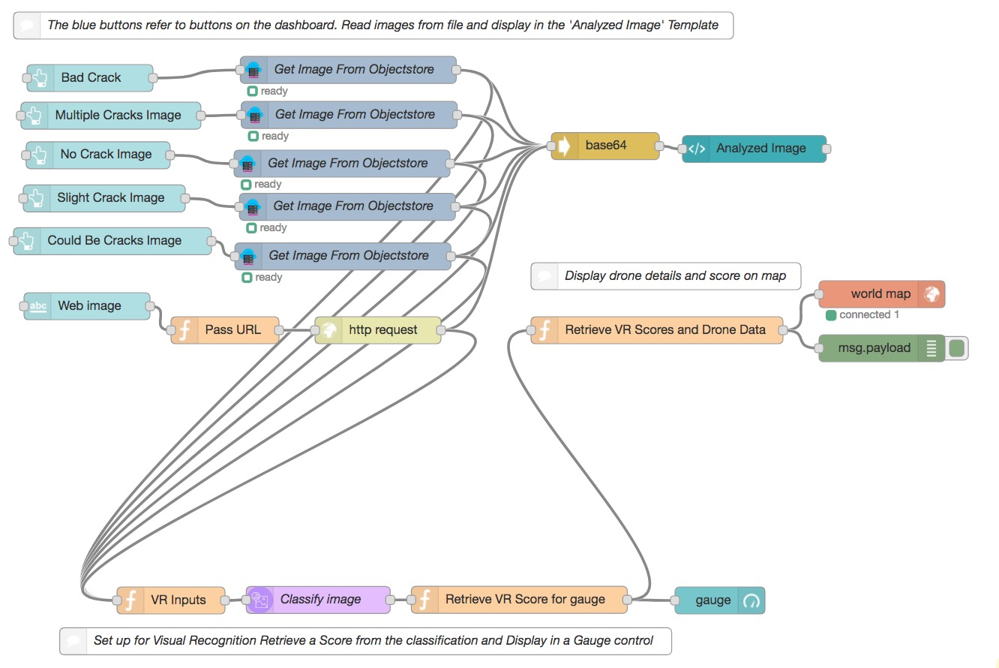

**(7)** Deploy the flow, enter a web image URL in the dashboard, then go to https://MYNODEREDAPPNAME.mybluemix.net/worldmap/ to see the map. If you click on the icon the popup appears showing all the other attributes discussed, including a live link to the image itself.  

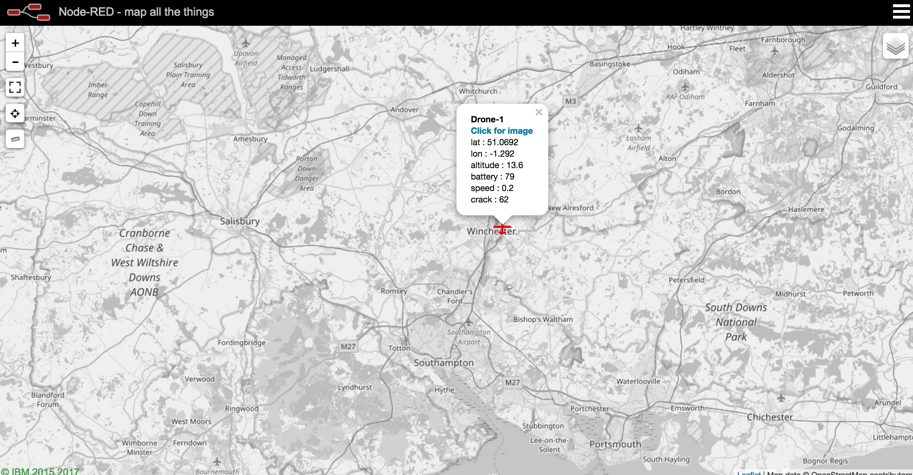

The complete flow can be downloaded from [here](./Node-RED/inspection2.json).

Congratulations! You've reached the end of the Visual Recognition lab. There's plenty of scope for reuse and extension here, some of which you'll see in the IoT labs that follow.

If you've finished early, you could visit our [Cognitive: Extras & Special Features](../X-Special) section to create your own GDPR Advisor chatbot!
