# Cognitive Lab 5: Watson Natural Language Understanding
**Watson Natural Language Understanding (NLU)** allows us to uncover insights from structured and unstructured data and analyse the semantic features of text input by extracting metadata from content such as concepts, entities, keywords, categories, relations and roles.

It can also understand sentiment and emotion, and returns both overall sentiment and emotion for a document, as well as targeted sentiment and emotion against keywords in the text for deeper analysis, and can do all this in thirteen languages.

NLU can be useful in many scenarios that demand rapid analysis of text without requiring in-depth natural language processing expertise. For example, you can monitor sentiment and emotion in customer support chat transcripts, or you can quickly categorise blog posts and sort them based on general
concepts, keywords, and entities.

The application we'll build here is a Cognitive Text Analyser that uses a _Node-RED dashboard_ and **Watson NLU** to allow a user to enter either raw text or a link to a webpage, runs the source text through NLU, and presents a summary of the content and the NLU metadata back to the user on the same dashboard. The metadata displayed includes document emotion analysis, extraction of entities, and sentiment analysis of each of the entities discovered.

## Requirements
This workshop does not use any of the assets built during previous labs.
The same instance of Node-RED can be used.

## Agenda
- build a Node-RED flow to analyse text from a web page
- import Node-RED dashboard components
- format NLU output for dashboard table and chart
- test your new Cognitive Text Analyser app

## Build a Node-RED flow to analyse text from a web page
The flow we'll create here utilises a number of Node-RED and IBM Cloud components we've already used in previous labs, so no additional services or Node-RED modules need to be installed.

**(1)** In [Cognitive Lab 2](../2-Extended) we created a basic flow that uses NLU to analyse some injected text. Analysing text from a web page is slightly more complex, so let's build that up now.

Drop in `Inject`, `HTTP Request` and `Debug` nodes. Edit the `HTTP Request` node, ensuring the method selected is `GET` and that we return `a UTF-8 string`, and copy in a web page address to analyse in the `URL` field. We're looking for something with a reasonable amount of text here, so examples might be a Wikipedia page or a BBC News article.

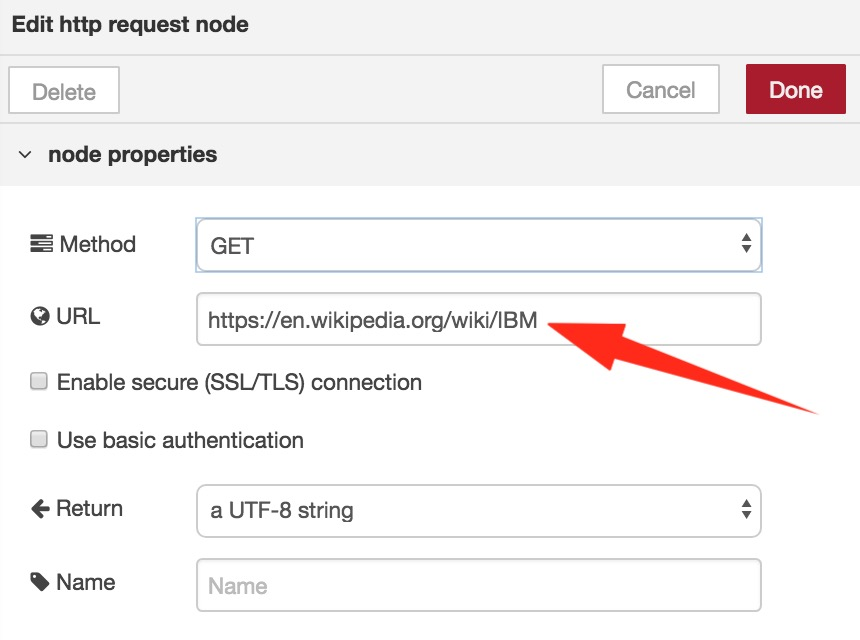

Modify the `Debug` node so it outputs the `complete message object` rather than just `msg.payload`, as we'll need to see the full output message a little later. Connect the nodes up and `Deploy`.

When you hit the `Inject` button, the flow retrieves the entire webpage, which includes all of the text, plus the HTML formatting.

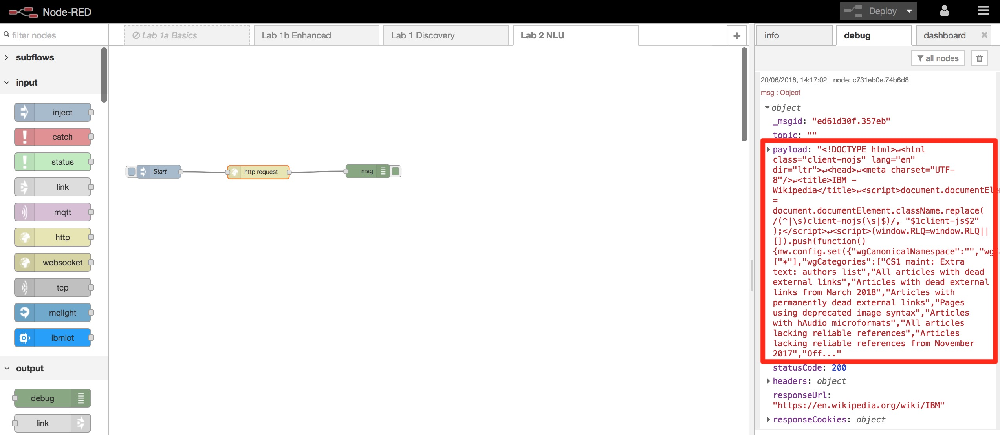

**(2)** Clearly we want to pull just the text from the web page, and we can extract this from the text held within each of the `paragraph` or `<p>` tags within the HTML. Drop in an `HTML` node, and modify it's properties to look like this:

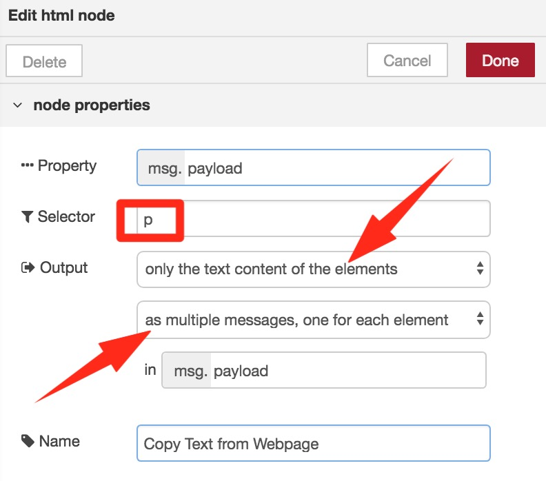

`Deploy` and hit `Inject`, and the debug output should this time show a series of separate messages, but where each `msg.payload` contains just a paragraph of text and no HTML data.

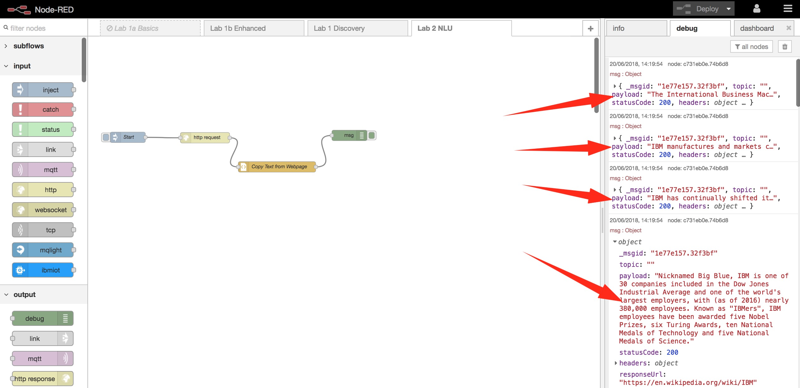

**(3)** We want this data to be fed through the NLU service as one message, so we need to merge all of these messages into one. We can do this with a `Join` node - drop one of these in now. Change its properties to `Mode` **manual** and then enter **3** in the `After a timeout following the first message` field. The messages will arrive at this node in quick succession, so setting the timeout field ensures we keep collecting and joining the messages until a 3 second delay suggests they have stopped arriving.

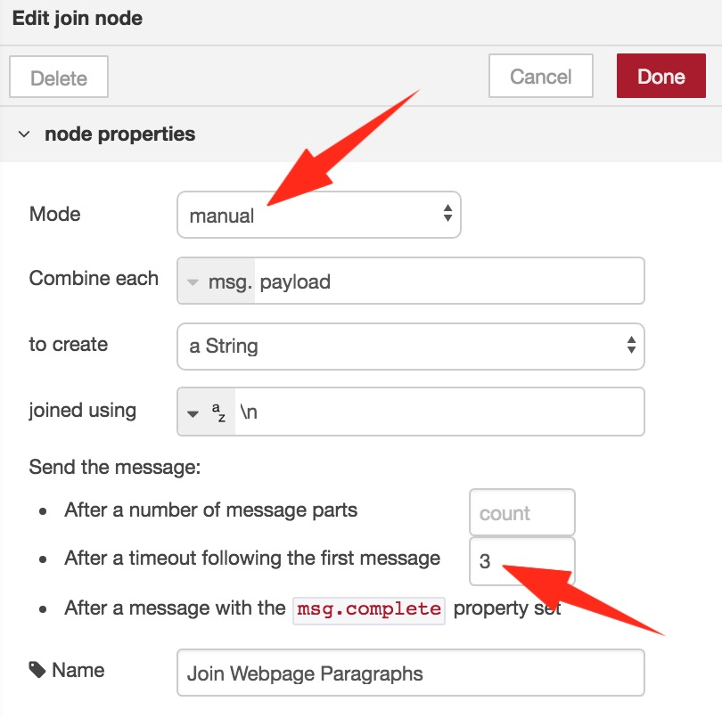

`Deploy` and hit `Inject` again, and you should see just one message, where `msg.payload` consists of all of the extracted text.

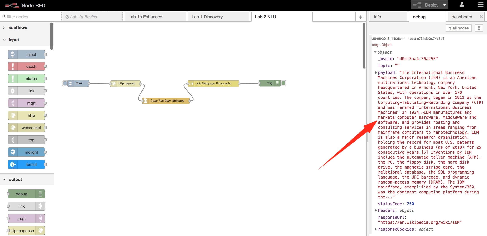

**(4)** Drop in a `Natural Language Understanding` node, edit it so the `Document Emotion`, `Document Sentiment`, `Entities`, `Entity Emotion` and `Entity Sentiment` are ticked.

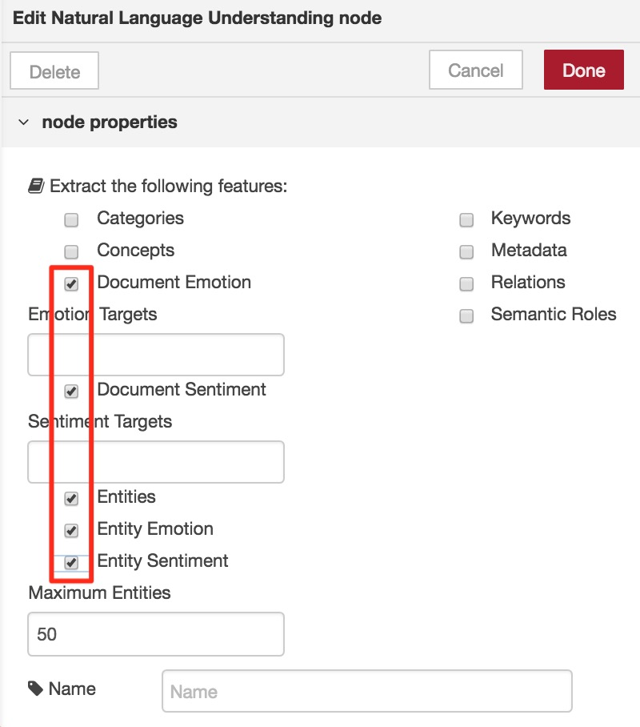

`Deploy` and `Inject` once more, and expand the `msg.features` section of the debug message produced. You should be able to see things like overall document sentiment and emotion, and a list of the entities NLU has recognised in the text and extracted (with their associated sentiment and emotion).

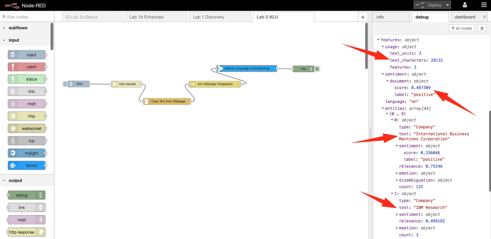

You can download the flow created to this point from [here](./Node-RED/nlu-webpage.json).

## Create a Node-RED dashboard to present the results
Having got the text analysis results in raw format, we'll now use a Node-RED dashboard to display the data in a more agreeable format.

**(1)** Copy the Node-RED dashboard code from [here](./Node-RED/nlu-dashboard.json) and `Import` from `Clipboard` in your Node-RED editor. The nodes imported are the ones highlighed below - position them approximately as you see here:

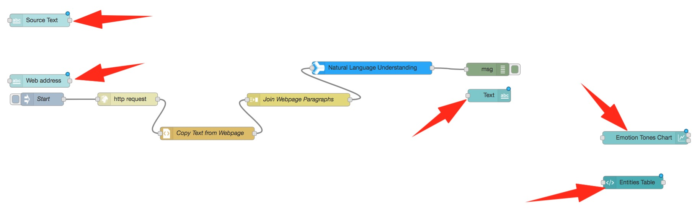

- The `Source Text` and `Web address` nodes are dashboard `text input` nodes that allows the user to enter raw text to be analysed or a web page to be processed as above, then analysed by NLU.

- The `Text` node is a dashboard `text` widget that simply displays the first 500 characters of the text that is being analysed. If you double-click the node you'll see how this works - in the `Value format` field you can see:

  `{{msg.payload | limitTo: 500}}.....`

- This tells the node to output whatever is in `msg.payload`, limited to 500 characters, followed by some full stops that indicate there is more to the message than has been displayed. This field can contain HTML and [Angular](https://scotch.io/tutorials/all-about-the-built-in-angularjs-filters) filters.

- The `Emotions Tone Chart` node is a dashboard `chart` node that can use multiple input formats (using `msg.payload`, `msg.topic` and `msg.label`) to automatically produce a number of different charts. As with all Node-RED nodes, if you select it and go to the `Help` tab you can see documentation on how to use the node.

  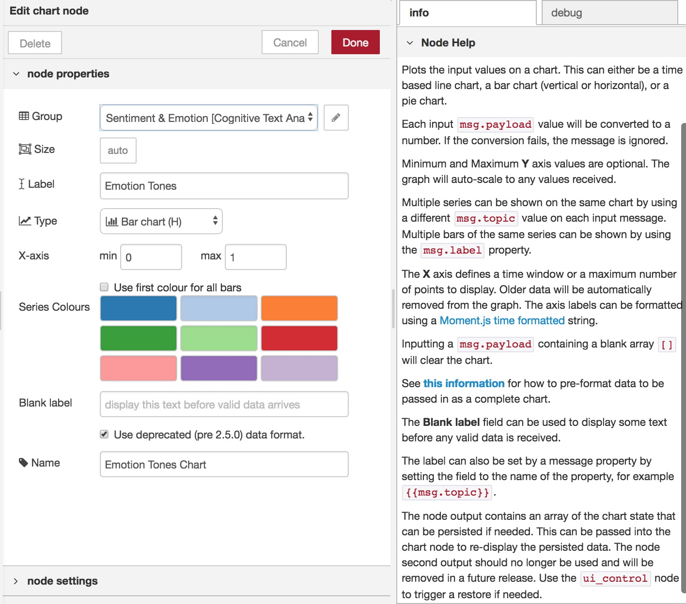

- Finally, the `Entities Table` node is a dashboard `template` node similar to the one you saw in the Visual Recognition lab, in this case taking an array as input and displaying it in table format.

**(2)** Delete the `Inject` node, and drop in two `Function` nodes and a `Change` node.

  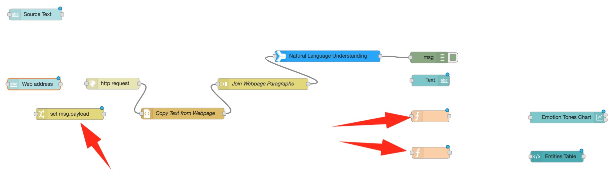

Edit the `Change` node to set `msg.url` to `msg.payload`. If we want to pass a URL to the `HTTP request` node (rather than specifying it in the node), this is where it is expected within the message passed.

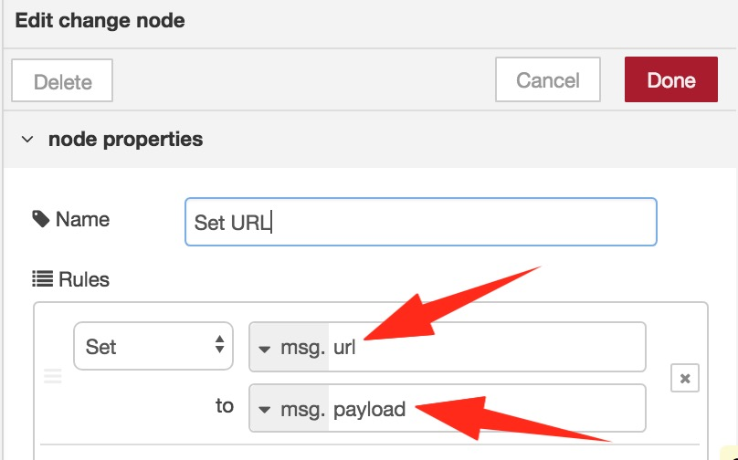

Now go into the HTTP request node and blank out the URL field (as we are now passing this in via `msg.url`).

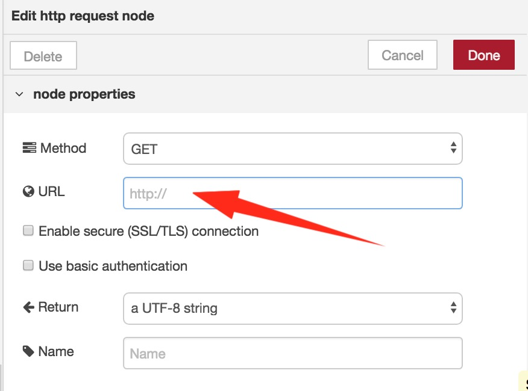

**(3)** Double-click the first `Function` node, call it `Convert for Chart`, copy in the code below, and change `Outputs` to **5**.

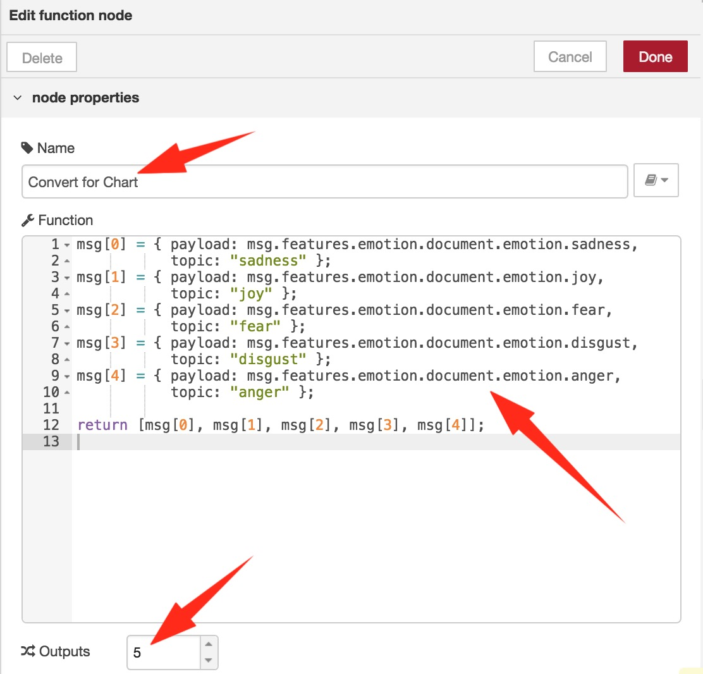

This short piece of code takes the document emotion data passed from the NLU analysis, and sends it to the chart node for display. We are sending five separate messages here representing the five emotions analysed by NLU - any `msg.topic` we send will be displayed as a chart label, whilst the `msg.payload ` sent within the same message is its associated value from the NLU analysis.

```javascript
msg[0] = { payload: msg.features.emotion.document.emotion.sadness,
           topic: "sadness" };
msg[1] = { payload: msg.features.emotion.document.emotion.joy,
           topic: "joy" };
msg[2] = { payload: msg.features.emotion.document.emotion.fear,
           topic: "fear" };  
msg[3] = { payload: msg.features.emotion.document.emotion.disgust,
           topic: "disgust" };
msg[4] = { payload: msg.features.emotion.document.emotion.anger,
           topic: "anger" };           

return [msg[0], msg[1], msg[2], msg[3], msg[4]];
```

**(4)** Modify the second `Function` node. Name it `Convert for Table` and use the code below. This code takes the top twenty `entities` recognised in the text by NLU, creates an array consisting of _[entity name, entity score (relevance and sentiment), entity type]_ for each entity, and passes it to the `template` node for display in table format.

```javascript
// Create array entry for each entity found
// Set maximum returned to be 20

var numEntities = 20;
if (msg.features.entities.length < numEntities) {
    numEntities = msg.features.entities.length;
}
var entities = [];
for (i = 0; i < numEntities; i++) {
    entities.push({name: msg.features.entities[i].text,
                   score: (msg.features.entities[i].relevance * 100).toFixed(0) + " (" + (msg.features.entities[i].sentiment.score * 100).toFixed(0) + ")",
                   type: msg.features.entities[i].type.substring(0,10)
                 })
}
msg.payload = {
    entitylist: entities,
};
return msg;
```

**(5)** Connect the nodes up as below:

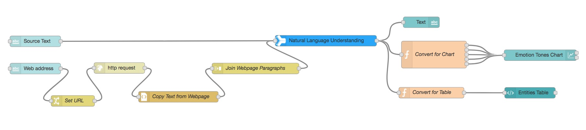

**(6)** Finally, go to the Node-RED `dashboard` tab and the `Site` sub-tab. Change the `1x1 Widget Size` values to 50, and the `Widget Spacing` values to 15. These increase the default widget size/spacing so we can squeeze the full results table into a single widget. Now `Deploy`!

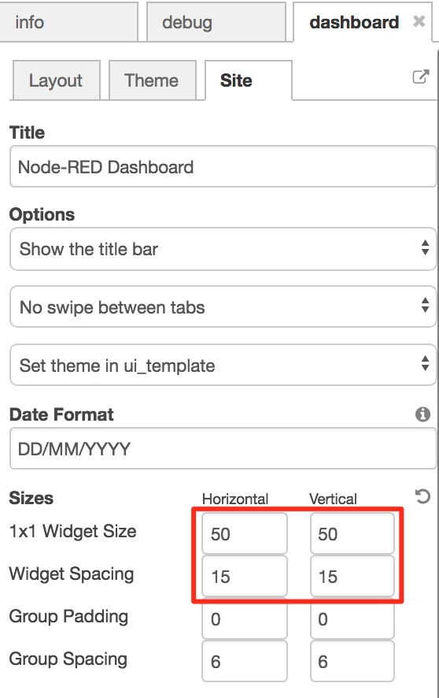

**(7)** Go to your Node-RED Dashboard URL, and test your new application by entering some text or a web URL. The analysis will take a few seconds, and you'll then see an analysis that looks something like this.

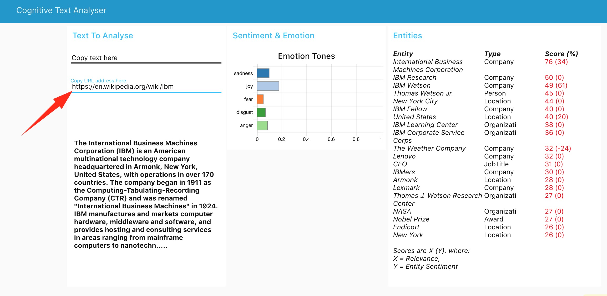

The NLU **emotion** feature detects anger, disgust, fear, joy, and sadness implied in text. A score of 0 means the text does not convey the emotion; 1 means the text definitely carries the emotion.

The **entities** feature helps you identify people, cities, organisations, and many other
types of entities in your text. It returns items such as persons, places, and organisations that
are present in the input text. The **sentiment** feature identifies attitude, opinions, or feelings in the content that is being analysed. Here we are analysing the sentiment toward our extracted entities.

The complete flow can be downloaded from [here](./Node-RED/nlu-final.json).

Congratulations! You've reached the end of the Natural Language Understanding lab.

Next try [Cognitive Lab 6](../6-Translation) where we'll use **Watson Language Translator** to create an application that can automatically translate selected tweets from English, to a language you can specify.
