# Cognitive: Extras & Special Features
If you've completed the Basics, Extended and Discovery labs, then you could try one (or both) of these additional challenges!

### GDPR Chatbot
Using the Telegram infrastructure you've already built, create a chatbot that uses Watson Conversation and Watson Discovery to answer queries about GDPR.

### Insurance Claims Visual Recognition
Using the methodology you followed to build the Drone Inspection prototype, build an Insurance Claims dashboard that can process images associated with an insurance claim. The application should be able to specifically recognise motorcycles, flat tyres, broken windshields and vehicle vandalism. It should also use Watson's default visual recognition capabilities to analyse images and present all of the classes/objects it can see in a supplied image.

Below you'll find some guidance on how you could go about building these prototypes, followed by some assets you could use to create them if you don't want to do it all yourself!

## GDPR Chatbot: Straw Man

**(1)** Build a `Watson Conversation` workspace for short-tail responses that has at least:

- three `intents` for **#greeting**, **#goodbye** and **#gdprbasics**
    - **#gdprbasics** should test for when a user asks what GPDR is, a summary, the concepts etc.


- five basic `dialog` nodes:
  - `welcome` - default node that should welcome the user ... edit the response with a variation on "Hello I'm a GDPR bot"
  - `greeting` - called by the **#greeting** intent and replies by asking the user for a question about GDPR
  - `gdprbasics` - called by the **#gdprbasics** intent, and responds with a short summary of what GDPR is ... find some suitable text via a Google search, or you can use the sample response in the assets below
  - `goodbye` - picked up by the **#goodbye** intent, and simply says thanks and goodbye, and then jumps back up to welcome to start the dialog again
  - `anything_else` - a 'default' node for unknown responses

**(2)** Test your dialog using the `Try It Out` feature in Watson Conversation.

**(3)**  Create a `Watson Discovery` collection with question and answer pairs for long-tail responses:
  - search the web for appropriate Q&A pairs that could help build your GDPR chatbot knowledge base
  - FAQs are a typically good source for this type of information - there are plenty out there, e.g.
    - http://www.eugdpr.org/eugdpr.org.html
    - https://www.skillcast.com/blog/10-top-frequently-asked-questions-about-gdpr
    - https://www.safetica.com/blog/38-questions-and-answers-about-gdpr/
    - https://www.clearswift.com/sites/default/files/documents/technical-guides/clearswift_gdpr_faq_v3.pdf
  - create a JSON document for each Q&A pair you find from your FAQs - [Atom](https://atom.io/) is a good UI for doing this
  - each JSON document should have two fields, and look something like the example below:
```
{
  "Question": "Does the GDPR affect the transfer of data within the EU?",
  "Accepted_Answer": "The GDPR provides that the free movement of personal data within the European Union shall be neither restricted nor prohibited for reasons connected with the protection of natural persons with regard to the processing of personal data. The GDPR allows Member States to maintain or introduce further conditions, including limitations, with regard to the processing of genetic data, biometric data or data concerning health. However, this should not hamper the free flow of personal data."
}
```    
  - if you don't want to build your own Q&A repository, you can download an archive with 60 Q&A pairs from the asset list below
  - create a new `Watson Discovery` collection, and upload your Q&A JSON documents

**(4)** After the upload has completed, test your Watson Discovery collection by building and running some test queries.

**(5)** Create the Node-RED flow for your GDPR bot by copying your existing Phone Advisor chatbot flow:
  - change the `Telegram Command` node from `/phone` to `/gdpr`
  - change the `Conversation` and `Discovery` nodes to use your new GDPR Watson Conversation workspace and Watson Discovery collection.
  - in the `Wait, Merge, Prioritise Results` node, change the `threshold` variable to `0.9` to ensure we return only very accurate Conversation results
  - alternatively, you can import the whole _chatbot flow_ from the assets list, and just modify the Conversation and Discovery nodes as appropriate

**(6)** Deploy your flow and test your new GDPR chatbot. Hopefully it will look something like this.

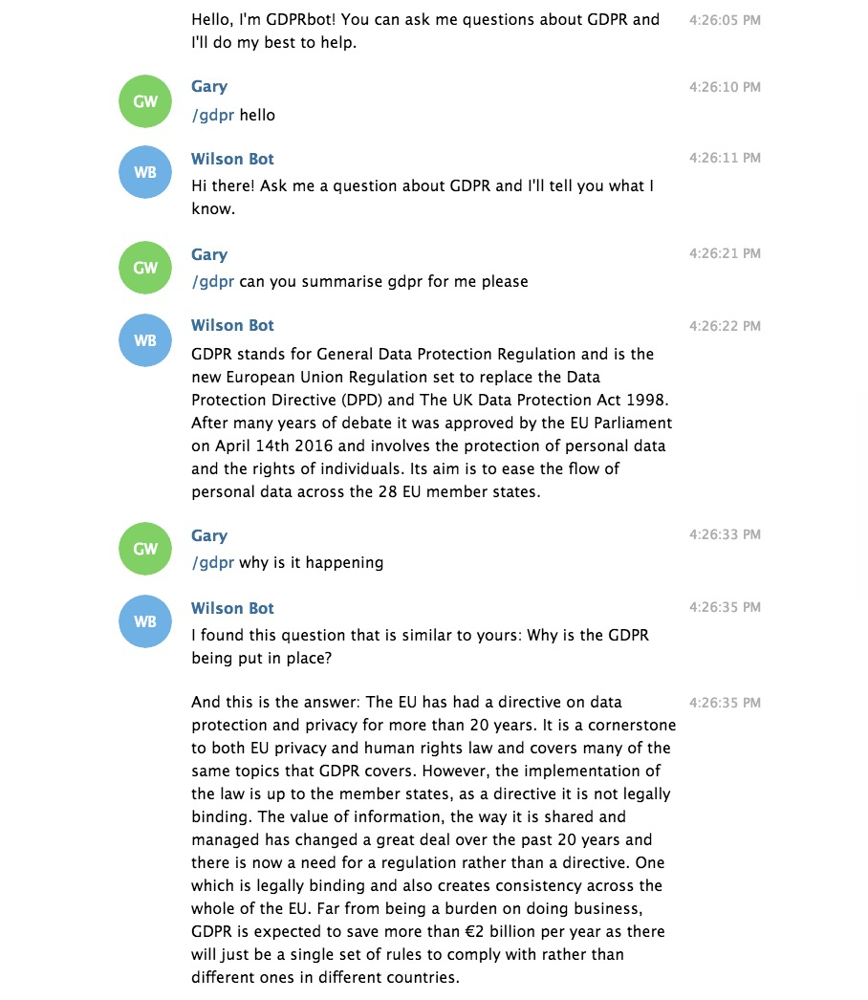
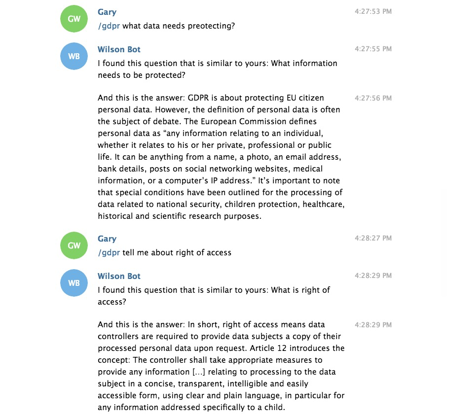
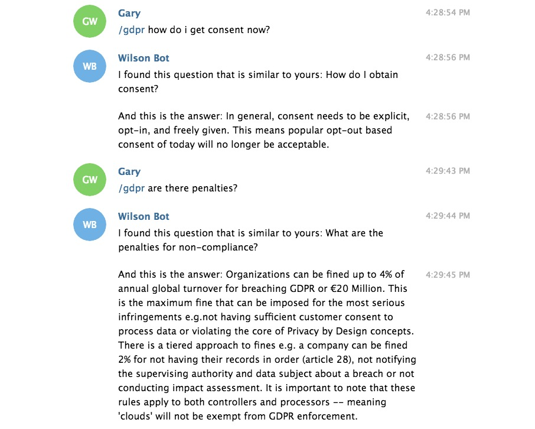
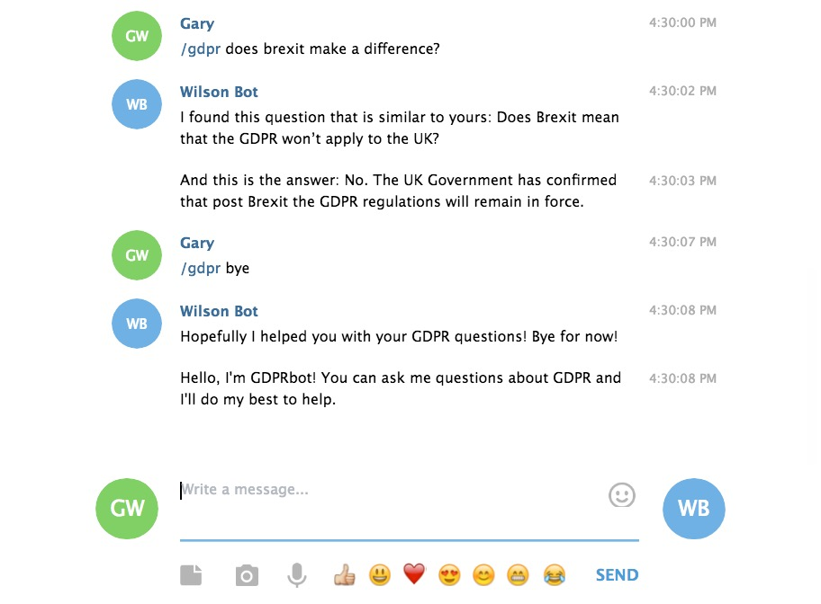

## GDPR Chatbot: Assets
- `#gdprbasics` Watson Conversation intent, sample response:

`GDPR stands for General Data Protection Regulation and is the new European Union Regulation set to replace the Data Protection Directive (DPD) and The UK Data Protection Act 1998. After many years of debate it was approved by the EU Parliament on April 14th 2016 and involves the protection of personal data and the rights of individuals. Its aim is to ease the flow of personal data across the 28 EU member states.`
- GDPR Q&A pairs [zipfile](./data/GDPR-QA-Pairs.zip)
- Node-RED GDPR [chatbot flow](./Node-RED/gdpr-chatbot-flow.json)

## Insurance Claims VR application: Straw Man

**(1)** Your should be aiming for your app to look something like this:

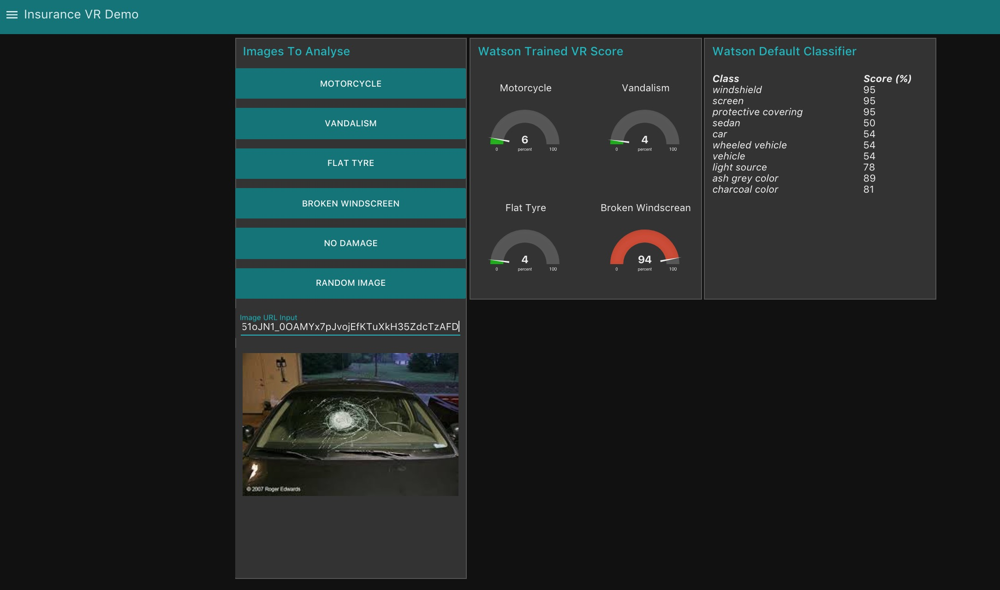

It should take images from IBM Cloud Object Storage via Node-RED dashboard buttons, and again allow the user to enter an image URL. It should then pass the image through a Watson Visual Recognition custom classifier that you have trained to look for motorcycles, flat tyres, broken windshields and vehicle vandalism.

_Note: you can create a single Watson Visual Recognition classifier with multiple classes._

The app has two additional pieces of functionality over the Drone Inspection prototype:
- the additional dashboard button called `Random Image`, which pulls a random image from the object storage container for VR analysis, and
- it passes the image through the Watson default classifier to create the `Watson Default Classifier` table you can see above.

**(2)** First, train your Visual Recognition custom classifier. This time create a classifier with a class for **each** of the four items you are trying to recognise.

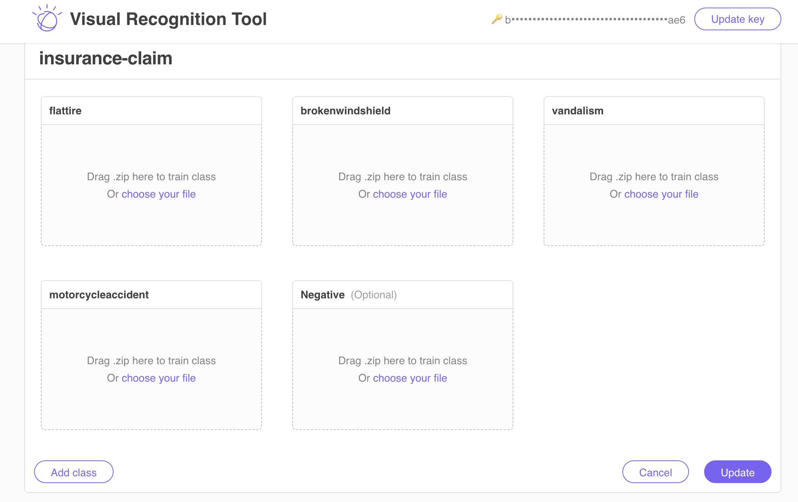

As before you'll have to upload a zip file of images that represent each class in order to train Watson, and also provide a `Negative` set of images. So in this case, you'll need 'positive' images of motorcycles, flat tyres, broken windshields and vandalism.

You can obtain these images from a Google Images search, or use the zip files from the assets section below.

Go to http://visual-recognition-tooling.mybluemix.net to access the Visual Recognition service and train your new classifier - remember to note down the classifer ID provided, as you'll need this in your Node-RED flow.

**(3)** Configure Object Storage by uploading some test images. Create a new `insurance` container within your IBM Cloud Object Storage instance, extract the test images from the [test images](./data/test.zip) file in the assets section below, and upload the images to the new container.

**(4)** Build your Node-RED code using your Drone Inspection flow as a guide.

- Create a `dashboard button` node for each of the VR classes you've created, which when selected will retrieve an appropriate image from IBM Cloud Object Storage.

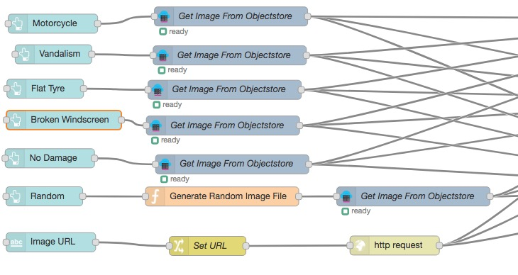

- When you create the first dashboard button, you should create a `new UI group` (e.g. _Images To Analyse_) and `new UI tab` (e.g. _Insurance VR demo_) for your new application, and then use these for the other dashboard buttons.

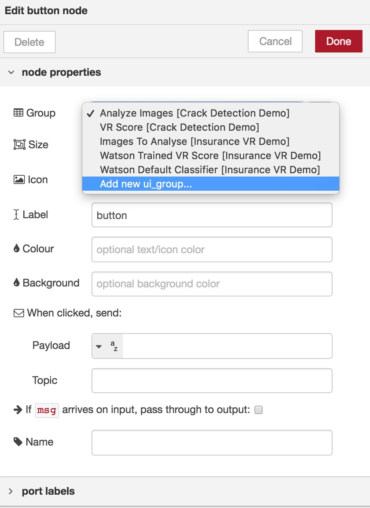

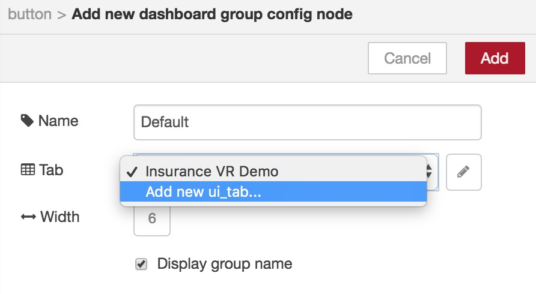

- Edit each of the `Get Image from Objectstore` nodes and modify the `object name` and `container` fields, as appropriate.

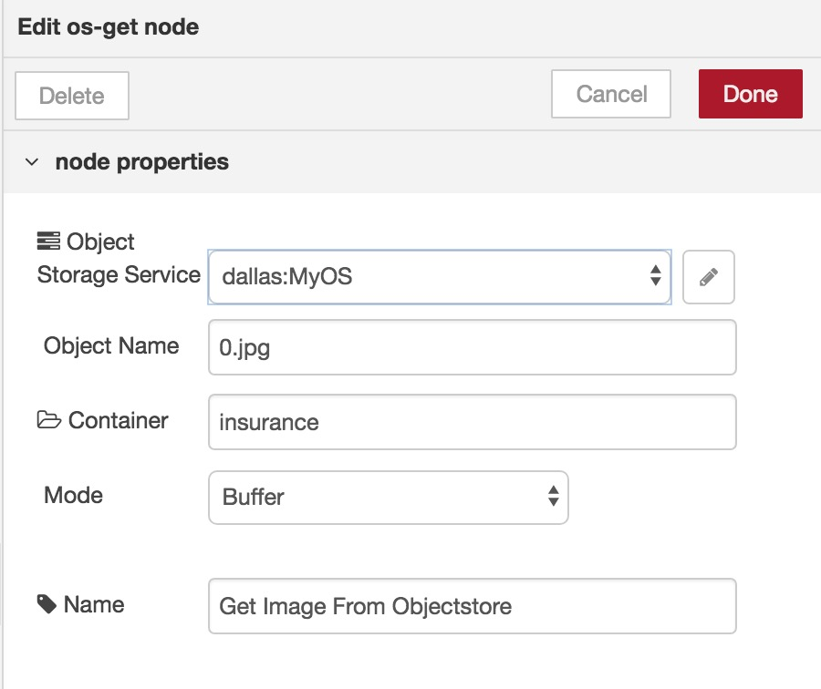

If you are using the test images from the supplied zipfile, then you can use:
  - _0.jpg_ for motorcycle
  - _1.jpg_ for no damage
  - _2.jpg_ for vandalism
  - _5.jpg_ for flat tyre
  - _9.jpg_ for broken windshield

**(5)** The new `Random` dashboard button calls some Javacript to generate a random image to retrieve from object storage. This code will generate an `objectname` to retrieve - between 0.jpg and 9.jpg.
```javascript
// Images in object storage are x.JPG, where x = 0..9
rnd = Math.floor ( Math.random() * (9 - 0) + 0);
msg.objectname = rnd + ".jpg";
return msg;
```
In the accompanying Object Storage node, the object name should be set to `msg.filename`.

**(6)** Build the code for the Watson VR score retrieval and display:

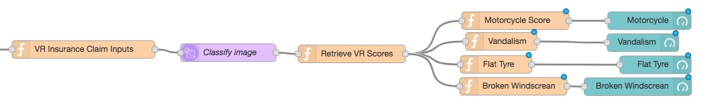

- Ensure the function node that calls Watson VR `Classify Image` is using your newly created classifer ID - other than this change the code is the same as you used in the Drone Inspection app.
- The `Retrieve VR Scores` node needs to be a bit more sophisticated for this application, as we are retrieving and passing multiple classes and values to the dashboard. Use the code below as a template - it checks the results from Watson Visual Recognition, and stores each of the scores returned in `msg.payload.<CLASSNAME>`, where `<CLASSNAME>` is the name of each of the classes you created and trained in your Watson VR classifier.

```javascript
// Move Watson VR results to local variables

var classifiers  = msg.result.images[0].classifiers;
var classCount = msg.result.custom_classes;

var className = "";
var score = 0;
var scores = { "Type":0 };

var filePath = global.get("fileName");

// Loop through results ...
//   className = name of class(es) specified when building Watson VR classifier
//   score = confidence level of Watson VR for each trained class
// ... and set up msg.payload results - a {className : score} pair for each class

if (classCount > 0) {
    for (var i = 0 ; i<classCount; i++){
        className = classifiers[0].classes[i].class;
        score = classifiers[0].classes[i].score;
        scores[className] = (score*100).toFixed(0);
    }
    msg.payload = scores;
}
else {
    msg.payload = {};
}

return msg;
```

**(7)** Also, instead of just sending the value retrieved to a single `dashboard gauge` node as we did before, we now need an additional step to send each of the four values to separate gauges.

The code for each function nodes should look like this. The only change to each node is to modify `msg.payload.motorcycleaccident` to reflect the appropriate variable to be passed to the gauge.

Remember, the variable we are passing here in each function node - is `msg.payload.<CLASSNAME>`.
```javascript
// The variable name here is msg.payload.<classname from Watson VR>
var mc = msg.payload.motorcycleaccident;
msg.payload=mc;
return msg;
```
Your four gauge nodes should again use a new dashboard UI group (e.g. `Watson Trained VR Score`) under the new UI tab you created in **(4)** above.

**(8)** The code to display the image on the dashboard is the same as you used before, except you will again need to edit the Analysed Image node to use the UI group and tab created in **(4)**.

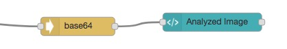

**(9)** Now let's add in the code for the Watson default classifier.

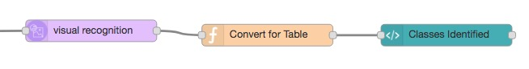

- The `Visual Recognition` node can be left to the defaults, calling _classify an image_.
- An image passed to this node without specifying a custom classifier will return the objects it can recognise with an associated confidence level score in `msg.results.images[].classifiers[].classes[]`.

Here's some code you can use to build an array of the results in the `Convert for Table` function node:
```javascript
// Create array entry for each image class found
var images = [];
for (i = 0; i < msg.result.images[0].classifiers[0].classes.length; i++) {
    images.push({class: msg.result.images[0].classifiers[0].classes[i].class,
                      score: (msg.result.images[0].classifiers[0].classes[i].score * 100).toFixed(0)
                    })
}
msg.payload = {
    imagelist: images,
};
return msg;
```

**(10)** Finally, drop in a `dashboard template` node - we've called ours `Classes Identified`. If you remember from previous labs, the template widget can contain any valid HTML and Angular directives, which can be used to create a dynamic user interface element that changes its appearance based on the input message.

Customise the template node so it looks like this:

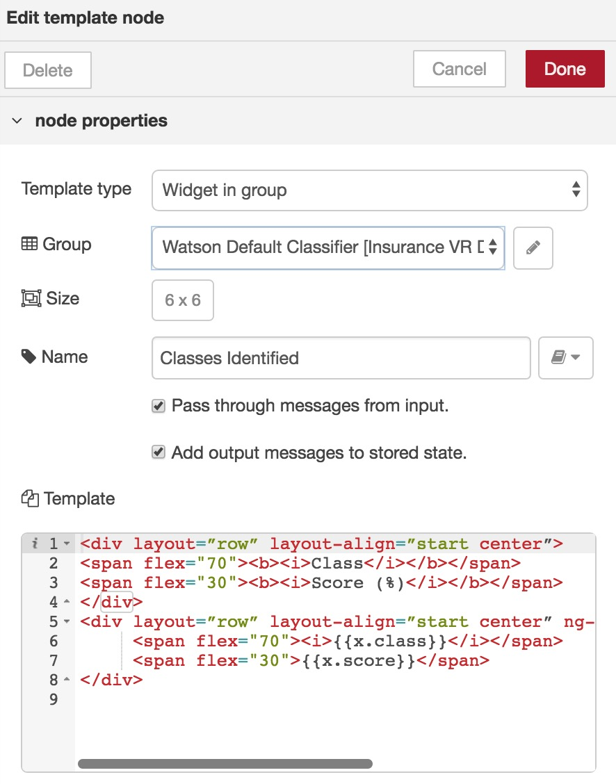

It should belong to a new UI group (e.g. `Watson Default Classifier`), and have something similar to the following HTML code in the `Template` field:
```html
<div layout=”row” layout-align=”start center”>
<span flex="70"><b><i>Class</i></b></span>
<span flex="30"><b><i>Score (%)</i></b></span>
</div>
<div layout=”row” layout-align=”start center” ng-repeat="x in msg.payload.imagelist">
     <span flex="70"><i>{{x.class}}</i></span>
     <span flex="30">{{x.score}}</span>
</div>
```

This will format the array created in the `Convert for Table` node into a neat table on the dashboard.

**(11)** The finished flow should look something like this:

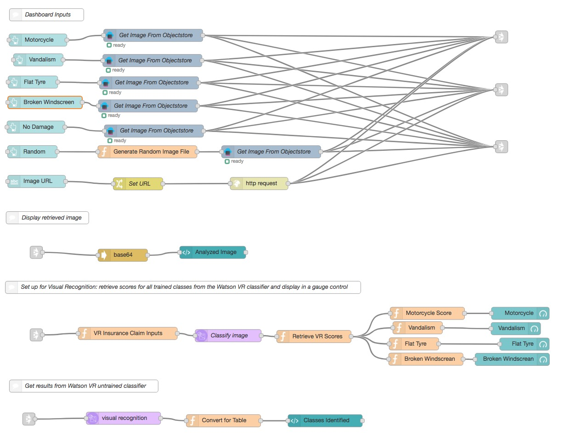

Yours may look a lot more complicated!

We've used `link out` and `link in` nodes here to give the flow a cleaner look. All `link` nodes do is create a virtual wire between flows, so when `link out` and `link in` nodes are connected, they behave as if they were wired together - sort of like a GOTO statement.

In our application we are passing each object storage or HTTP URL to all three 'routines' ... display image, pass to custom classifer, and pass to default classifier.

You can download and import the finished code from [here](./Node-RED/insurance-vr-flow.json).

## Insurance Claims VR application: Assets
- Images: [broken windshields](./data/brokenwindshield.zip)
- Images: [flat tyres](./data/flattire.zip)
- Images: [motorcycles](./data/motorcycleaccident.zip)
- Images: [vehicle vandalism](./data/vandalism.zip)
- Images: [negative images](./data/negatives.zip)
- Images: [test images for object storage](./data/test.zip)
- Node-RED [code](./Node-RED/insurance-vr-flow.json)

_Thanks to Mike Hope for the idea and building the application._
